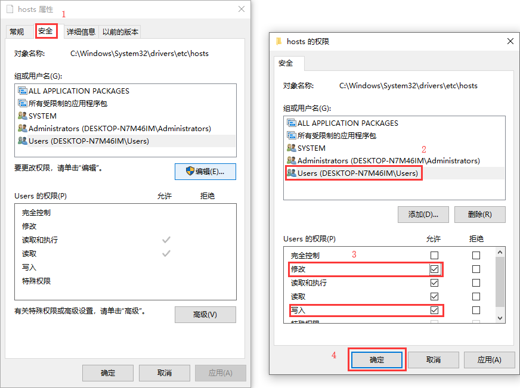

# Windows {docsify-ignore}

## 1.1 修改hosts文件

> 因为当前用户没有权限， `hosts` 文件是修改不了的。有些时候某些软件需要对这个文件进行操作，所以不得不通过管理员的权限进行修改。

解决方案一：

1. 首先按下 `Win + R` 调出运行窗口，然后输入 `C:\Windows\System32\drivers\etc`，最后点击 `确定` 跳到指定路径下。

   

2. 选中 `hosts` 文件后，右键 `属性`，将 `只读` 的勾取消掉，最后 `确定`。

   

3. 在 Windows 10 搜索中输入 `记事本` （输入拼音也可以检索到），点击 `以管理员身份运行`。

   

4. 在记事本左上角，选择 `文件`，然后点击 `打开`，选择 `所有文件......` 后，选中 `hosts` 文件，最后点击 `打开`。

   

5. 图中我将已存在的数据复制了一份，保存后就可以去测试自己安装的软件了。

   

解决方案二：

1. 第一步、第二步同上。

2. 第三步、第四步替换如下图，两种方式都是赋予修改、写入的权限。

   

  > 建议用第一种解决方案，因为赋予修改、写入的权限是一次性的。

  !> 将 `hosts` 的 `只读` 权限勾选回来，因为不确定什么时候会有恶意程序利用这个漏洞。

## 1.2 PowerShell 切换成 CMD

> 因为 `CMD` 有很多命令在 `PowerShell` 中无法直接运行，需要切换模式。

解决方案：

```powershell
PS C:\WINDOWS\system32> cmd
Microsoft Windows [版本 10.0.19042.330]
(c) 2020 Microsoft Corporation. 保留所有权利。

C:\WINDOWS\system32>
```

## 1.3 PowerShell 进入 Program File 文件夹时出错

> `CMD` 模式下，进入 `Program File` 是没有问题的，但是 `PowerShell` 访问时，如果有空格或者中文就需要加上 `""`，才可以访问。

```powershell
PS C:\WINDOWS\system32> cd "C:\Program Files"
PS C:\Program Files>
```

## 1.4 操作路由表项

1. 查看电脑内部路由。

  ```powershell
  route print
  ```

2. 临时添加电脑内部路由。

  命令：route add 网段 mask 子网掩码 网关

  ```powershell
  route add 172.18.0.0 mask 255.255.0.0 172.16.0.1
  ```

  > 电脑重启后，该路由自动消失。

3. 永久添加电脑内部路由，需要跟上参数 `-p`。

  ```powershell
  route add 172.19.0.0 mask 255.255.0.0 172.16.0.1 -p
  ```

4. 修改电脑内部路由。

  命令：route change 网段 mask 子网掩码 网关

  说明：只用于修改网关和/或跃点数。

  例如：修改172.20.0.0 网关由172.20.0.1修改为172.20.0.254

  ```powershell
  route change 172.20.0.0 mask 255.255.0.0 172.20.0.254
  ```

5. 删除电脑内部路由。

  命令：route delete 网段

  ```powershell
  route delete 172.18.0.0
  ```