## 2.1 Linux {docsify-ignore}

### 2.1.1 CentOS

#### 2.1.1.1 CentOS 7 清空终端屏幕

解决方案：

输出很多信息的命令行窗口，如下图：

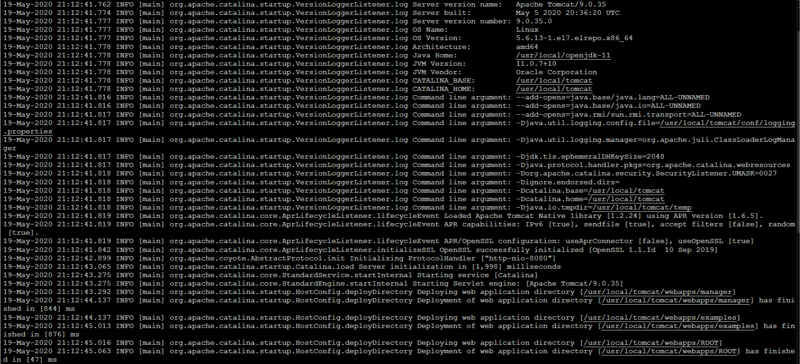

执行命令。

```bash
root@192.168.1.10:~# reset
```

清空后的窗口:


#### 2.1.1.2 CentOS 7 删除多余的内核

解决方案：

1. 首先列出系统中正在使用的内核。

```bash
uname -a
```

2. 查询系统中全部的内核。

```bash
rpm -qa | grep kernel
```

3. 将需要删除的内核删除掉（多个内核可空格隔开，也可以写模糊的内核名称）。

```bash
yum -y remove 内核名称
```

4. 重启之后就可以看到内核被删掉了，同时多余的启动项也自动删掉了。

#### 2.1.1.3 CentOS 7 中安装或升级最新的内核

> 本文转载自 [Linux 中国](https://linux.cn/article-8310-1.html)

虽然有些人使用 `Linux` 来表示整个操作系统，但要注意的是，严格地来说，`Linux` 只是个内核。另一方面，发行版是一个完整功能的系统，它建立在内核之上，具有各种各样的应用程序工具和库。

在正常操作期间，内核负责执行两个重要任务：

* 作为硬件和系统上运行的软件之间的接口。

* 尽可能高效地管理系统资源。

为此，内核通过内置的驱动程序或以后可作为模块安装的驱动程序与硬件通信。

例如，当你计算机上运行的程序想要连接到无线网络时，它会将该请求提交给内核，后者又会使用正确的驱动程序连接到网络。

> 建议阅读： [如何在 Ubuntu 中升级内核](https://linux.cn/article-8284-1.html)

随着新的设备和技术定期出来，如果我们想充分利用它们，保持最新的内核就很重要。此外，更新内核将帮助我们利用新的内核函数，并保护自己免受先前版本中发现的漏洞的攻击。

准备好了在 `CentOS 7` 或其衍生产品（如 `RHEL 7` 和 `Fedora`）上更新内核了么？如果是这样，请继续阅读！

1. 检查已安装的内核版本。

让我们安装了一个发行版，它包含了一个特定版本的内核。为了展示当前系统中已安装的版本，我们可以：

```bash
uname -sr
```

下面的图片展示了在一台 `CentOS 7` 服务器上的输出信息：

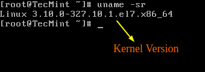

如果我们现在进入 [Linux 内核官网](https://www.kernel.org/)，在撰写本文时，我们看到最新的内核版本是 `4.10.1`（其他版本可以从同一网站获得）。

还要考虑的一个重要的事情是内核版本的生命周期 - 如果你当前使用的版本接近它的生命周期结束，那么在该日期后将不会提供更多的 `bug` 修复。关于更多信息，请参阅[内核发布页](https://www.kernel.org/category/releases.html)。

2. 在 `CentOS 7` 中升级内核。

大多数现代发行版提供了一种使用 [yum等包管理系统](http://www.tecmint.com/20-linux-yum-yellowdog-updater-modified-commands-for-package-mangement/) 和官方支持的仓库升级内核的方法。

但是，这只会升级内核到仓库中可用的最新版本 - 而不是在 [Linux 内核官网](https://www.kernel.org/) 中可用的最新版本。不幸的是，`Red Hat` 只允许使用前者升级内核。

与 `Red Hat` 不同，`CentOS` 允许使用 `ELRepo`，这是一个第三方仓库，可以将内核升级到最新版本。

要在 `CentOS 7` 上启用 `ELRepo` 仓库，请运行：

```bash
rpm --import https://www.elrepo.org/RPM-GPG-KEY-elrepo.org
rpm -Uvh http://www.elrepo.org/elrepo-release-7.0-2.el7.elrepo.noarch.rpm
```

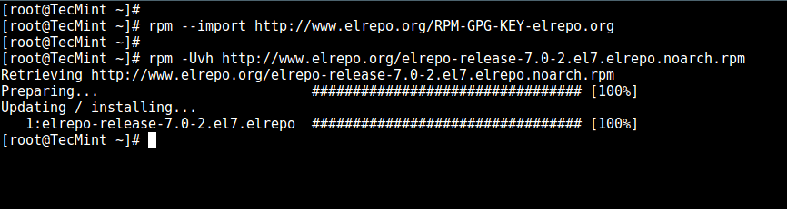

仓库启用后，你可以使用下面的命令列出可用的内核相关包：

```bash
yum --disablerepo="*" --enablerepo="elrepo-kernel" list available
```

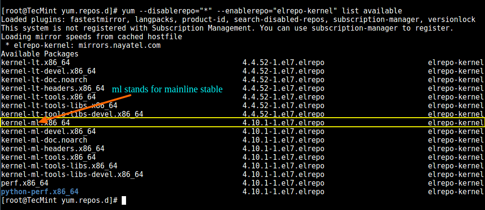

接下来，安装最新的主线稳定内核：

```bash
yum --enablerepo=elrepo-kernel install kernel-ml
```

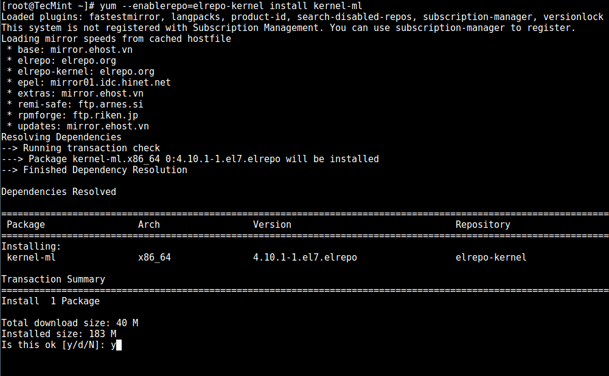

最后，重启机器并应用最新内核，接着运行下面的命令检查最新内核版本：

```bash
uname -sr
```

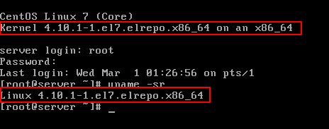

3. 设置 `GRUB` 默认的内核版本。

为了让新安装的内核成为默认启动选项，你需要如下修改 GRUB 配置：

打开并编辑 `/etc/default/grub` 并设置 `GRUB_DEFAULT=0`。意思是 `GRUB` 初始化页面的第一个内核将作为默认内核。

```text
GRUB_TIMEOUT=5
GRUB_DISTRIBUTOR="$(sed 's, release .*$,,g' /etc/system-release)"
GRUB_DEFAULT=0
GRUB_DISABLE_SUBMENU=true
GRUB_TERMINAL_OUTPUT="console"
GRUB_CMDLINE_LINUX="crashkernel=auto rd.lvm.lv=centos/root rd.lvm.lv=centos/swap rhgb quiet"
GRUB_DISABLE_RECOVERY="true"
```

接下来运行下面的命令来重新创建内核配置。

```bash
grub2-mkconfig -o /boot/grub2/grub.cfg
```

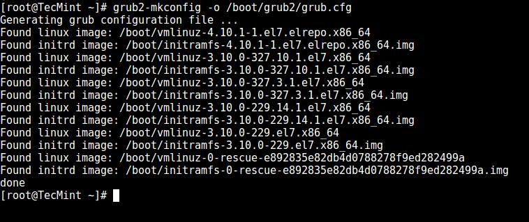

重启并验证最新的内核已作为默认内核。

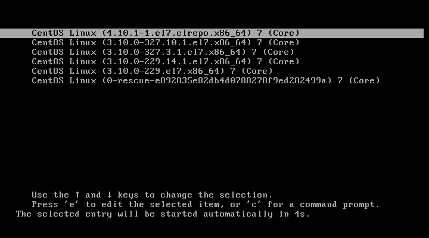

恭喜你！你已经在 `CentOS 7` 中升级内核了！

4. 总结

本文中，我们解释了如何轻松升级系统上的 `Linux` 内核。我们还没讲到另外一个方法，因为它涉及从源代码编译内核，这可以写成一本书，并且不推荐在生产系统上这么做。

虽然它是最好的学习体验之一，并且允许细粒度配置内核，但是你可能会让你的系统不可用，并且可能必须从头重新安装它。

如果你仍然有兴趣构建内核作为学习经验，你可以在 [Kernel Newbies](https://kernelnewbies.org/KernelBuild) 页面中获得指导。

一如既往，如果你对本文有任何问题或意见，请随时使用下面的评论栏。

作者简介：

我是一个计算机上瘾的家伙，并且是开源和 `Linux` 系统软件的粉丝，有大约 4 年的 `Linux` 发行版桌面、服务器和 `bash` 脚本的经验。

[via](http://www.tecmint.com/install-upgrade-kernel-version-in-centos-7/)

作者：`Matei Cezar` 译者：`geekpi` 校对：`wxy`

本文由 `LCTT` 原创编译，`Linux中国` 荣誉推出

#### 2.1.1.4 wget 命令

> 本文部分内容转载自 [博客园](https://www.cnblogs.com/jiufen/p/5013678.html)，略有修改。

安装 `wget` 。

```bash
root@192.168.1.10:~# yum -y install wget
```

下载多个文件命令。

```bash
root@192.168.1.10:~# wget -i files.txt
```

下载链接的文件 `files.txt` 。

```txt
http://192.168.1.3:3000/images/B122.png
http://192.168.1.3:3000/docs/01-Windows.md
http://192.168.1.3:3000/favicon.ico
http://192.168.1.3:3000/index.html
```

#### 2.1.1.5 netstat 命令

安装 `netstat` 。

```bash
root@192.168.1.10:~# yum -y install netstat
```

`netstat` 参数：

```txt
-a 显示所有选项，默认不显示 LISTEN 相关。
-t 仅显示 tcp 相关选项。
-u 仅显示 udp 相关选项。
-n 拒绝显示别名，能显示数字的全部转化成数字。
-l 仅列出有在 Listen 的服务状态。
-p 显示建立相关链接的程序名。
-r 显示路由信息，路由表。
-e 显示扩展信息，例如 uid 等。
-s 按各个协议进行统计。
-c 每隔一个固定时间，执行该 netstat 命令。
```

> `LISTEN` 和 `LISTENING` 的状态只有用 `-a` 或者 `-l` 才能看到。

查找运行在指定端口的进程。

```bash
root@192.168.1.10:~# netstat -anltp | grep 9000
tcp        0      0 0.0.0.0:9000            0.0.0.0:*               LISTEN      19785/nginx: master
```

查看所有运行中的服务信息。

```bash
root@192.168.1.10:~# netstat -tunpl
Active Internet connections (only servers)
Proto Recv-Q Send-Q Local Address           Foreign Address         State       PID/Program name    
tcp        0      0 127.0.0.1:25            0.0.0.0:*               LISTEN      1280/master         
tcp        0      0 0.0.0.0:90              0.0.0.0:*               LISTEN      19785/nginx: master 
tcp        0      0 0.0.0.0:9000            0.0.0.0:*               LISTEN      19785/nginx: master 
tcp        0      0 0.0.0.0:22              0.0.0.0:*               LISTEN      1168/sshd           
tcp6       0      0 ::1:25                  :::*                    LISTEN      1280/master         
tcp6       0      0 :::22                   :::*                    LISTEN      1168/sshd           
udp        0      0 0.0.0.0:68              0.0.0.0:*                           986/dhclient
```

#### 2.1.1.6 查看系统版本

解决方案：

```bash
root@192.168.1.10:~# cat /etc/redhat-release
```

#### 2.1.1.7 sudo 命令

安装 `sudo` 。

```bash
root@192.168.1.10:~# yum -y install sudo
```

#### 2.1.1.8 rm 命令

> 因为重复下载多个版本的软件以及解压产生的文件夹，所以记录删除命令。

解决方案：

```bash
# 命令强制删除不提示
root@192.168.1.10:~# rm -rf nginx-1.18.0
```

#### 2.1.1.9 mv 命令

1. 重命名文件或目录

```bash
# 将 CentOS-Base.repo 重命名为 CentOS-Base.repo.backup
root@192.168.1.10:/etc# mv /etc/yum.repos.d/CentOS-Base.repo /etc/yum.repos.d/CentOS-Base.repo.backup
```
2. 批量移动文件

```bash
root@192.168.1.6:~# mv *.rpm software/
root@192.168.1.6:~# mv *.tar.gz software
root@192.168.1.6:~# mv *.tgz software
```

#### 2.1.1.10 mkdir、touch 命令

解决方案：

```bash
# 创建一个目录
root@192.168.1.10:~# mkdir demodir
# 创建一个文件
root@192.168.1.10:~# touch demofile.txt
```

#### 2.1.1.11 查看程序是否启动

解决方案：

```bash
# 这里以 nginx 为例，相应替换成其他程序名或者端口号
root@192.168.1.10:~# ps -ef | grep nginx
```


#### 2.1.1.12 cp 命令

解决方案：

```txt
参数说明：
-a 复制所有的目录。
-d 若源文件为连接文件(link file)，则复制连接文件属性而非文件本身。
-f 强制(force)，若有重复或其它疑问时，不会询问用户，而强制复制。
-i 若目标文件(destination)已存在，在覆盖时会先询问是否真的操作。
-l 建立硬连接(hard link)的连接文件，而非复制文件本身。
-p 与文件的属性一起复制，而非使用默认属性。
-r 递归复制，用于目录的复制操作。
-s 复制成符号连接文件(symbolic link)，即“快捷方式”文件。
-u 若目标文件比源文件旧，更新目标文件 。
```

```bash
# 拷贝 nginx.conf 到上一级目录 conf.d
cp nginx.conf ../conf.d/
```

```bash
# 拷贝 yum_source 目录以及所有文件 到 data 目录下
cp -a yum_source/ data/
```

```bash
# 拷贝 test 目录以及所有文件 到 root 目录下，感觉和 -a 的操作差不多，如果不加参数复制的话，会出现错误：cp: omitting directory ‘/test’
cp -r /test /root
```

#### 2.1.1.13 CentOS 8 安装教程

> 通过 [CSDN](https://blog.csdn.net/l1028386804/article/details/105479495) 这篇文章安装了 `CentOS`，抽空写一篇自己的安装过程。

#### 2.1.1.14 cat、head、tail 的区别

`cat` 查看的是整个文件内容。

```bash
root@192.168.1.6:~/nginx/conf# cat ../logs/access.log
```

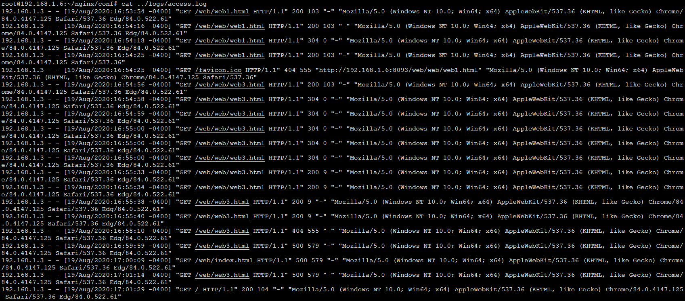

`head` 查看指定行数开头的内容。

```bash
root@192.168.1.6:~/nginx/sbin# head -2 ../logs/access.log
```

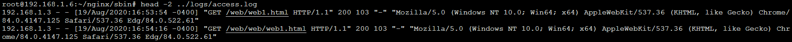

`tail` 查看指定行数结尾的内容。

```bash
root@192.168.1.6:~/nginx/conf# tail -2 ../logs/access.log
```

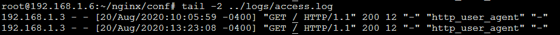

#### 2.1.1.15 生成密码文件

```bash
# 安装 httpd-tools
root@192.168.1.6:~/nginx/sbin# yum install httpd-tools
# 设置用户 store，密码 @store.123!，生成 user.pass 密码文件
root@192.168.1.6:~/nginx/sbin# htpasswd -bc /root/user.pass store @store.123!
Adding password for user store
# 查看文件内容
root@192.168.1.6:~/nginx/sbin# cat /root/user.pass
store:$apr1$xJGvt1Kc$7SAtusUhdWgb8KRdxYY7P0
```

#### 2.1.1.16 yum 命令

```bash
# 查找软件包 
yum search 

# 输入 ifconfig 提示 -bash: ifconfig: command not found
# 通过搜索得知 ifconfig 命令的包为 net-tools.x86_64。ip addr 命令和 ifconfig 命令效果差不多
yum search ifconfig
# 安装 net-tools
yum -y install net-tools
```

```bash
# 列出所有可安装的软件包 
yum list 
```

```bash
# 列出所有可更新的软件包 
yum list updates 
```

```bash
# 列出所有已安装的软件包 
yum list installed

# 1. 以 Docker 为例，列出已安装的 Docker ：docker.x86_64、docker-client.x86_64、docker-common.x86_64。
yum list installed | grep docker
# 2. 移除安装的 `Docker` 。
# 方法一：
yum -y remove docker.x86_64                        
yum -y remove docker-client.x86_64                  
yum -y remove docker-common.x86_64
# 方法二：
yum -y remove docker.x86_64 docker-client.x86_64 docker-common.x86_64
# 方法三：模糊移除所有 `Docker` 。
yum -y remove docker
```

```bash
# 列出所有已安装但不在 Yum 仓库内的软件包 
yum list extras
```

```bash
# 获取软件包信息 
yum info
```

```bash
# 列出所有可更新的软件包信息 
yum info updates
```

```bash
# 列出所有已安装的软件包信息 
yum info installed
```

```bash
# 列出所有已安装但不在 Yum 仓库内的软件包信息 
yum info extras
```

```bash
# 列出软件包提供哪些文件 
yum provides
```

#### 2.1.1.17 停止进程

```bash
# 查询 nginx 主进程号
ps -ef | grep nginx # 进程列表找到 nginx master 进程所在行，第一个编号就是主进程号。
# 从容停止 nginx
kill -QUIT 主进程号 # kill -QUIT 6957 （主进程以及相关进程都会停止）
# 快速停止 nginx
kill -TERM 主进程号 # kill -TERM 7546 （主进程以及相关进程都会停止）
# 强制停止 nginx
kill -9 主进程号    # kill -9 -97665 （只能停止 master 主进程，相关无法停止）
```

#### 2.1.1.18 扩展存储空间

> 安装 Python 的时候，提示空间不足，参考 [VMware虚拟机如何设置CentOS 7 磁盘扩容？](https://jingyan.baidu.com/article/ca00d56cad34dda89febcf7b.html) 解决了此问题。

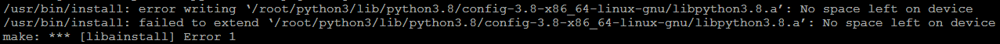

环境说明：<br/>
虚拟机软件：`Oracle VM VirtualBox`<br/>
系统：`CentOS 7.8`

1. 首先 [扩展虚拟硬盘容量](docs/07-System-assist.md#_711-扩展虚拟硬盘容量) 。

2. 查询磁盘空间占用情况，可以看到 `root` 剩余空间只剩下 `92k`。

```bash
root@192.168.1.6:~# df -h
Filesystem               Size  Used Avail Use% Mounted on
devtmpfs                 479M     0  479M   0% /dev
tmpfs                    492M     0  492M   0% /dev/shm
tmpfs                    492M  6.7M  486M   2% /run
tmpfs                    492M     0  492M   0% /sys/fs/cgroup
/dev/mapper/centos-root  6.7G  6.7G   92K 100% /
/dev/sda1                497M  130M  368M  27% /boot
tmpfs                     99M     0   99M   0% /run/user/0
```

3. 查看新磁盘的分区信息，扩展的存储空间已经增加到系统中，但是没有挂载，从两个分区的大小总和可以看出。

```bash
root@192.168.1.6:~# fdisk -l
Disk /dev/sda: 16.1 GB, 16106127360 bytes, 31457280 sectors
Units = sectors of 1 * 512 = 512 bytes
Sector size (logical/physical): 512 bytes / 512 bytes
I/O size (minimum/optimal): 512 bytes / 512 bytes
Disk label type: dos
Disk identifier: 0x00027253

   Device Boot      Start         End      Blocks   Id  System
/dev/sda1   *        2048     1026047      512000   83  Linux
/dev/sda2         1026048    16777215     7875584   8e  Linux LVM

Disk /dev/mapper/centos-root: 7159 MB, 7159676928 bytes, 13983744 sectors
Units = sectors of 1 * 512 = 512 bytes
Sector size (logical/physical): 512 bytes / 512 bytes
I/O size (minimum/optimal): 512 bytes / 512 bytes


Disk /dev/mapper/centos-swap: 859 MB, 859832320 bytes, 1679360 sectors
Units = sectors of 1 * 512 = 512 bytes
Sector size (logical/physical): 512 bytes / 512 bytes
I/O size (minimum/optimal): 512 bytes / 512 bytes
```

4. 对新增的磁盘进行分区操作。

```bash
root@192.168.1.6:~# fdisk  /dev/sda
Welcome to fdisk (util-linux 2.23.2).

Changes will remain in memory only, until you decide to write them.
Be careful before using the write command.


Command (m for help): p # 查看已分区的数量

Disk /dev/sda: 16.1 GB, 16106127360 bytes, 31457280 sectors
Units = sectors of 1 * 512 = 512 bytes
Sector size (logical/physical): 512 bytes / 512 bytes
I/O size (minimum/optimal): 512 bytes / 512 bytes
Disk label type: dos
Disk identifier: 0x00027253

   Device Boot      Start         End      Blocks   Id  System
/dev/sda1   *        2048     1026047      512000   83  Linux
/dev/sda2         1026048    16777215     7875584   8e  Linux LVM

Command (m for help): n # 新增一个分区
Partition type:
   p   primary (3 primary, 0 extended, 1 free)
   e   extended
Select (default e): p
Selected partition 3
Partition number (3-4, default 3): 3 # 输入默认分区号 3

.................................... # 终端操作内容丢失，使用作者的图片代替，接着，在显示的起始扇区直接敲回车键，在弹出的 Last 后面，直接敲回车键即可进入下一步

Command (m for help): p # 查看已分区的数量，已经多了一个分区

Disk /dev/sda: 16.1 GB, 16106127360 bytes, 31457280 sectors
Units = sectors of 1 * 512 = 512 bytes
Sector size (logical/physical): 512 bytes / 512 bytes
I/O size (minimum/optimal): 512 bytes / 512 bytes
Disk label type: dos
Disk identifier: 0x00027253

   Device Boot      Start         End      Blocks   Id  System
/dev/sda1   *        2048     1026047      512000   83  Linux
/dev/sda2         1026048    16777215     7875584   8e  Linux LVM
/dev/sda3        16777216    31457279     7340032   83  Linux

Command (m for help): w # 写入磁盘信息并保存
The partition table has been altered!

Calling ioctl() to re-read partition table.

WARNING: Re-reading the partition table failed with error 16: Device or resource busy.
The kernel still uses the old table. The new table will be used at
the next reboot or after you run partprobe(8) or kpartx(8)
Syncing disks.
root@192.168.1.6:~# reboot # 重启 CentOS
```

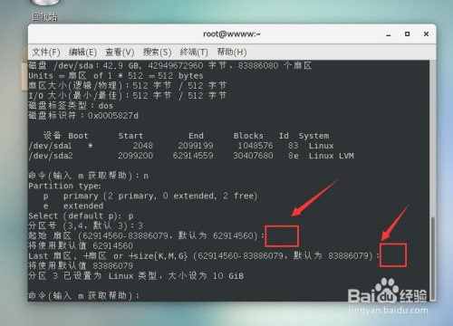

5. 重启完成后，查看磁盘卷组名。

```bash
root@192.168.1.6:~# vgdisplay
  --- Volume group ---
  VG Name               centos
  System ID             
  Format                lvm2
  Metadata Areas        1
  Metadata Sequence No  3
  VG Access             read/write
  VG Status             resizable
  MAX LV                0
  Cur LV                2
  Open LV               2
  Max PV                0
  Cur PV                1
  Act PV                1
  VG Size               <7.51 GiB
  PE Size               4.00 MiB
  Total PE              1922
  Alloc PE / Size       1912 / <7.47 GiB
  Free  PE / Size       10 / 40.00 MiB
  VG UUID               G1IckR-BqGy-po4L-uYVw-zLMc-S037-jS7SDP
```

6. 初始化新增的分区。

```bash
root@192.168.1.6:~# pvcreate  /dev/sda3
WARNING: dos signature detected on /dev/sda3 at offset 510. Wipe it? [y/n]: y
  Wiping dos signature on /dev/sda3.
  Physical volume "/dev/sda3" successfully created.
```

7. 将刚才初始化的分区加入到虚拟卷组名中。

```bash
root@192.168.1.6:~# vgextend centos /dev/sda3
  Couldn't create temporary archive name.
```

!> 输入命令出现 `Couldn't create temporary archive name.`，在 [CSDN](https://blog.csdn.net/weixin_41772761/article/details/102662739) 看到一篇文章，因为存储空间使用 `100%`，无法挂载，须预留部分空间出来，所以删除 `Python` 安装文件。

```bash
root@192.168.1.6:~# rm -rf Python-3.8.5
root@192.168.1.6:~# rm -rf python3
root@192.168.1.6:~# vgextend centos /dev/sda3
  Volume group "centos" successfully extended
```

8. 查看卷组的详细信息，可以看到刚增加的 `7.04G` 空间还是处于空闲的状态。

```bash
root@192.168.1.6:~# vgdisplay
  --- Volume group ---
  VG Name               centos
  System ID             
  Format                lvm2
  Metadata Areas        2
  Metadata Sequence No  5
  VG Access             read/write
  VG Status             resizable
  MAX LV                0
  Cur LV                2
  Open LV               2
  Max PV                0
  Cur PV                2
  Act PV                2
  VG Size               14.50 GiB
  PE Size               4.00 MiB
  Total PE              3713
  Alloc PE / Size       1912 / <7.47 GiB
  Free  PE / Size       1801 / <7.04 GiB
  VG UUID               G1IckR-BqGy-po4L-uYVw-zLMc-S037-jS7SDP
```

9. 查看并记下需要扩展的文件系统名 `/dev/mapper/centos-root`，不同版本可能有所区别。

```bash
root@192.168.1.6:~# df -h
Filesystem               Size  Used Avail Use% Mounted on
devtmpfs                 479M     0  479M   0% /dev
tmpfs                    492M     0  492M   0% /dev/shm
tmpfs                    492M  6.7M  486M   2% /run
tmpfs                    492M     0  492M   0% /sys/fs/cgroup
/dev/mapper/centos-root  6.7G  6.3G  412M  94% /
/dev/sda1                497M  130M  368M  27% /boot
tmpfs                     99M     0   99M   0% /run/user/0
```

10. 扩展卷组容量。

!> 扩展容量小于新增分区的大小，不然会扩展失败，我这里是 `7G`。

```bash
root@192.168.1.6:~# lvextend -L +7G /dev/mapper/centos-root
  Size of logical volume centos/root changed from <6.67 GiB (1707 extents) to <13.67 GiB (3499 extents).
  Logical volume centos/root successfully resized.
```

11. 查看当前的卷组，`/dev/sda3` 显示的信息中卷组已经扩容成功了，接下来需要将文件系统也扩容。

```bash
root@192.168.1.6:~# pvdisplay
  --- Physical volume ---
  PV Name               /dev/sda2
  VG Name               centos
  PV Size               7.51 GiB / not usable 3.00 MiB
  Allocatable           yes (but full)
  PE Size               4.00 MiB
  Total PE              1922
  Free PE               0
  Allocated PE          1922
  PV UUID               YZNg77-ijrg-XxkR-VGGx-h455-aSbg-eZTV2C
   
  --- Physical volume ---
  PV Name               /dev/sda3
  VG Name               centos
  PV Size               7.00 GiB / not usable 4.00 MiB
  Allocatable           yes 
  PE Size               4.00 MiB
  Total PE              1791
  Free PE               9
  Allocated PE          1782
  PV UUID               oXMofo-A12j-7N6r-CwEI-GnUJ-yLKI-ZjNId5
```

12. 查看文件系统的格式。

```bash
root@192.168.1.6:~# cat /etc/fstab | grep centos-root
/dev/mapper/centos-root /                       xfs     defaults        0 0
```

13. 扩展磁盘空间。

```bash
root@192.168.1.6:~# xfs_growfs /dev/mapper/centos-root
meta-data=/dev/mapper/centos-root isize=256    agcount=4, agsize=436992 blks
         =                       sectsz=512   attr=2, projid32bit=1
         =                       crc=0        finobt=0 spinodes=0
data     =                       bsize=4096   blocks=1747968, imaxpct=25
         =                       sunit=0      swidth=0 blks
naming   =version 2              bsize=4096   ascii-ci=0 ftype=0
log      =internal               bsize=4096   blocks=2560, version=2
         =                       sectsz=512   sunit=0 blks, lazy-count=1
realtime =none                   extsz=4096   blocks=0, rtextents=0
data blocks changed from 1747968 to 3582976
```

!> 不同的文件系统要用不同的命令，不然会导致报错。

14. 查看磁盘大小，可以看到，`/dev/mapper/centos-root` 已经扩展到 `14G`。

```bash
root@192.168.1.6:~# df -h
Filesystem               Size  Used Avail Use% Mounted on
devtmpfs                 479M     0  479M   0% /dev
tmpfs                    492M     0  492M   0% /dev/shm
tmpfs                    492M  6.7M  486M   2% /run
tmpfs                    492M     0  492M   0% /sys/fs/cgroup
/dev/mapper/centos-root   14G  6.3G  7.5G  46% /
/dev/sda1                497M  130M  368M  27% /boot
tmpfs                     99M     0   99M   0% /run/user/0
```

#### 2.1.1.19 Centos 7.8 误删 Python 2.7 之后，导致 yum 无法使用

> 最近学习 `uwsgi协议的反向代理`，使用 `pip` 安装 `uwsgi`，提示没有 `pip` 这个命令，所以卸载了系统的 `Python 2.7`，安装了 `Python 3.8.5` 新版本，以下解决方案参考 [博客园](https://www.cnblogs.com/sueyyyy/p/10410832.html) 。

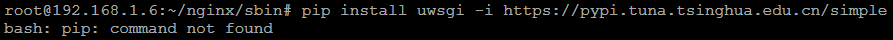

卸载 `Python` 及其依赖命令：

```bash
# 强制删除已安装 python 及其依赖
rpm -qa|grep python|xargs rpm -ev --allmatches --nodeps
# 删除残留文件
whereis python|xargs rm -frv
```

运行 `yum` 安装 `Python` 时，提示没有此文件或者目录。

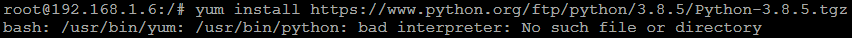

解决方案：

1. 使用 `wget` 分别下载以下 `rpm`，[CentOS官网]( http://vault.centos.org/) 找到对应版本的包。

```bash
wget http://centos.ustc.edu.cn/centos/7.8.2003/os/x86_64/Packages/python-2.7.5-88.el7.x86_64.rpm
wget http://centos.ustc.edu.cn/centos/7.8.2003/os/x86_64/Packages/python-IPy-0.75-6.el7.noarch.rpm
wget http://centos.ustc.edu.cn/centos/7.8.2003/os/x86_64/Packages/python-augeas-0.5.0-2.el7.noarch.rpm
wget http://centos.ustc.edu.cn/centos/7.8.2003/os/x86_64/Packages/python-backports-1.0-8.el7.x86_64.rpm
wget http://centos.ustc.edu.cn/centos/7.8.2003/os/x86_64/Packages/python-backports-ssl_match_hostname-3.5.0.1-1.el7.noarch.rpm
wget http://centos.ustc.edu.cn/centos/7.8.2003/os/x86_64/Packages/python-configobj-4.7.2-7.el7.noarch.rpm
wget http://centos.ustc.edu.cn/centos/7.8.2003/os/x86_64/Packages/python-dateutil-1.5-7.el7.noarch.rpm
wget http://centos.ustc.edu.cn/centos/7.8.2003/os/x86_64/Packages/python-decorator-3.4.0-3.el7.noarch.rpm
wget http://centos.ustc.edu.cn/centos/7.8.2003/os/x86_64/Packages/python-dmidecode-3.12.2-4.el7.x86_64.rpm
wget http://centos.ustc.edu.cn/centos/7.8.2003/os/x86_64/Packages/python-ethtool-0.8-8.el7.x86_64.rpm
wget http://centos.ustc.edu.cn/centos/7.8.2003/os/x86_64/Packages/python-firewall-0.6.3-8.el7.noarch.rpm
wget http://centos.ustc.edu.cn/centos/7.8.2003/os/x86_64/Packages/python-gobject-base-3.22.0-1.el7_4.1.x86_64.rpm
wget http://centos.ustc.edu.cn/centos/7.8.2003/os/x86_64/Packages/python-iniparse-0.4-9.el7.noarch.rpm
wget http://centos.ustc.edu.cn/centos/7.8.2003/os/x86_64/Packages/python-inotify-0.9.4-4.el7.noarch.rpm
wget http://centos.ustc.edu.cn/centos/7.8.2003/os/x86_64/Packages/python-ipaddress-1.0.16-2.el7.noarch.rpm
wget http://centos.ustc.edu.cn/centos/7.8.2003/os/x86_64/Packages/python-libs-2.7.5-88.el7.x86_64.rpm
wget http://centos.ustc.edu.cn/centos/7.8.2003/os/x86_64/Packages/python-linux-procfs-0.4.11-4.el7.noarch.rpm
wget http://centos.ustc.edu.cn/centos/7.8.2003/os/x86_64/Packages/python-perf-3.10.0-1127.el7.x86_64.rpm
wget http://centos.ustc.edu.cn/centos/7.8.2003/os/x86_64/Packages/python-pycurl-7.19.0-19.el7.x86_64.rpm
wget http://centos.ustc.edu.cn/centos/7.8.2003/os/x86_64/Packages/python-pyudev-0.15-9.el7.noarch.rpm
wget http://centos.ustc.edu.cn/centos/7.8.2003/os/x86_64/Packages/python-schedutils-0.4-6.el7.x86_64.rpm
wget http://centos.ustc.edu.cn/centos/7.8.2003/os/x86_64/Packages/python-setuptools-0.9.8-7.el7.noarch.rpm
wget http://centos.ustc.edu.cn/centos/7.8.2003/os/x86_64/Packages/python-six-1.9.0-2.el7.noarch.rpm
wget http://centos.ustc.edu.cn/centos/7.8.2003/os/x86_64/Packages/python-slip-0.4.0-4.el7.noarch.rpm
wget http://centos.ustc.edu.cn/centos/7.8.2003/os/x86_64/Packages/python-slip-dbus-0.4.0-4.el7.noarch.rpm
wget http://centos.ustc.edu.cn/centos/7.8.2003/os/x86_64/Packages/python-srpm-macros-3-32.el7.noarch.rpm
wget http://centos.ustc.edu.cn/centos/7.8.2003/os/x86_64/Packages/python-syspurpose-1.24.26-1.el7.centos.x86_64.rpm
wget http://centos.ustc.edu.cn/centos/7.8.2003/os/x86_64/Packages/python-urlgrabber-3.10-10.el7.noarch.rpm
wget http://centos.ustc.edu.cn/centos/7.8.2003/os/x86_64/Packages/python2-futures-3.1.1-5.el7.noarch.rpm
wget http://centos.ustc.edu.cn/centos/7.8.2003/os/x86_64/Packages/yum-3.4.3-167.el7.centos.noarch.rpm
wget http://centos.ustc.edu.cn/centos/7.8.2003/os/x86_64/Packages/yum-metadata-parser-1.1.4-10.el7.x86_64.rpm
wget http://centos.ustc.edu.cn/centos/7.8.2003/os/x86_64/Packages/yum-plugin-aliases-1.1.31-53.el7.noarch.rpm
wget http://centos.ustc.edu.cn/centos/7.8.2003/os/x86_64/Packages/yum-plugin-protectbase-1.1.31-53.el7.noarch.rpm
wget http://centos.ustc.edu.cn/centos/7.8.2003/os/x86_64/Packages/yum-utils-1.1.31-53.el7.noarch.rpm
wget http://centos.ustc.edu.cn/centos/7.8.2003/os/x86_64/Packages/rpm-python-4.11.3-43.el7.x86_64.rpm
```

2. 安装 `rpm`。

```bash
rpm -Uvh --replacepkgs python*.rpm --nodeps --force
rpm -Uvh --replacepkgs rpm-python*.rpm yum*.rpm --nodeps --force
```

> `--nodeps --force` 表示仅安装当前的，不考虑安装所需的依赖。

经过以上2个步骤，`yum` 可以使用，但是新的问题出现了，目前没有找到解决方案，先记录在此，不过不影响使用。

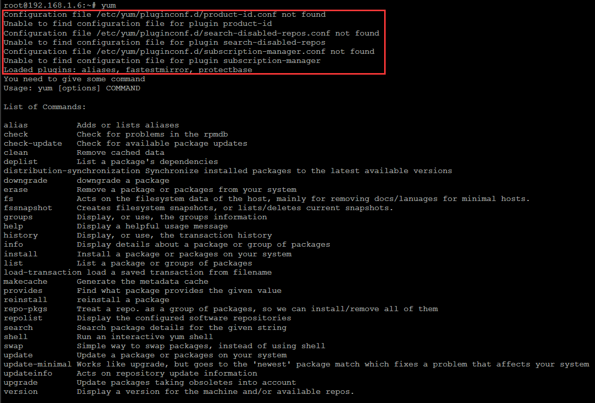

#### 2.1.1.20 安装 Python 3.8.5

> 参考 [CSDN](https://blog.csdn.net/qq_42353939/article/details/94609591)，记录安装步骤，略有改动。

建议安装前确认相关依赖是否安装完毕，否则遇到各种依赖问题，需要反复编译、安装，浪费时间。

1. 下载。

```bash
wget https://www.python.org/ftp/python/3.8.5/Python-3.8.5.tgz
# 官方下载缓慢，使用淘宝源
wget https://npm.taobao.org/mirrors/python/3.8.5/Python-3.8.5.tgz
```

2. 解压。

```bash
tar -xzvf Python-3.8.5.tgz
```

3. 创建安装目录。

```bash
mkdir /root/python3
```

4. 运行 `configure` 。

```bash
cd Python-3.8.5
./configure --enable-optimizations --prefix=/root/python3/
```

5. 编译、安装。

```bash
make && sudo make altinstall
```

6. 添加环境变量。

> 如果不添加环境变量，不能在任意路径下使用 `python3.8`，所以在 `root` 根目录 `.bashrc` 文件中添加 `PATH=/root/python3/bin:$PATH`，多个变量用 `:` 隔开。

```bashrc
# .bashrc

# User specific aliases and functions

alias rm='rm -i'
alias cp='cp -i'
alias mv='mv -i'

# Source global definitions
if [ -f /etc/bashrc ]; then
	. /etc/bashrc
fi

PATH=/root/python3/bin:$PATH
```

7. 使环境变量配置生效。

```bash
source ~/.bashrc
```

!> 错误一：zipimport.ZipImportError: can't decompress data; zlib not available

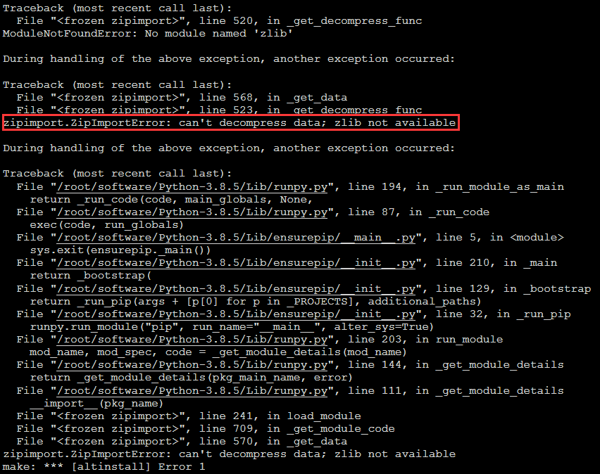

参考 [CSDN](https://blog.csdn.net/blueheart20/article/details/72827666) 文章得知，缺少 `zlib` 解压缩类库。

```bash
yum -y install zlib*
```

!> 错误二：安装 `Python` 完成后，使用 `pip3.8` 安装 `uwsgi` 或者 `ansible`，都会出现错误 `·ModuleNotFoundError: No module named '_ctypes'` 。

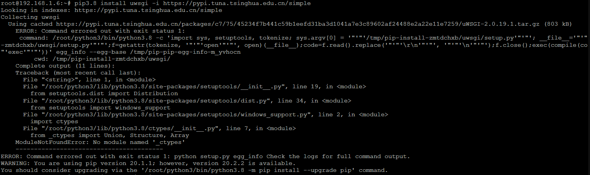

解决方案：

1. 首先安装 `Python` 的依赖 `libffi-devel` 。

```bash
yum install libffi-devel
```

2. 接着，`Python` 安装步骤 4~5，重新运行一遍。

#### 2.1.1.21 tailf、tail -f、tail -F 三者区别

> 本文转载自 [博客园](https://www.cnblogs.com/jackzz/p/9358213.html) 。

<table>
	<tr>
	    <th>命令</th>
	    <th>描述</th>
	    <th>操作</th>
	</tr>
	<tr>
	    <td>tail -f</td>
	    <td>等同于&ensp;--follow=descriptor，根据文件描述符进行追踪，当文件改名或被删除，追踪停止</td>
	    <td rowspan="3">
            此时要想暂停刷新，使用【Ctrl】+【S】暂停终端。<br/>
            若想继续终端，使用【Ctrl】+【Q】。<br/>
            若想退出 tail 命令，直接使用【Ctrl】+【C】。
        </td>
	</tr>
	<tr>
	    <td>tail -F</td>
	    <td>
            等同于&ensp;--follow=name&ensp;--retry，根据文件名进行追踪，并保持重试，即该文件被删除或改<br/>
            名后，如果再次创建相同的文件名，会继续追踪
        </td>
	</tr>
	<tr>
	    <td>tailf</td>
	    <td>
            等同于&ensp;tail&ensp;-f&ensp;-n&ensp;10（貌似&ensp;tail&ensp;-f&ensp;或&ensp;-F&ensp;默认也是打印最后&ensp;10&ensp;行，然后追踪文件），与<br/>
            tail&ensp;-f&ensp;不同的是，如果文件不增长，它不会去访问磁盘文件，所以&ensp;tailf&ensp;特别适合那些便携<br/>
            机上跟踪日志文件，因为它减少了磁盘访问，可以省电 
        </td>
	</tr>
</table>

#### 2.1.1.22 crontab 命令

> 本文转载自 [博客园](https://www.cnblogs.com/xssxss/archive/2012/12/04/2801050.html) 。

1. `root` 身份登录到命令行。

2. 输入 `crontab -e` 并回车。

3. 按下 `A` 键进入到编辑模式。

4. 输入 `0 0 * * *  /root/nginx/nginx_log_rotate.sh` 。

5. 同时按下 `Ctrl + C` 退出编辑模式。

6. 按下 `Shift + :` 输入 `wq` 退出 `crontab` 。

#### 2.1.1.23 zip、unzip 命令

> 本文部分内容转载自 [CSDN](https://blog.csdn.net/crazycui/article/details/52239234) ，略有修改。

```bash
# 压缩成 zip 的目标文件放在前面，源文件或目录放在最后
root@192.168.1.6:~# zip yum_source.zip yum_source 
  adding: yum_source/ (stored 0%)
```

```bash
# 解压时，如果有同名文件或者目录，会提示是否替换，重命名
root@192.168.1.6:~# unzip yum_source.zip
Archive:  yum_source.zip
replace yum_source? [y]es, [n]o, [A]ll, [N]one, [r]ename: y 
  inflating: yum_source
```

批量解压 `zip` 文件

方法一：

> 用 `;` 或者 `&&` 隔开，执行解压，适用于对象较少的时候。

```bash
# && 分隔分别执行解压
root@192.168.1.6:~# unzip index.zip && unzip readme.zip && unzip a.zip && unzip hello.zip
# ; 分隔分别执行解压
root@192.168.1.6:~# unzip index.zip; unzip readme.zip; unzip a.zip; unzip hello.zip
```

方法二：

```bash
root@192.168.1.6:~# find . -name '*.zip' -exec unzip {} \;
```

方法三：

> 以覆盖的方式解压，`unzip` 后面加上 `-o` 参数。`n1` 中是数字 `1`，不是字母 `l` 。

```bash
root@192.168.1.6:~# ls *.zip | xargs -n1 unzip -o -P infected
```

方法四：

创建 `unzip.sh` 脚本文件，使用 `for` 循环解压。

```sh
#!/bin/bash
for i in *.zip
do
	unzip -o $i
done
```

执行 `sh` 脚本的两种方法。

```bash
# 方法一：当前目录下执行
root@192.168.1.6:~# ./unzip.sh
# 方法二：添加权限执行
root@192.168.1.6:~# chmod +x unzip.sh
root@192.168.1.6:~# sh unzip.sh
```

#### 2.1.1.24 修改系统时间以及时区

> 参考 [博客园-文帅不吃香菜](https://www.cnblogs.com/yizhipanghu/p/11579516.html) [博客园-白不菜](https://www.cnblogs.com/BaiGuodong/p/5532124.html) [CSDN](https://blog.csdn.net/boy_vansun/article/details/50735706) 文章修改。

环境说明：<br/>
系统：`CentOS 7.8`

1. 修改时区。

> 使用 `timedatectl` 命令检查系统时区是否正确，如果不正确修改，否则跳过此步骤。

方法一：

`etc` 目录下 `profile` 文件末尾追加 `export TZ='Asia/Shanghai'` 。

```bash
root@192.168.1.6:~#  export TZ='Asia/Shanghai'
root@192.168.1.6:~# reboot

Last login: Tue Aug 25 07:30:35 2020 from 192.168.1.3
[root@localhost ~]# 
root@192.168.1.6:/# timedatectl 
      Local time: Tue 2020-08-25 07:32:27 CST
  Universal time: Mon 2020-08-24 23:32:27 UTC
        RTC time: Tue 2020-08-25 07:32:27
       Time zone: Asia/Shanghai (CST, +0800)
     NTP enabled: n/a
NTP synchronized: no
 RTC in local TZ: yes
      DST active: n/a

Warning: The system is configured to read the RTC time in the local time zone.
         This mode can not be fully supported. It will create various problems
         with time zone changes and daylight saving time adjustments. The RTC
         time is never updated, it relies on external facilities to maintain it.
         If at all possible, use RTC in UTC by calling
         'timedatectl set-local-rtc 0'.
```

> 几天后发现修改过的时间恢复为以前的状态了，目前已经按照如上教程修改时间，后面如果再次出现这种问题，彻底解决掉。

方法二：

```bash
# 删除当前默认时区
root@192.168.1.6:~#  rm -rf /etc/localtime
# 复制替换默认时区为上海
root@192.168.1.6:~#  ln -s /usr/share/zoneinfo/Asia/Shanghai /etc/localtime
```

方法三：

```bash
# 设置系统时区为上海
root@192.168.1.6:~#  timedatectl set-timezone Asia/Shanghai
```

方法四：

```bash
# 设置系统时区为上海
root@192.168.1.6:~#  cp /usr/share/zoneinfo/Asia/Shanghai /etc/localtime # 和方法二类似，命令不同
```

2. 时间自动同步和校正。

```bash
# 安装时间同步服务（组件)
root@192.168.1.6:/# yum install -y ntp
# 设置同步服务器
root@192.168.1.6:/# ntpdate us.pool.ntp.org
28 Aug 02:15:13 ntpdate[8597]: step time server 4.53.160.75 offset 28802.083609 sec
# 查看系统时间方面的各种状态
root@192.168.1.6:/# timedatectl 
      Local time: Fri 2020-08-28 02:28:50 CST
  Universal time: Thu 2020-08-27 18:28:50 UTC
        RTC time: Thu 2020-08-27 18:28:48
       Time zone: Asia/Shanghai (CST, +0800)
     NTP enabled: no
NTP synchronized: no
 RTC in local TZ: yes
      DST active: n/a

Warning: The system is configured to read the RTC time in the local time zone.
         This mode can not be fully supported. It will create various problems
         with time zone changes and daylight saving time adjustments. The RTC
         time is never updated, it relies on external facilities to maintain it.
         If at all possible, use RTC in UTC by calling
         'timedatectl set-local-rtc 0'.
```

3. 将硬件时间和本地时间设置为同一个值。

```bash
root@192.168.1.6:/# hwclock --systohc
root@192.168.1.6:/# timedatectl
      Local time: Fri 2020-08-28 02:38:48 CST
  Universal time: Thu 2020-08-27 18:38:48 UTC
        RTC time: Fri 2020-08-28 02:38:48
       Time zone: Asia/Shanghai (CST, +0800)
     NTP enabled: no
NTP synchronized: no
 RTC in local TZ: yes
      DST active: n/a

Warning: The system is configured to read the RTC time in the local time zone.
         This mode can not be fully supported. It will create various problems
         with time zone changes and daylight saving time adjustments. The RTC
         time is never updated, it relies on external facilities to maintain it.
         If at all possible, use RTC in UTC by calling
         'timedatectl set-local-rtc 0'.
```

#### 2.1.1.25 reboot 和 init 6 的区别

> 本文转载自 [博客园](https://www.cnblogs.com/yizhipanghu/p/11579516.html) 。

`init 6`、`reboot` 两个命令都是重新启动机器。
`init` 命令用于改变操作系统的运行级别。

对这两个操作使用 `man` 命令看到的内容如下：<br/>
`init 6` 基于一系列 `/etc/inittab` 文件，并且每个应用都会有一个相应 `shutdown` 脚本。<br/>
`init 6` 调用一系列 `shutdown` 脚本(`/etc/rc0.d/K*`)来使系统优雅关机;<br/>
`reboot` 并不执行这些过程，`reboot` 更是一个 `kernel` 级别的命令，不对应用使用 `shutdown` 脚本。

reboot - reboot performs a sync(1M) operation on the disks, and then a multi- user reboot is initiated. See init(1M) for details.<br/>
init 6 Stop the operating system and reboot to the state defined by the initdefault entry in /etc/inittab.

我们应该在通常情况下使用 `init 6` 。<br/>
在出问题的状况下或强制重启时使用 `reboot` 。

#### 2.1.1.26 误删 root 目录

> 本文转载自 [CSDN](https://blog.csdn.net/m0_38014125/article/details/80782693) ，内容略有修改。

安装 `pyenv-virtualenv` 的时候，路径安装错误，根目录出现一个 `~` 路径，想都没想就把它删除了，重新查看时，发现 `root` 目录不见了。

解决方案：

1. 创建 `root` 目录。

```bash
mkdir root
```
2. 复制 `/etc/skel/` 下的所有文件到 `root` 目录。

```bash
cp -a /etc/skel/.[!.]* /root
```

#### 2.1.1.27 vim 命令

| 序号 |       命令       |    含义    |
| :--: | :--------------: | :--------: |
|  1   |       `i`        |    编辑    |
|  2   |    `Ctrl + C`    |  结束编辑  |
|  3   | `:wq` 或者 `:x` | 保存并退出 |

```bash
# 使用 vim 打开 uwsgi.ini
root@192.168.1.8:~/test_nginx# vim uwsgi/uwsgi.ini
```

#### 2.1.1.28 sudo su 和 su 的区别

> 本文转载自 [博客园](https://www.cnblogs.com/jiading/p/11717388.html) 。

`su` 是申请切换 `root` 用户，需要申请 `root` 用户密码。有些 `Linux` 发行版，例如 `Ubuntu` ，默认没有设置 `root` 用户的密码，所以需要我们先使用 `sudo passwd root` 设置 `root` 用户密码。

而 `sudo su` 是当前用户暂时申请 `root` 权限，所以输入的不是 `root` 用户密码，而是当前用户的密码。`sudo` 是用户申请管理员权限执行一个操作，而此处的操作就是变成管理员，使用完后，输入 `exit` 退出管理员状态。

拓展：

`sudo` 是 `Linux` 系统管理指令，是允许系统管理员让普通用户执行一些或者全部的 `root` 命令的一个工具，如 `halt`，`reboot`，`su` 等等。这样不仅减少了 `root` 用户的登录和管理时间，同样也提高了安全性。`sudo` 不是对 `shell` 的一个代替，它是面向每个命令的。

它的特性主要有这样几点：

`sudo` 能够限制用户只在某台主机上运行某些命令。

`sudo` 提供了丰富的日志，详细地记录了每个用户干了什么。它能够将日志传到中心主机或者日志服务器。

`sudo` 使用时间戳文件来执行类似的“检票”系统。当用户调用 `sudo` 并且输入它的密码时，用户获得了一张存活期为 `5` 分钟的票（这个值可以在编译的时候改变）。之后的一段时间内（默认为 `5` 分钟，可在 `/etc/sudoers` 自定义），使用 `sudo` 不需要再次输入密码。

`sudo` 的配置文件是 `sudoers` 文件，它允许系统管理员集中的管理用户的使用权限和使用的主机。它所存放的位置默认是在 `/etc/sudoers`，属性必须为 `0440`。

在 `sudo` 于 `1980` 年前后被写出之前，一般用户管理系统的方式是利用 `su` 切换为超级用户。但是使用 `su` 的缺点之一在于必须要先告知超级用户的密码

由于不需要超级用户的密码，部分类 `Unix` 系统甚至利用 `sudo` 使一般用户取代超级用户作为管理帐号，例如 `Ubuntu` 、`Mac OS` 等。

#### 2.1.1.29 设置静态 IP

> 参考 [博客园](https://www.cnblogs.com/qianyuliang/archive/2019/09/26/11591970.html) 文章修改静态 `IP` 。

环境说明：`CentOS 8.2`

1. 进入 `/etc/sysconfig/network-scripts/` 路径下。

```bash
root@192.168.1.5:~# cd /etc/sysconfig/network-scripts/
```

2. 编辑 `ifcfg-enp0s3` 文件。

> 修改前备份 `ifcfg-enp0s3` 文件。

```bash
root@192.168.1.5:/etc/sysconfig/network-scripts# vi ifcfg-enp0s3
```

`ifcfg-enp0s3` 配置文件内容如下。

```bash
TYPE="Ethernet"
PROXY_METHOD="none"
BROWSER_ONLY="no"

# BOOTPROTO 参数有 3 个值，static（静态），dhcp（动态）或 none（不指定）
BOOTPROTO="static"
DEFROUTE="yes"
IPV4_FAILURE_FATAL="no"
IPV6INIT="yes"
IPV6_AUTOCONF="yes"
IPV6_DEFROUTE="yes"
IPV6_FAILURE_FATAL="no"
IPV6_ADDR_GEN_MODE="stable-privacy"
NAME="enp0s3"
UUID="cb2032f6-063d-4063-b5e1-963b42c7afb8"
DEVICE="enp0s3"
ONBOOT="yes"

# 设置IP地址
IPADDR=192.168.1.5
NETMASK=255.255.255.0
GATEWAY=192.168.1.1
DNS1=192.168.1.1
```

3. 重新回载网络配置。

!> 使用 `service network restart` 重启网络提示 `Failed to restart network.service: Unit network.service not found.` ，参考博客园的文章，使用 `nmcli` 。

```bash
root@192.168.1.5:/etc/sysconfig/network-scripts# service network restart
Redirecting to /bin/systemctl restart network.service
Failed to restart network.service: Unit network.service not found.
root@192.168.1.5:/etc/sysconfig/network-scripts# nmcli c reload
```

4. 查看网络状态。

```bash
root@192.168.1.5:/etc/sysconfig/network-scripts# nmcli
enp0s3: 已连接 到 enp0s3
        "Intel 82540EM"
        ethernet (e1000), 08:00:27:98:AC:1F, 硬件, mtu 1500
        ip4 默认
        inet4 192.168.1.5/24
        route4 192.168.1.0/24
        route4 0.0.0.0/0
        inet6 fe80::34c0:ab4f:f990:84aa/64
        route6 fe80::/64
        route6 ff00::/8

lo: 未托管
        "lo"
        loopback (unknown), 00:00:00:00:00:00, 软件, mtu 65536

DNS configuration:
        servers: 192.168.1.1
        interface: enp0s3

使用 "nmcli device show" 获取关于已知设备的完整信息，以及 
"nmcli connection show" 获取活动连接配置集的概述。

完整的用法细节，可参考 nmcli(1) 和 nmcli-examples(7) 手册页。
```

### 2.1.2 Kali

#### 2.1.2.1 设置静态 IP

> 参考 [CSDN](https://blog.csdn.net/veiTian/article/details/108318591) 文章修改静态 `IP` 。

1. 编辑 `interfaces` 文件，设置静态 `IP` 相关属性。

```bash
kali@192.168.1.4:~$ sudo su
[sudo] password for kali: 
root@kali:/home/kali# vim /etc/network/interfaces
```

`interfaces` 配置文件内容：

```bash
# This file describes the network interfaces available on your system
# and how to activate them. For more information, see interfaces(5).

source /etc/network/interfaces.d/*

# The loopback network interface
auto lo
iface lo inet loopback

auto eth0
# 使用静态地址
inface eth0 inet static   
# 设置 IP 地址
address 192.168.1.4   
# 设置网关
gateway 192.168.1.1    
# 设置子网掩码
netmask  255.255.255.0   
```

> `auto lo` 与 `auto eth0` 是指 `lo` 接口跟 `eth0` 接口会在系统启动时被自动配置。<br/>
`iface lo inet loopback` 将 `lo` 接口设置为一个本地回环（`loopback`）地址。

2. 编辑 `resolv.conf` 文件，添加 `DNS` 。

```bash
root@kali:/home/kali# vim /etc/resolv.conf                          
```

`resolv.conf` 文件内容：

```bash
# Generated by NetworkManager
# 设置 DNS 服务器的 IP 地址
nameserver 192.168.1.1                          
```

`resolv.conf` 文件是 `DNS` 客户机配置文件，用于设置 `DNS` 服务器的 `IP` 地址及 `DNS` 域名，还包含了主机的域名搜索顺序。该文件是由域名解析器（`resolver` ：一个根据主机名解析 `IP` 地址的库）使用的配置文件。

`resolv.conf` 的关键字主要有四个，分别是：

| 序号 |    关键字    |           含义            |
| :--: | :----------: | :-----------------------: |
|  1   | `nameserver` | 定义 `DNS` 服务器的IP地址 |
|  2   |   `domain`   |       定义本地域名        |
|  3   |   `search`   |    定义域名的搜索列表     |
|  4   |  `sortlist`  |   对返回的域名进行排序    |

3. 重启网络。

```bash
kali@192.168.1.4:~$ /etc/init.d/networking restart
Restarting networking (via systemctl): networking.service==== AUTHENTICATING FOR org.freedesktop.systemd1.manage-units ===
Authentication is required to restart 'networking.service'.
Authenticating as: kali,,, (kali)
Password: 
==== AUTHENTICATION COMPLETE ===
```