## 4.1 数据库 {docsify-ignore}

### 4.1.1 MySQL

#### 4.1.1.1 1130-Host ‘主机名’ is not allowed to connect to this MySQL server

错误提示如下：


解决方案：

```sql
-- 1. 更改需要登录用户的 ‘host’ 为 ‘%’。
update user set host = '%' where user ='root';

-- 2. 刷新 ‘MySQL’ 的系统权限相关表。
flush privileges;
```

> 执行后，再次连接测试。如果还不行，重启 `MySQL` 服务。

#### 4.1.1.2 2003-Can't connect to MySQL server on ‘IP’(10060)

错误提示如下：


> 如上图所示，原因是防火墙拦截了 `MySQL` 的端口号，导致访问不通。

解决方案：

1. `控制面板` → `系统和安全`。

  

2. 点击 `Windows Defender 防火墙`。

  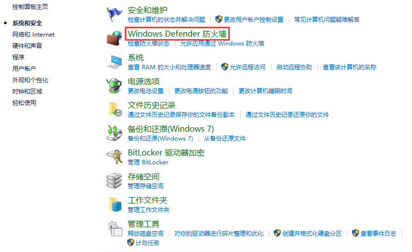

3. 点击 `高级设置`。

  

4. 点击 `入站规则`，然后 `新建规则`。

  

5. 选择 `端口`，点击 `下一步`。

  

6. 默认 `TCP`，`特定本地端口` 录入 `MySQL` 的端口。

  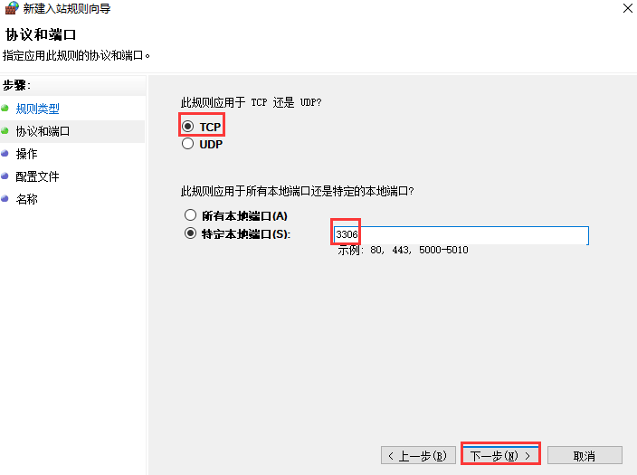

7. 默认 `允许连接`，点击 `下一步`。

  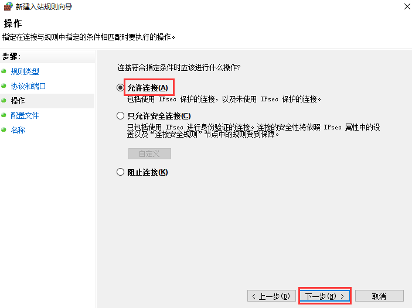

8. 点击 `下一步`。

  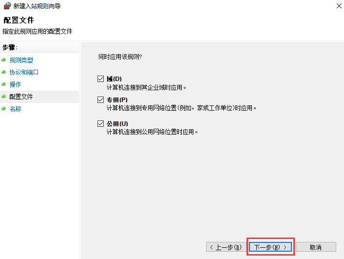

9. 最后录入 `名称`，点击 `完成`。

  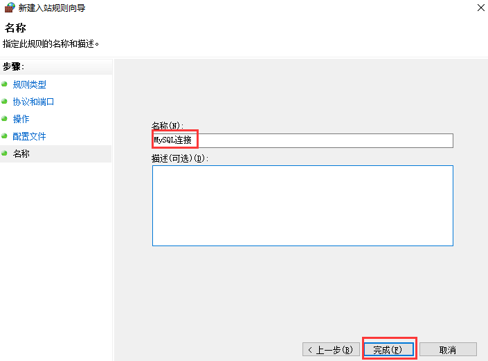

#### 4.1.1.3 The server time zone value '�й���׼ʱ��' is unrecognized or represents more than...

1. 环境说明。
 
  * MySQL：`8.0.19`
  * MySQL 驱动：`8.0.21`

2. 数据源配置。

  ```xml
  <!--配置数据源-->
  <bean id="dataSource" class="com.mchange.v2.c3p0.ComboPooledDataSource">
      <property name="driverClass" value="com.mysql.cj.jdbc.Driver"></property>
      <property name="jdbcUrl" value="jdbc:mysql://localhost:3306/spring-learn"></property>
      <property name="user" value="root"></property>
      <property name="password" value="1"></property>
  </bean>
  ```

3. 程序调用与数据库交互的方法时，出现如下错误：

  ```error
  Caused by: com.mysql.cj.exceptions.InvalidConnectionAttributeException: The server time zone value '�й���׼ʱ��' is unrecognized or represents more than one time zone. You must   configure either the server or JDBC driver (via the 'serverTimezone' configuration property) to use a more specifc time zone value if you want to utilize time zone support.
  	at sun.reflect.GeneratedConstructorAccessor42.newInstance(Unknown Source)
  	at sun.reflect.DelegatingConstructorAccessorImpl.newInstance(DelegatingConstructorAccessorImpl.java:45)
  	at java.lang.reflect.Constructor.newInstance(Constructor.java:423)
  	at com.mysql.cj.exceptions.ExceptionFactory.createException(ExceptionFactory.java:61)
  	at com.mysql.cj.exceptions.ExceptionFactory.createException(ExceptionFactory.java:85)
  	at com.mysql.cj.util.TimeUtil.getCanonicalTimezone(TimeUtil.java:132)
  	at com.mysql.cj.protocol.a.NativeProtocol.configureTimezone(NativeProtocol.java:2120)
  	at com.mysql.cj.protocol.a.NativeProtocol.initServerSession(NativeProtocol.java:2143)
  	at com.mysql.cj.jdbc.ConnectionImpl.initializePropsFromServer(ConnectionImpl.java:1310)
  	at com.mysql.cj.jdbc.ConnectionImpl.connectOneTryOnly(ConnectionImpl.java:967)
  	at com.mysql.cj.jdbc.ConnectionImpl.createNewIO(ConnectionImpl.java:826)
  	... 11 more
  ```

  > 通过错误信息可知，需要配置 `serverTimezone` 的属性。

  修改后的 `XML` 如下：

  ```xml
  <!--配置数据源-->
  <bean id="dataSource" class="com.mchange.v2.c3p0.ComboPooledDataSource">
      <property name="driverClass" value="com.mysql.cj.jdbc.Driver"></property>
      <property name="jdbcUrl" value="jdbc:mysql://localhost:3306/spring-learn?serverTimezone=Asia/Shanghai"></property>
      <property name="user" value="root"></property>
      <property name="password" value="1"></property>
  </bean>
  ```

通过上面的修改，程序运行正常。不过还有一点需要注意的是，`MySQL 8.0` 版本和以前的版本驱动类名不一样，区别如下：

!> MySQL 8.0：com.mysql.cj.jdbc.Driver<br/>
   MySQL 5.7：com.mysql.jdbc.Driver

#### 4.1.1.4 1251-Client does not support...

错误如下：


环境说明：

* Navicat for MySQL：10.1.7
* MySQL：8.0.2

原因：`MySQL` 服务端要求认证插件的版本与客户端不一致造成的。

在命令行输入如下命令，查看系统用户对应的认证插件：

```bash
docker exec -it 9d bash
mysql -uroot -p
select user,plugin,host from mysql.user;
```

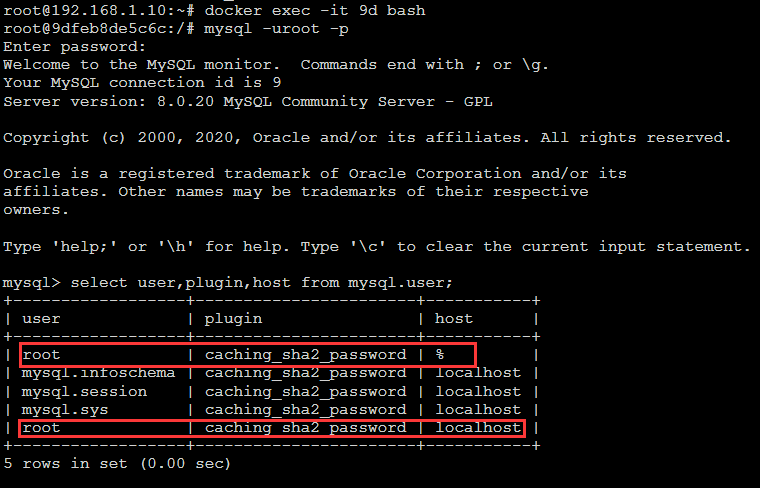

可以看到 `root` 用户使用的 `plugin是caching_sha2_password`，官方网站 `MySQL 8` 操作手册有如下说明：

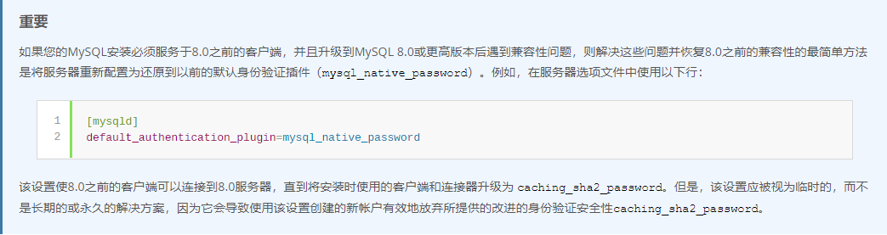

`plugin` 的作用之一就是处理后的密码格式和长度是不一样的，类似于使用 `MD5` 加密和使用 `base64` 加密一样，对于同一个密码处理后的格式是不一样的。

根据官方提供的方案，解决方案有两个，一个方案是修改配置文件（或者通过数据库脚本修改），另一个方案是使用支持 `plugin` 的客户端进行访问。

解决方案一：

```sql
alter user 'root' identified with mysql_native_password by '1';
```


这行代码有两层含义：

1. 修改 `root` 的密码为'1'，摒弃或覆盖原来的旧密码。

2. 使用 `mysql_native_password` 对新密码进行编码。

如下图，修改完成后再用客户端登陆成功。


解决方案二：

使用 `DataGrip 2020.1.1` 连接。

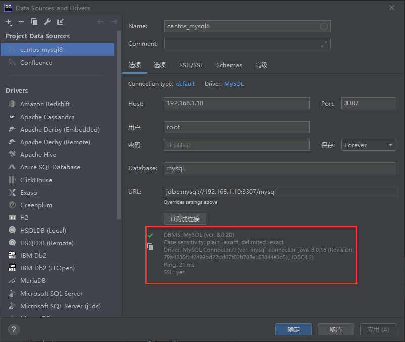

#### 4.1.1.5 排序规则和字符集的修改

!> 在对数据库进行任何修改之前，请先备份数据。

执行脚本忽略外键约束。

```sql
SET FOREIGN_KEY_CHECKS=0;
-- 将查询到SQL语句放到此处
SET FOREIGN_KEY_CHECKS=1;
```

以下内容含义，`SQL` 脚本中相应替换：

```text
<DB>：数据库名称
<charset>：utf8 或 utf8mb4
<collation>：utf8_bin 或 utf8mb4_bin
```

更改数据库排序规则：

```sql
ALTER DATABASE <DB> CHARACTER SET <charset> COLLATE <collation>
```

更改表排序规则：

```sql
SELECT CONCAT('ALTER TABLE `',  table_name, '` CHARACTER SET <charset> COLLATE <collation>;')
FROM information_schema.TABLES AS T, information_schema.`COLLATION_CHARACTER_SET_APPLICABILITY` AS C
WHERE C.collation_name = T.table_collation
AND T.table_schema = '<DB>'
AND
(
    C.CHARACTER_SET_NAME != '<charset>'
    OR
    C.COLLATION_NAME != '<collation>'
);
```

更改 `varchar` 列的列排序规则 ：

```sql
SELECT CONCAT('ALTER TABLE `', table_name, '` MODIFY `', column_name, '` ', DATA_TYPE, '(', CHARACTER_MAXIMUM_LENGTH, ') CHARACTER SET <charset> COLLATE <collation>', (CASE WHEN IS_NULLABLE = 'NO' THEN ' NOT NULL' ELSE '' END), ';')
FROM information_schema.COLUMNS
WHERE TABLE_SCHEMA = '<DB>'
AND DATA_TYPE = 'varchar'
AND
(
    CHARACTER_SET_NAME != '<charset>'
    OR
    COLLATION_NAME != '<collation>'
);
```

更改非 `varchar` 列的列排序规则：

```sql
SELECT CONCAT('ALTER TABLE `', table_name, '` MODIFY `', column_name, '` ', DATA_TYPE, ' CHARACTER SET <charset> COLLATE <collation>', (CASE WHEN IS_NULLABLE = 'NO' THEN ' NOT NULL' ELSE '' END), ';')
FROM information_schema.COLUMNS
WHERE TABLE_SCHEMA = '<DB>'
AND DATA_TYPE != 'varchar'
AND
(
    CHARACTER_SET_NAME != '<charset>'
    OR
    COLLATION_NAME != '<collation>'
);
```

#### 4.1.1.6 MySQL 8.0 安装

一、下载 `MySQL`

1. 进入 [MySQL官网](https://www.mysql.com/downloads/)。

2. 单击 `MySQL Community (GPL) Downloads »`。

  

3. `MySQL Community Server` 是解压版，`MySQL Installer for Windows` 是安装版，这里以解压版演示，点击进入下一步。

  

2. `Select Operating System:` 可以根据需求选择相应操作系统的压缩包，点击 `Download`。

  

3. 点击 `No thanks,just start my download` 开始下载。

  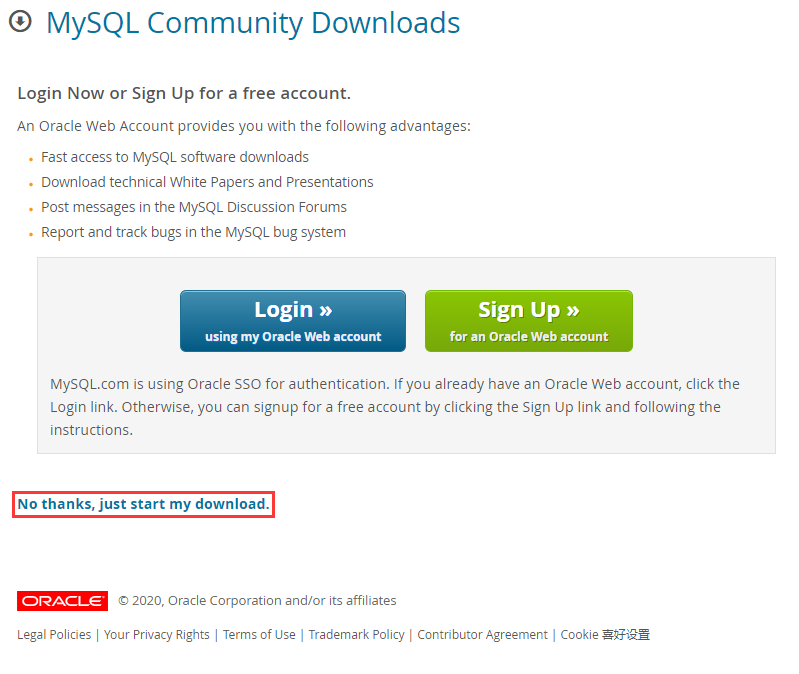

二、`MySQL` 安装

1. 解压 `MySQL` 到需要安装的路径。

2. 进入 `bin` 目录，打开 `PowerShell`。

3. 初始化 `MySQL`。

  ```powershell
  .\mysqld --initialize
  ```

4. 安装 `MySQL` 服务。

  ```powershell
  .\mysqld --install
  ```

5. 启动 `MySQL` 服务。

  ```powershell
  net start mysql
  ```

6. 登录 `MySQL`。

  ```powershell
  .\mysql -u root -p
  ```

  连续两次回车，返回ERROR。打开 `data` 目录下 `*.err` 文件，搜索 `password` 复制临时生成的密码。

7. 重新输入：

  ```powershell
  .\mysql -u root -p 临时密码
  ```

8. 登录成功后，修改密码。
 
  ```powershell
  ALTER USER 'root'@'localhost' IDENTIFIED WITH mysql_native_password BY '新密码';
  ```

  如果返回 `Query OK, 0 rows affected`，则表示密码重置成功。

#### 4.1.1.7 1064 - You have an error in your SQL syntax; check the manual that corresponds to your MySQL server...

问题如下图所示:

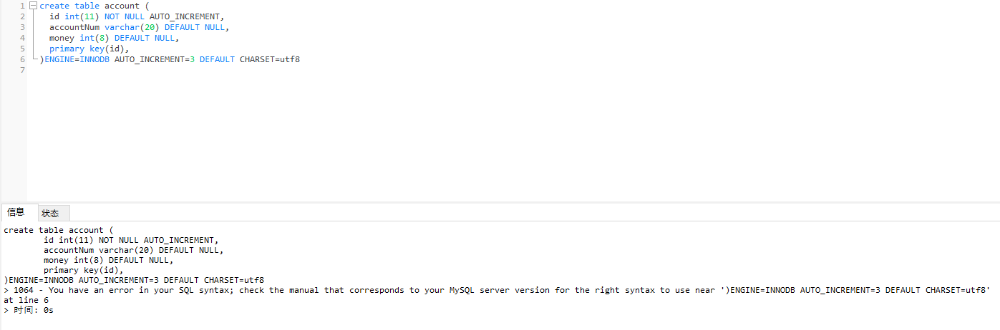

原因：`primary key(id),` 这里多了一个逗号，去掉后运行成功。

#### 4.1.1.8 忘记 MySQL 数据库连接密码后重置

> 本文部分内容转载自 [CSDN](https://blog.csdn.net/weidong_y/article/details/80493743) 。

环境说明：

* MySQL：5.1.55

1. 首先停止 `MySQL` 服务（使用管理员窗口运行）。

  ```powershell
  PS D:\1-ProgramFiles\1-DevTools\wcpServer\mysql\bin> net stop wcpdb
  ```

  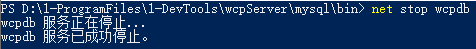

2. 启动 `MySQL` 服务的时候跳过权限表认证（免密登录）。

  ```powershell
  PS D:\1-ProgramFiles\1-DevTools\wcpServer\mysql\bin> .\mysqld --skip-grant-tables
  ```

  运行后出现如下错误：

  

  > 参考 [新浪博客](http://blog.sina.com.cn/s/blog_5504485801011ju2.html) 修改 `my.ini` 中的 `skip-locking` 为 `skip-external-locking` 。

  ```ini
  [mysqld]
  port		= 3399
  socket		= MySQL
  #skip-locking
  skip-external-locking
  key_buffer_size = 16M
  max_allowed_packet = 1M
  table_open_cache = 64
  sort_buffer_size = 512K
  net_buffer_length = 8K
  read_buffer_size = 256K
  read_rnd_buffer_size = 512K
  myisam_sort_buffer_size = 8M
  log-bin=mysql-bin
  binlog_format=mixed
  server-id	= 1
  character_set_server = utf8
  ```

3. 再次运行 `.\mysqld --skip-grant-tables` 。

  

4. 重新打开一个管理员窗口，运行 `.\mysql` 。

  

5. 连接权限数据库 `use mysql` 。

  

6. 修改数据库连接密码。

  ```powershell
  mysql> update user set password=password("1") where user="root";
  ```

  

7. 刷新权限。

  ```powershell
  mysql> flush privileges;
  ```

  

8. 退出 `mysql` 。

  ```powershell
  mysql> quit
  ```

  

9. 修改 `root` 密码后，需要执行下面的语句和新修改的密码。不然开启 `mysql` 时会出错。

  ```powershell
  PS D:\1-ProgramFiles\1-DevTools\wcpServer\mysql\bin> ./mysqladmin -u root -p shutdown
  ```

  

10. 将 `my.ini` 中的 `skip-external-locking` 还原为 `skip-locking` 。

11. 启动 `mysql` 服务。

  ```powershell
  PS D:\1-ProgramFiles\1-DevTools\wcpServer\mysql\bin> net start wcpdb
  ```

  

### 4.1.2 PostgreSQL

#### 4.1.2.1 解压版安装

> 本文部分内容转载自 [开源中国](https://my.oschina.net/ososchina/blog/860341) 。

1. [PostgreSQL](https://www.enterprisedb.com/download-postgresql-binaries) 解压版官网下载。

  

2. 将下载的 `PostgreSQL` 解压。

  

3. 设置环境变量。

  第一种方式：系统环境变量 `Path` 中追加 `E:\DevTools\postgresql\bin`。

  第二种方式：添加环境变量 `PGHOME=E:\DevTools\postgresql`，然后系统环境变量 `Path` 中追加 `%PGHOME%/bin`（作者这种比较灵活，可以在外部环境变量中随时调整 `PostgreSQL` 路径结构，推荐使用）。

4. 初始化数据库。

  ```cmd
  C:\Users\Jack>initdb.exe -D E:\DevTools\postgresql\data -E UTF-8 -U postgres -W
  属于此数据库系统的文件宿主为用户 "Jack".
  此用户也必须为服务器进程的宿主.
  数据库簇将使用本地化语言 "Chinese (Simplified)_People's Republic of China.936"进行初始化.
  initdb: could not find suitable text search configuration for locale "Chinese (Simplified)_People's Republic of China.936"
  缺省的文本搜索配置将会被设置到"simple"
  
  禁止为数据页生成校验和.
  
  输入新的超级用户口令:
  再输入一遍:
  
  创建目录 E:/DevTools/postgresql/data ... 成功
  正在创建子目录 ... 成功
  选择动态共享内存实现 ......windows
  选择默认最大联接数 (max_connections) ... 100
  选择默认共享缓冲区大小 (shared_buffers) ... 128MB
  selecting default time zone ... Asia/Hong_Kong
  创建配置文件 ... 成功
  正在运行自举脚本 ...成功
  正在执行自举后初始化 ...成功
  同步数据到磁盘...成功
  
  initdb: 警告: 为本地连接启用"trust"身份验证
  你可以通过编辑 pg_hba.conf 更改或你下次
  执行 initdb 时使用 -A或者--auth-local和--auth-host选项.
  
  成功。您现在可以用下面的命令开启数据库服务器：
  
      pg_ctl -D ^"E^:^\DevTools^\postgresql^\data^" -l 日志文件 start
  ```

  > [PostgreSQL 12 初始化参数官方详细介绍](https://www.postgresql.org/docs/12/app-initdb.html)     
  `【-D】`：数据库集群目录 `E:\DevTools\postgresql\data`    
  `【-E】`：数据库默认编码方式  
  `【--locale】`：区域设置，不指定参数默认为 `Chinese(Simplified)_China.936`，不同区域设置，排序规则不一样  
  `【--no-locale】` 等同于 `--locale=C`，`C` 对应 `chinese-simplified-china`    
  `【-U】`：数据库超级用户的用户名 `postgres`   
  `【-W】`：超级用户设置密码的提示  

5. 启动数据库服务。

  ```cmd
  C:\Users\Jack>pg_ctl -D E:\DevTools\postgresql\data -l logfile start
  等待服务器进程启动 .... 完成
  服务器进程已经启动
  ```

  日志文件在 `bin` 目录下。

6. 将 `PostgreSQL` 注册到 `Windows` 服务列表中。

  如果不注册为系统服务，每次需要运行命令启动，所以此处 `以管理员身份运行 cmd`。

  ```cmd
  C:\Windows\system32>pg_ctl register -N "PostgreSQL" -D "E:\DevTools\postgresql\data"
  ```

7. 查看已注册的服务,`Win + R`，然后输入 `services.msc` 并回车。

  

  上图为列表中服务启动后的截图，右键点击 `PostgreSQL` 属性，你就会发现可执行路径如下:

  `"E:\DevTools\postgresql\bin\pg_ctl.exe" runservice -N "PostgreSQL" -D "E:\DevTools\postgresql\data" -w`

8. 命令启动服务。

  ```cmd
  C:\WINDOWS\system32>net start PostgreSQL
  PostgreSQL 服务正在启动 .
  PostgreSQL 服务已经启动成功。
  ```

9. 查看服务运行状态。

  ```cmd 
  C:\Windows\system32>netstat -ano -p tcp | findstr "5432"
    TCP    127.0.0.1:5432         0.0.0.0:0              LISTENING       4732
  
  C:\Windows\system32>tasklist | findstr "4732"
  postgres.exe                  4732 Services                   0     20,424 K
  ```

10. 卸载服务（以管理员身份运行）。

  ```cmd 
  C:\Windows\system32>net stop PostgreSQL
  PostgreSQL 服务正在停止.
  PostgreSQL 服务已成功停止。
  
  C:\Windows\system32>sc delete PostgreSQL
  [SC] DeleteService 成功
  ```

11. 密码重置。

  如果忘记了刚才设置的密码，需要将 `E:\DevTools\postgresql\data\pg_hba.conf` 路径下的文件内容修改如下：

  ```conf
  # TYPE  DATABASE        USER            ADDRESS                 METHOD
  
  # IPv4 local connections:
  host    all             all             127.0.0.1/32            trust
  # IPv6 local connections:
  host    all             all             ::1/128                 trust
  # Allow replication connections from localhost, by a user with the
  # replication privilege.
  #host    replication     all            127.0.0.1/32            md5
  #host    replication     all            ::1/128                 md5
  ```

  重新启动服务

  ```cmd
  E:\DevTools\postgresql\bin>pg_ctl -D "E:\DevTools\postgresql\data" restart
  2020-08-08 04:24:46.594 HKT [4124] 日志:  接收到快速 (fast) 停止请求
  等待服务器进程关闭 ...2020-08-08 04:24:46.596 HKT [4124] 日志:  中断任何激活事务
  .2020-08-08 04:24:46.607 HKT [4124] 日志:  后台工作进程 "logical replication launcher" (PID 4324) 已退出, 退出代码 1
  2020-08-08 04:24:46.612 HKT [5104] LOG:  shutting down
  2020-08-08 04:24:46.638 HKT [4124] 日志:  数据库系统已关闭
   完成
  服务器进程已经关闭
  等待服务器进程启动 ....2020-08-08 04:24:46.744 HKT [4888] 日志:  正在启动 PostgreSQL 12.3, compiled by Visual C++ build 1914,
  it
  2020-08-08 04:24:46.751 HKT [4888] 日志:  正在监听IPv6地址"::1"，端口 5432
  2020-08-08 04:24:46.752 HKT [4888] 日志:  正在监听IPv4地址"127.0.0.1"，端口 5432
  2020-08-08 04:24:46.784 HKT [3968] LOG:  database system was shut down at 2020-08-08 04:24:46 HKT
  2020-08-08 04:24:46.795 HKT [4888] 日志:  数据库系统准备接受连接
   完成
  服务器进程已经启动
  ```

  运行登录命令

  ```cmd
   E:\DevTools\postgresql\bin>psql -h localhost -p 5432 -U postgres
  psql (12.3)
  输入 "help" 来获取帮助信息.
  postgres=#
  ```

  修改密码

  ```cmd
  postgres=# alter user postgres with password '1';
  ALTER ROLE
  ```

  最后，将 `pg_hba.conf` 文件中的内容再修改回 `md5`，然后运行退出命令，再次重启数据库服务就可以操作数据库了。

  ```cmd
  postgres=# exit
  
  E:\DevTools\postgresql\bin>pg_ctl -D "E:\DevTools\postgresql\data" restart
  2020-08-08 04:24:46.594 HKT [4124] 日志:  接收到快速 (fast) 停止请求
  等待服务器进程关闭 ...2020-08-08 04:24:46.596 HKT [4124] 日志:  中断任何激活事务
  .2020-08-08 04:24:46.607 HKT [4124] 日志:  后台工作进程 "logical replication launcher" (PID 4324) 已退出, 退出代码 1
  2020-08-08 04:24:46.612 HKT [5104] LOG:  shutting down
  2020-08-08 04:24:46.638 HKT [4124] 日志:  数据库系统已关闭
   完成
  服务器进程已经关闭
  等待服务器进程启动 ....2020-08-08 04:24:46.744 HKT [4888] 日志:  正在启动 PostgreSQL 12.3, compiled by Visual C++ build 1914,
  it
  2020-08-08 04:24:46.751 HKT [4888] 日志:  正在监听IPv6地址"::1"，端口 5432
  2020-08-08 04:24:46.752 HKT [4888] 日志:  正在监听IPv4地址"127.0.0.1"，端口 5432
  2020-08-08 04:24:46.784 HKT [3968] LOG:  database system was shut down at 2020-08-08 04:24:46 HKT
  2020-08-08 04:24:46.795 HKT [4888] 日志:  数据库系统准备接受连接
   完成
  服务器进程已经启动
  ```

### 4.1.3 Oracle

### 4.1.4 SQL Server

### 4.1.5 管理工具

#### 4.1.5.1 DataGrip

##### 4.1.5.1.1 DataGrip 连接后看不到自己创建的数据库

1. 首先先连接自己的数据库。

  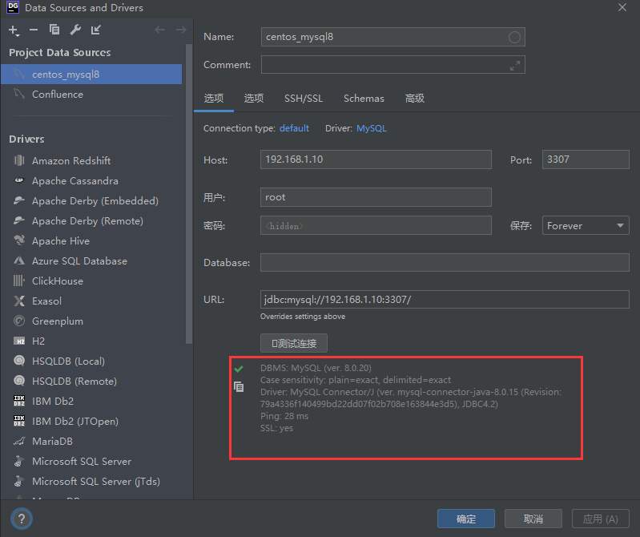

2. 连接成功后，切换到 `Schemes` 页签，勾选自己的数据库。

  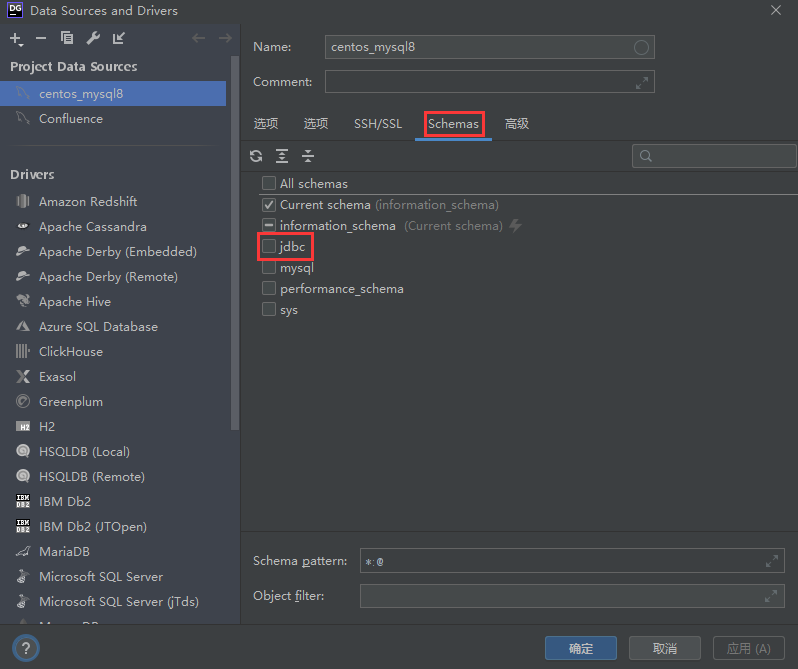

3. 返回就能看到已勾选的数据库了。

  

#### 4.1.5.2 Navicat Premium

##### 4.1.5.2.1 点击左上角工具栏菜单闪退

解决方案：网易有道词典导致闪退的，关闭后使用 `Navicat`，一切正常。

##### 4.1.5.2.2 Navicat Premium 15 无法备份数据库为 psc 格式

> `Navicat` 新版本备份格式为 `nb3` 。

解决方案：

使用低版本的 `Navicat`，例如：`Navicat for mysql 10.1.7` 。
