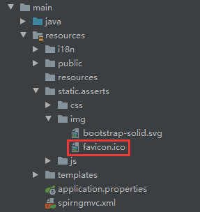
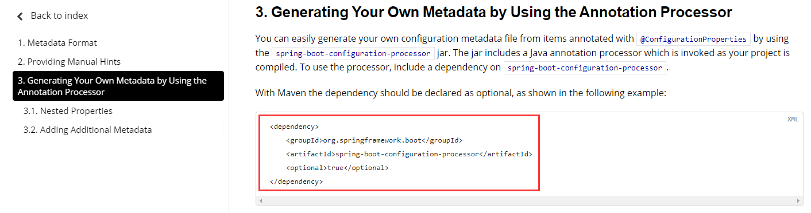
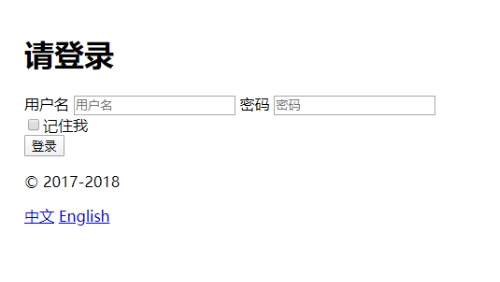
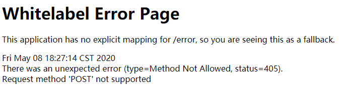
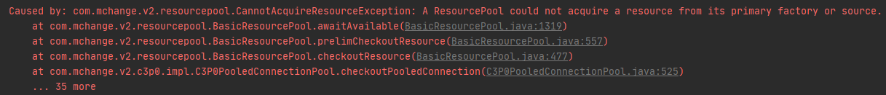

## 4.8 Spring Boot

### 4.8.1 Failed to bind properties under 'spring.datasource' to javax.sql.DataSource

`Spring Boot` 整合 `Druid` 时，引入了 `Druid` 的数据源，在配置文件 `application.yml` 中配置了相关配置:

```yml
spring :
  datasource:
    username: root
    password: 1
    url: jdbc:mysql://192.168.1.10:3307/jdbc
    driver-class-name: com.mysql.jdbc.Driver
    initialization-mode: always
    type: com.alibaba.druid.pool.DruidDataSource
    # schema:
    #   - classpath:department.sql
    # 数据源其他配置
    initialSize: 5
    minIdle: 5
    maxActive: 20
    maxWait: 60000
    timeBetweenEvictionRunsMillis: 60000
    minEvictableIdleTimeMillis: 300000
    validationQuery: SELECT 1 FROM DUAL
    testWhileIdle: true
    testOnBorrow: false
    testOnReturn: false
    poolPreparedStatements: true
    # 配置监控统计拦截的filters，去掉后监控界面sql无法统计，'wall'用于防火墙
    filters: stat,wall,log4j
    maxPoolPreparedStatementPerConnectionSize: 20
    useGlobalDataSourceStat: true
    connectionProperties: druid.stat.mergeSql=true;druid.stat.slowSqlMillis=500
```

`DruidConfig.java`。

```java
package com.woshijack.springboot.config;
 
import com.alibaba.druid.pool.DruidDataSource;
import com.alibaba.druid.support.http.StatViewServlet;
import com.alibaba.druid.support.http.WebStatFilter;
import org.springframework.boot.context.properties.ConfigurationProperties;
import org.springframework.boot.web.servlet.FilterRegistrationBean;
import org.springframework.boot.web.servlet.ServletRegistrationBean;
import org.springframework.context.annotation.Bean;
import org.springframework.context.annotation.Configuration;
 
import javax.sql.DataSource;
import java.util.Arrays;
import java.util.HashMap;
import java.util.Map;
 
@Configuration
public class DruidConfig {
 
    @ConfigurationProperties(prefix="spring.datasource")
    @Bean
    public DataSource druid(){
        return new DruidDataSource();
    }
 
    @Bean
    public ServletRegistrationBean statViewServlet(){
        ServletRegistrationBean bean = new ServletRegistrationBean(new StatViewServlet(), "/druid/*");
        Map<Object, Object> initParams = new HashMap<>();
        initParams.put("loginUsername","admin");
        initParams.put("loginPassword","1");
        initParams.put("allow","");
        initParams.put("deny","192.168.1.10");
        bean.setInitParameters(initParams);
        return bean;
    }
 
    @Bean
    public FilterRegistrationBean webStatFilter(){
        FilterRegistrationBean bean = new FilterRegistrationBean();
        bean.setFilter(new WebStatFilter());
        Map<Object, Object> initParams = new HashMap<>();
        initParams.put("exclusions","*.js,*.css,/druid/*");
        bean.setInitParameters(initParams);
        bean.setUrlPatterns(Arrays.asList("/*"));
        return bean;
    }
}
```

启动报错如下：

根据错误提示得知，和 `log4j` 有关，在`pom` 文件中引入依赖。

```xml
<dependency>
    <groupId>log4j</groupId>
    <artifactId>log4j</artifactId>
    <version>1.2.17</version>
</dependency>
```

### 4.8.2 favicon.ico 图标不显示

> `Spring Boot` 版本为 `2.2.6`。

项目中 `favicon.ico` 的位置，其他路径设置不起效果。



登录页设置favicon.ico

```html
<link type="image/x-icon" rel="shortcut icon" href="/asserts/img/favicon.ico" th:href="@{/asserts/img/favicon.ico}">
```

登录后其他页面设置 `favicon.ico`。

```java
public class LoginHandlerInterceptor implements HandlerInterceptor {
    @Override
    public boolean preHandle(HttpServletRequest request, HttpServletResponse response, Object handler) throws Exception {
        // 登录后将 favicon.ico 添加到页面中
        String contextPath = request.getContextPath();
        StringBuilder link=new StringBuilder();
        link.append("<script>");
        link.append("var link = document.createElement('link');");
        link.append("link.type = 'image/x-icon';");
        link.append("link.rel = 'shortcut icon';");
        if (!StringUtils.isEmpty(contextPath)){
            link.append("link.href = '" +contextPath+"/asserts/img/favicon.ico';");
        }else {
            link.append("link.href = '/asserts/img/favicon.ico';");
        }
        link.append("document.getElementsByTagName('head')[0].appendChild(link);");
        link.append("</script>");
        response.setCharacterEncoding("UTF-8");//解决页面乱码问题
        response.getWriter().append(link);
        Object user = request.getSession().getAttribute("loginUser");
        if (user==null){
            request.setAttribute("msg","没有权限，请先登录");
            request.getRequestDispatcher("/index.html").forward(request,response);
            return false;
        }else {
            return true;
        }
    }
}
```

配置类中排除 `.ico` 的拦截。

```java
@Override
public void addInterceptors(InterceptorRegistry registry) {
    registry.addInterceptor(new LoginHandlerInterceptor()).addPathPatterns("/**")
    .excludePathPatterns("/index.html","/","/user/login","/**/*.css","/**/*.js","/**/*.svg","/**/*.ico");
}
```


### 4.8.3 Spring Boot 2.x 与1.x版本的嵌入式Servlet容器区别

```java
//在SpringBoot 1.x 中配置嵌入式的Servlet容器
@Bean
public EmbeddedServletContainerCustomizer embeddedServletContainerCustomizer(){
    return new EmbeddedServletContainerCustomizer() {

        //定制嵌入式的Servlet容器相关的规则
        @Override
        public void customize(ConfigurableEmbeddedServletContainer container) {
            container.setPort(8083);
        }
    };
}

//在SpringBoot 2.x 中配置嵌入式的Servlet容器
@Bean
public WebServerFactoryCustomizer webServerFactoryCustomizer(){
    return  new WebServerFactoryCustomizer<ConfigurableServletWebServerFactory>() {
        @Override
        public void customize(ConfigurableServletWebServerFactory factory) {
            factory.setPort(8083);
        }
    };
};
```    

`Spring Boot 2.x` 以上配置嵌入式 `Servlet` 容器时 `EmbeddedServletContainerCustomizer` 类被 `WebServerFactoryCustomizer` 替代以至于在项目中找不到 `EmbeddedServletContainerCustomizer`。

同时， `WebServerFactoryCustomizer` 需使用 `ConfigurableWebServerFactory` 对象实现对 `customize()` 方法的转换才能实现配置。

### 4.8.4 Spring Boot+JPA 项目启动失败，无法扫描到Repository

根据以下错误，搜了好多都是添加各种注解。

```text
Factory method 'mvcConversionService' threw exception; nested exception is org.springframework.beans.factory.BeanCreationException:

Error creating bean with name 'userRepository' defined in com.woshijack.springboot.repository.UserRepository defined in @EnableJpaRepositories.....
```

其实Spring Boot 项目启动开头的日志已经告诉了我们错误在哪里：

```text
HHH000342: Could not obtain connection to query metadata : Driver com.mysql.jdbc.Driver claims to not accept jdbcUrl, jdbc//192.168.1.10:3307/jpa
```

`application.yml` 修改前：

```yml
spring:
  datasource:
    username: root
    password: 1
    url: jdbc//192.168.1.10:3307/jpa
    driver-class-name: com.mysql.cj.jdbc.Driver
  jpa:
    hibernate:
      ddl-auto: update
    show-sql: true
```

`application.yml` 修改后：

```yml
spring:
  datasource:
    username: root
    password: 1
    url: jdbc:mysql://192.168.1.10:3307/jpa
    driver-class-name: com.mysql.cj.jdbc.Driver
  jpa:
    hibernate:
      ddl-auto: update
    show-sql: true
```


### 4.8.5 Spring Boot Configuration Annotation Processor not configured

问题：虽然提示了如下错误，但是不影响最终运行效果。


解决方案：

点击 `Open Documentation...` ，然后打开如下网页，将红框内容复制到 `pom.xml` 文件中。



上图中的依赖叫做注解处理器，配置注解处理器后，当执行类中已经定义了对象和该对象的字段，在 `application.properties` 文件中赋值时，可以提示需要赋值的信息：


### 4.8.6 Spring Boot应用启动时，不能加载执行resources文件下的SQL文件

在 `Spring Boot 2.0` 版本之前，如果把 `SQL` 文件直接放在 `resources` 文件夹下是可以直接被加载执行，完成数据库的创建和数据的插入,但是要符合相应的规则：

!> 1. 建表语句要命名为，`schema.sql` 或者 `schema-all.sql`。<br/>
2. 数插入语句要命名为：`data.sql` 或者 `data-all.sql`。

如果你想使用其他命名的 `SQL` 文件，你可以在 `application.yml` 或者是 `application.properties` 文件中指定：

```yml
schema:
  - classpath:sql/department.sql
  - classpath:sql/employee.sql
```  
这样系统在启动的时候就会自动加载然后执行这些 `SQL` 文件，并且系统在每次启动的时候都会加载一次,也就是这些文件都会被执行一次。

但是在 `Spring Boot 2.0` 的版本之后，以上所有操作都失效了，`SQL` 文件是不会被执行的，我们还需要在配置文件中添加一个配置：

```yml
initialization-mode: always
```

这样就可以加载你的目标 `SQL` 文件了。


### 4.8.7 拦截器排除css，js，svg等静态资源

未排除静态资源的拦截器代码：

```java
@Override
public void addInterceptors(InterceptorRegistry registry) {
    registry.addInterceptor(new LoginHandlerInterceptor()).addPathPatterns("/**")
            .excludePathPatterns("/index.html","/","/user/login");
}
```



排除静态资源的拦截器代码:

```java
@Override
public void addInterceptors(InterceptorRegistry registry) {
    registry.addInterceptor(new LoginHandlerInterceptor()).addPathPatterns("/**")
            .excludePathPatterns("/index.html","/","/user/login","/**/*.css","/**/*.js","/**/*.svg");
}
```


### 4.8.8 删除表单报错：Request method 'POST' not supported



!> Spring Boot 2.2.X默认不支持put，delete等请求方式。

在配置文件 `application.properties` 中启用 `hiddenMethod` 过滤器。

```properties
# 启用hiddenMethod过滤器
spring.mvc.hiddenmethod.filter.enabled=true
```

`Java Controller` 删除方法：

```java
@DeleteMapping("/emp/{id}")
public String delete(@PathVariable("id") Integer id){
    employeeDao.delete(id);
    return "redirect:/emps";
}
```

`HTML` 相关代码：

```html
<button th:attr="del_uri=@{/emp/}+${emp.id}" class="btn btn-sm btn-danger delBtn">删除</button>
<form id="delEmpForm" method="post">
    <input type="hidden" name="_method" value="delete"/>
</form>
<script>
    $(".delBtn").click(function(){
        $("#delEmpForm").attr("action",$(this).attr("del_uri")).submit();
        return false;
    });
</script>
```


## 4.11 Spring

### 4.11.1 AOP 注解事务控制数据库 commit 问题

> 在慕课网学习 [Spring AOP 实现之注解配置](http://www.imooc.com/wiki/springlesson/aopan.html) ，代码执行完成后，发现提交动作在释放连接之后，数据没有更新成功。根据 [通过AOP控制事务的案例](https://blog.csdn.net/fy_java1995/article/details/83933673) 得知，需要采用环绕通知。另外查阅官方文档，使用注解 `@EnableAspectJAutoProxy` 替换 XML 中的 `<aop:aspectj-autoproxy></aop:aspectj-autoproxy>` 自动代理配置。

```java
/**
 * 事务管理工具类
 */
@Component
@Aspect
@EnableAspectJAutoProxy
public class TransactionManager {

    @Autowired
    private ConnectionUtils connectionUtils;

    @Pointcut("execution(* com.naijuw.service.impl.*.*(..))")
    private void pc() {}

    /**
     * 环绕通知
     * @param joinPoint
     * @return
     */
    @Around("pc()")
    public Object aroundMethod(ProceedingJoinPoint joinPoint) {
        Object result = null;
        try {
            beginTransaction();
            Object[] args = joinPoint.getArgs();
            result = joinPoint.proceed(args);
            commit();
        } catch (Throwable e) {
            e.printStackTrace();
            rollback();
        }finally {
            release();
        }
        return result;
    }

    /**
     * 开启事务
     */
    public void beginTransaction() {
        try {
            System.out.println("开启事务");
            connectionUtils.getThreadConnection().setAutoCommit(false);
        } catch (Exception e) {
            e.printStackTrace();
        }
    }

    /**
     * 提交事务
     */
    public void commit() {
        try {
            System.out.println("提交事务");
            connectionUtils.getThreadConnection().commit();
        } catch (Exception e) {
            e.printStackTrace();
        }
    }

    /**
     * 回滚事务
     */
    public void rollback() {
        try {
            System.out.println("回滚事务");
            connectionUtils.getThreadConnection().rollback();
        } catch (Exception e) {
            e.printStackTrace();
        }
    }

    /**
     * 释放连接
     */
    public void release() {
        try {
            System.out.println("释放连接");
            connectionUtils.getThreadConnection().close();//还回连接池中
            connectionUtils.removeConnection();
        } catch (Exception e) {
            e.printStackTrace();
        }
    }
}
```

### 4.11.2 A ResourcePool could not acquire a resource from its primary factory or source

> 由于粗心，错把数据库名当作表名放到 `SQL` 语句中。



### 4.11.3 MySQL低版本驱动连接高版本数据库错误

环境说明：

`MySQL` 驱动：5.1.6<br/>
`MySQL` 数据库：8.0.19

```error
Caused by: org.springframework.beans.factory.BeanCreationException: Error creating bean with name 'dataSource' defined in class path resource [applicationContext.xml]: Error setting property values; nested exception is org.springframework.beans.PropertyBatchUpdateException; nested PropertyAccessExceptions (1) are:
PropertyAccessException 1: org.springframework.beans.MethodInvocationException: Property 'driverClassName' threw exception; nested exception is java.lang.IllegalStateException: Could not load JDBC driver class [com.mysql.cj.jdbc.Driver]
	at org.springframework.beans.factory.support.AbstractAutowireCapableBeanFactory.applyPropertyValues(AbstractAutowireCapableBeanFactory.java:1650)
	at org.springframework.beans.factory.support.AbstractAutowireCapableBeanFactory.populateBean(AbstractAutowireCapableBeanFactory.java:1357)
	at org.springframework.beans.factory.support.AbstractAutowireCapableBeanFactory.doCreateBean(AbstractAutowireCapableBeanFactory.java:582)
	at org.springframework.beans.factory.support.AbstractAutowireCapableBeanFactory.createBean(AbstractAutowireCapableBeanFactory.java:502)
	at org.springframework.beans.factory.support.AbstractBeanFactory.lambda$doGetBean$0(AbstractBeanFactory.java:312)
	at org.springframework.beans.factory.support.DefaultSingletonBeanRegistry.getSingleton(DefaultSingletonBeanRegistry.java:228)
	at org.springframework.beans.factory.support.AbstractBeanFactory.doGetBean(AbstractBeanFactory.java:310)
	at org.springframework.beans.factory.support.AbstractBeanFactory.getBean(AbstractBeanFactory.java:200)
	at org.springframework.beans.factory.support.BeanDefinitionValueResolver.resolveReference(BeanDefinitionValueResolver.java:367)
	... 15 more
```

> `Maven` 配置文件中将驱动版本修改为 `MySQL 8` 版本即可。

### 4.11.4 新建项目后，右键菜单无法新建 XML

* 首先添加 `Spring Framework` 依赖信息。

```xml
<dependency>
    <groupId>org.springframework</groupId>
    <artifactId>spring-context</artifactId>
    <version>5.0.2.RELEASE</version>
</dependency>
```

* 添加后就会显示 `Spring Config` 菜单项，这样就可以添加 `XML` 文件了。


## 4.12 MyBatis

### 4.12.1 创建 Config 配置文件模板

> 新建 `MyBatis` 配置文件的时候，发现没有这个选项，在 [MyBatis 头信息](https://www.cnblogs.com/jiaweit/p/10111845.html) 这篇博文中发现，需要自行配置模板。

[MyBatis 官网 XML 模板](https://mybatis.org/mybatis-3/zh/getting-started.html)

```xml
<!-- Config 配置模板 -->
<?xml version="1.0" encoding="UTF-8" ?>
<!DOCTYPE configuration
  PUBLIC "-//mybatis.org//DTD Config 3.0//EN"
  "http://mybatis.org/dtd/mybatis-3-config.dtd">
<configuration>
  <environments default="development">
    <environment id="development">
      <transactionManager type="JDBC"/>
      <dataSource type="POOLED">
        <property name="driver" value="${driver}"/>
        <property name="url" value="${url}"/>
        <property name="username" value="${username}"/>
        <property name="password" value="${password}"/>
      </dataSource>
    </environment>
  </environments>
  <mappers>
    <mapper resource=""/>
  </mappers>
</configuration>

<!-- Mapper 配置模板 -->
<?xml version="1.0" encoding="UTF-8" ?>
<!DOCTYPE mapper
  PUBLIC "-//mybatis.org//DTD Mapper 3.0//EN"
  "http://mybatis.org/dtd/mybatis-3-mapper.dtd">
<mapper namespace="">
  <select id="" resultType=""></select>
</mapper>
```

1. 首先 `Ctrl + Alt + S` → `File and Code Templates`，然后点击 `加号`，输入模板名称、后缀名以及模板内容，最后点击 `Apply`,`OK`。


2. 点击 `新建`，选择我们创建的模板 `Config.xml`。


3. 输入配置文件名、数据库连接信息，点击 `OK`。


4. 这样一个配置文件就创建好了。


