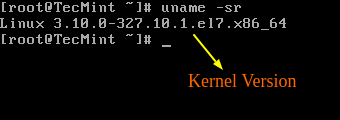
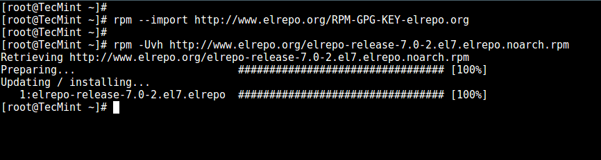
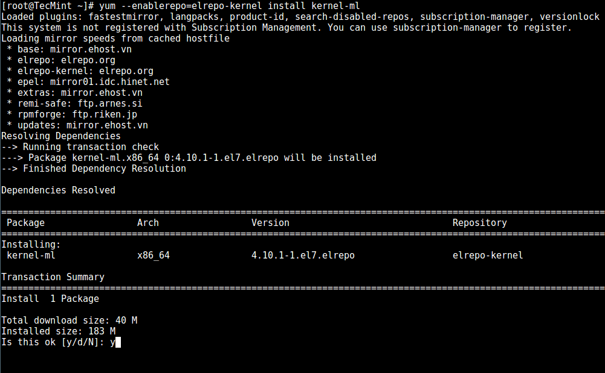
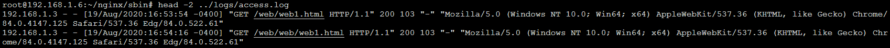
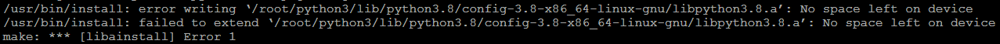
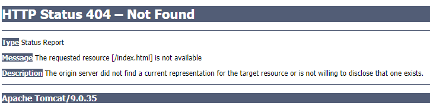

## 2.1 Linux

### 2.1.1 CentOS

#### 2.1.1.1 CentOS 7 清空终端屏幕

解决方案：

输出很多信息的命令行窗口，如下图：


执行命令。

```bash
root@192.168.1.10:~# reset
```

清空后的窗口:


#### 2.1.1.2 CentOS 7 删除多余的内核

解决方案：

1. 首先列出系统中正在使用的内核。

```bash
uname -a
```

2. 查询系统中全部的内核。

```bash
rpm -qa | grep kernel
```

3. 将需要删除的内核删除掉（多个内核可空格隔开，也可以写模糊的内核名称）。

```bash
yum -y remove 内核名称
```

4. 重启之后就可以看到内核被删掉了，同时多余的启动项也自动删掉了。

#### 2.1.1.3 CentOS 7 中安装或升级最新的内核

> 本文转载自 [Linux 中国](https://linux.cn/article-8310-1.html)

虽然有些人使用 `Linux` 来表示整个操作系统，但要注意的是，严格地来说，`Linux` 只是个内核。另一方面，发行版是一个完整功能的系统，它建立在内核之上，具有各种各样的应用程序工具和库。

在正常操作期间，内核负责执行两个重要任务：

* 作为硬件和系统上运行的软件之间的接口。

* 尽可能高效地管理系统资源。

为此，内核通过内置的驱动程序或以后可作为模块安装的驱动程序与硬件通信。

例如，当你计算机上运行的程序想要连接到无线网络时，它会将该请求提交给内核，后者又会使用正确的驱动程序连接到网络。

> 建议阅读： [如何在 Ubuntu 中升级内核](https://linux.cn/article-8284-1.html)

随着新的设备和技术定期出来，如果我们想充分利用它们，保持最新的内核就很重要。此外，更新内核将帮助我们利用新的内核函数，并保护自己免受先前版本中发现的漏洞的攻击。

准备好了在 `CentOS 7` 或其衍生产品（如 `RHEL 7` 和 `Fedora`）上更新内核了么？如果是这样，请继续阅读！

1. 检查已安装的内核版本。

让我们安装了一个发行版，它包含了一个特定版本的内核。为了展示当前系统中已安装的版本，我们可以：

```bash
uname -sr
```

下面的图片展示了在一台 `CentOS 7` 服务器上的输出信息：



如果我们现在进入 [Linux 内核官网](https://www.kernel.org/)，在撰写本文时，我们看到最新的内核版本是 `4.10.1`（其他版本可以从同一网站获得）。

还要考虑的一个重要的事情是内核版本的生命周期 - 如果你当前使用的版本接近它的生命周期结束，那么在该日期后将不会提供更多的 `bug` 修复。关于更多信息，请参阅[内核发布页](https://www.kernel.org/category/releases.html)。

2. 在 `CentOS 7` 中升级内核。

大多数现代发行版提供了一种使用 [yum等包管理系统](http://www.tecmint.com/20-linux-yum-yellowdog-updater-modified-commands-for-package-mangement/) 和官方支持的仓库升级内核的方法。

但是，这只会升级内核到仓库中可用的最新版本 - 而不是在 [Linux 内核官网](https://www.kernel.org/) 中可用的最新版本。不幸的是，`Red Hat` 只允许使用前者升级内核。

与 `Red Hat` 不同，`CentOS` 允许使用 `ELRepo`，这是一个第三方仓库，可以将内核升级到最新版本。

要在 `CentOS 7` 上启用 `ELRepo` 仓库，请运行：

```bash
rpm --import https://www.elrepo.org/RPM-GPG-KEY-elrepo.org
rpm -Uvh http://www.elrepo.org/elrepo-release-7.0-2.el7.elrepo.noarch.rpm
```



仓库启用后，你可以使用下面的命令列出可用的内核相关包：

```bash
yum --disablerepo="*" --enablerepo="elrepo-kernel" list available
```


接下来，安装最新的主线稳定内核：

```bash
yum --enablerepo=elrepo-kernel install kernel-ml
```



最后，重启机器并应用最新内核，接着运行下面的命令检查最新内核版本：

```bash
uname -sr
```


3. 设置 `GRUB` 默认的内核版本。

为了让新安装的内核成为默认启动选项，你需要如下修改 GRUB 配置：

打开并编辑 `/etc/default/grub` 并设置 `GRUB_DEFAULT=0`。意思是 `GRUB` 初始化页面的第一个内核将作为默认内核。

```text
GRUB_TIMEOUT=5
GRUB_DISTRIBUTOR="$(sed 's, release .*$,,g' /etc/system-release)"
GRUB_DEFAULT=0
GRUB_DISABLE_SUBMENU=true
GRUB_TERMINAL_OUTPUT="console"
GRUB_CMDLINE_LINUX="crashkernel=auto rd.lvm.lv=centos/root rd.lvm.lv=centos/swap rhgb quiet"
GRUB_DISABLE_RECOVERY="true"
```

接下来运行下面的命令来重新创建内核配置。

```bash
grub2-mkconfig -o /boot/grub2/grub.cfg
```


重启并验证最新的内核已作为默认内核。


恭喜你！你已经在 `CentOS 7` 中升级内核了！

4. 总结

本文中，我们解释了如何轻松升级系统上的 `Linux` 内核。我们还没讲到另外一个方法，因为它涉及从源代码编译内核，这可以写成一本书，并且不推荐在生产系统上这么做。

虽然它是最好的学习体验之一，并且允许细粒度配置内核，但是你可能会让你的系统不可用，并且可能必须从头重新安装它。

如果你仍然有兴趣构建内核作为学习经验，你可以在 [Kernel Newbies](https://kernelnewbies.org/KernelBuild) 页面中获得指导。

一如既往，如果你对本文有任何问题或意见，请随时使用下面的评论栏。

作者简介：

我是一个计算机上瘾的家伙，并且是开源和 `Linux` 系统软件的粉丝，有大约 4 年的 `Linux` 发行版桌面、服务器和 `bash` 脚本的经验。

[via](http://www.tecmint.com/install-upgrade-kernel-version-in-centos-7/)

作者：`Matei Cezar` 译者：`geekpi` 校对：`wxy`

本文由 `LCTT` 原创编译，`Linux中国` 荣誉推出

#### 2.1.1.4 安装 wget

```bash
root@192.168.1.10:~# yum -y install wget
```

#### 2.1.1.5 netstat: command not found


> 在 [CSDN](https://blog.csdn.net/binnygoal/article/details/88717786) 上看到一篇文章，需要安装网络工具。

解决方案：

```bash
root@192.168.1.10:~# yum -y install netstat
```

#### 2.1.1.6 查看系统版本

解决方案：

```bash
root@192.168.1.10:~# cat /etc/redhat-release
```

#### 2.1.1.7 安装 sudo

> 因为安装某些工具需要用到 `sudo`，所以记录下安装命令。

解决方案：

```bash
root@192.168.1.10:~# yum -y install sudo
```

#### 2.1.1.8 删除文件以及文件夹

> 因为重复下载多个版本的软件以及解压产生的文件夹，所以记录删除命令。

解决方案：

```bash
# 命令强制删除不提示
root@192.168.1.10:~# rm -rf nginx-1.18.0
```

#### 2.1.1.9 重命名文件或目录

解决方案：

```bash
# 将 CentOS-Base.repo 重命名为 CentOS-Base.repo.backup
root@192.168.1.10:/etc# mv /etc/yum.repos.d/CentOS-Base.repo /etc/yum.repos.d/CentOS-Base.repo.backup
```

#### 2.1.1.10 创建一个文件、目录

解决方案：

```bash
# 创建一个目录
root@192.168.1.10:~# mkdir demodir
# 创建一个文件
root@192.168.1.10:~# touch demofile.txt
```

#### 2.1.1.11 查看程序是否启动

解决方案：

```bash
# 这里以 nginx 为例，相应替换成其他程序名
root@192.168.1.10:~# ps -ef | grep nginx
```

#### 2.1.1.12 netstat

参数：

```txt
-a 显示所有选项，默认不显示 LISTEN 相关。
-t 仅显示 tcp 相关选项。
-u 仅显示 udp 相关选项。
-n 拒绝显示别名，能显示数字的全部转化成数字。
-l 仅列出有在 Listen 的服务状态。
-p 显示建立相关链接的程序名。
-r 显示路由信息，路由表。
-e 显示扩展信息，例如 uid 等。
-s 按各个协议进行统计。
-c 每隔一个固定时间，执行该 netstat 命令。
```

> `LISTEN` 和 `LISTENING` 的状态只有用 `-a` 或者 `-l` 才能看到。

```bash
# 查找运行在指定端口的进程
root@192.168.1.10:~# netstat -anltp | grep 9000
tcp        0      0 0.0.0.0:9000            0.0.0.0:*               LISTEN      19785/nginx: master
```

```bash
# 查看所有运行中的服务ip和端口信息
root@192.168.1.10:~# netstat -tunpl
Active Internet connections (only servers)
Proto Recv-Q Send-Q Local Address           Foreign Address         State       PID/Program name    
tcp        0      0 127.0.0.1:25            0.0.0.0:*               LISTEN      1280/master         
tcp        0      0 0.0.0.0:90              0.0.0.0:*               LISTEN      19785/nginx: master 
tcp        0      0 0.0.0.0:9000            0.0.0.0:*               LISTEN      19785/nginx: master 
tcp        0      0 0.0.0.0:22              0.0.0.0:*               LISTEN      1168/sshd           
tcp6       0      0 ::1:25                  :::*                    LISTEN      1280/master         
tcp6       0      0 :::22                   :::*                    LISTEN      1168/sshd           
udp        0      0 0.0.0.0:68              0.0.0.0:*                           986/dhclient
```

#### 2.1.1.13 复制文件、文件夹

解决方案：

```bash
# 拷贝 nginx.conf 到上一级目录 conf.d
cp nginx.conf ../conf.d/
```

```txt
参数说明：
-a 指archive的意思，也说是指复制所有的目录。
-d 若源文件为连接文件(link file)，则复制连接文件属性而非文件本身。
-f 强制(force)，若有重复或其它疑问时，不会询问用户，而强制复制。
-i 若目标文件(destination)已存在，在覆盖时会先询问是否真的操作。
-l 建立硬连接(hard link)的连接文件，而非复制文件本身。
-p 与文件的属性一起复制，而非使用默认属性。
-r 递归复制，用于目录的复制操作。
-s 复制成符号连接文件(symbolic link)，即“快捷方式”文件。
-u 若目标文件比源文件旧，更新目标文件 。
```

#### 2.1.1.14 CentOS 8 安装教程

> 通过 [CSDN](https://blog.csdn.net/l1028386804/article/details/105479495) 这篇文章安装了 `CentOS`，抽空写一篇自己的安装过程。

#### 2.1.1.15 cat、head、tail 的区别

`cat` 查看的是整个文件内容。

```bash
root@192.168.1.6:~/nginx/conf# cat ../logs/access.log
```


`head` 查看指定行数开头的内容。

```bash
root@192.168.1.6:~/nginx/sbin# head -2 ../logs/access.log
```



`tail` 查看指定行数结尾的内容。

```bash
root@192.168.1.6:~/nginx/conf# tail -2 ../logs/access.log
```


#### 2.1.1.16 生成密码文件

```bash
# 安装 httpd-tools
root@192.168.1.6:~/nginx/sbin# yum install httpd-tools
# 设置用户 store，密码 @store.123!，生成 user.pass 密码文件
root@192.168.1.6:~/nginx/sbin# htpasswd -bc /root/user.pass store @store.123!
Adding password for user store
# 查看文件内容
root@192.168.1.6:~/nginx/sbin# cat /root/user.pass
store:$apr1$xJGvt1Kc$7SAtusUhdWgb8KRdxYY7P0
```

#### 2.1.1.17 yum

```bash
# 查找软件包 
yum search 
# 列出所有可安装的软件包 
yum list 
# 列出所有可更新的软件包 
yum list updates 
# 列出所有已安装的软件包 
yum list installed 
# 列出所有已安装但不在 Yum 仓库内的软件包 
yum list extras 
# 获取软件包信息 
yum info 
# 列出所有可更新的软件包信息 
yum info updates 
# 列出所有已安装的软件包信息 
yum info installed 
# 列出所有已安装但不在 Yum 仓库内的软件包信息 
yum info extras 
# 列出软件包提供哪些文件 
yum provides
```

#### 2.1.1.19 停止进程

```bash
# 查询 nginx 主进程号
ps -ef | grep nginx # 进程列表找到 nginx master 进程所在行，第一个编号就是主进程号。
# 从容停止 nginx
kill -QUIT 主进程号 # kill -QUIT 6957 （主进程以及相关进程都会停止）
# 快速停止 nginx
kill -TERM 主进程号 # kill -TERM 7546 （主进程以及相关进程都会停止）
# 强制停止 nginx
kill -9 主进程号    # kill -9 -97665 （只能停止 master 主进程，相关无法停止）
```

#### 2.1.1.18 扩展存储空间

> 安装 Python 的时候，提示空间不足，参考 [VMware虚拟机如何设置CentOS 7 磁盘扩容？](https://jingyan.baidu.com/article/ca00d56cad34dda89febcf7b.html) 解决了此问题。



环境说明：<br/>
虚拟机软件：`Oracle VM VirtualBox`<br/>
系统：`CentOS 7.8`

1. 首先 [扩展虚拟硬盘容量](docs/07-System-assist.md#_711-扩展虚拟硬盘容量) 。

2. 查询磁盘空间占用情况，可以看到 `root` 剩余空间只剩下 `92k`。

```bash
root@192.168.1.6:~# df -h
Filesystem               Size  Used Avail Use% Mounted on
devtmpfs                 479M     0  479M   0% /dev
tmpfs                    492M     0  492M   0% /dev/shm
tmpfs                    492M  6.7M  486M   2% /run
tmpfs                    492M     0  492M   0% /sys/fs/cgroup
/dev/mapper/centos-root  6.7G  6.7G   92K 100% /
/dev/sda1                497M  130M  368M  27% /boot
tmpfs                     99M     0   99M   0% /run/user/0
```

3. 查看新磁盘的分区信息，扩展的存储空间已经增加到系统中，但是没有挂载，从两个分区的大小总和可以看出。

```bash
root@192.168.1.6:~# fdisk -l
Disk /dev/sda: 16.1 GB, 16106127360 bytes, 31457280 sectors
Units = sectors of 1 * 512 = 512 bytes
Sector size (logical/physical): 512 bytes / 512 bytes
I/O size (minimum/optimal): 512 bytes / 512 bytes
Disk label type: dos
Disk identifier: 0x00027253

   Device Boot      Start         End      Blocks   Id  System
/dev/sda1   *        2048     1026047      512000   83  Linux
/dev/sda2         1026048    16777215     7875584   8e  Linux LVM

Disk /dev/mapper/centos-root: 7159 MB, 7159676928 bytes, 13983744 sectors
Units = sectors of 1 * 512 = 512 bytes
Sector size (logical/physical): 512 bytes / 512 bytes
I/O size (minimum/optimal): 512 bytes / 512 bytes


Disk /dev/mapper/centos-swap: 859 MB, 859832320 bytes, 1679360 sectors
Units = sectors of 1 * 512 = 512 bytes
Sector size (logical/physical): 512 bytes / 512 bytes
I/O size (minimum/optimal): 512 bytes / 512 bytes
```

4. 对新增的磁盘进行分区操作。

```bash
root@192.168.1.6:~# fdisk  /dev/sda
Welcome to fdisk (util-linux 2.23.2).

Changes will remain in memory only, until you decide to write them.
Be careful before using the write command.


Command (m for help): p # 查看已分区的数量

Disk /dev/sda: 16.1 GB, 16106127360 bytes, 31457280 sectors
Units = sectors of 1 * 512 = 512 bytes
Sector size (logical/physical): 512 bytes / 512 bytes
I/O size (minimum/optimal): 512 bytes / 512 bytes
Disk label type: dos
Disk identifier: 0x00027253

   Device Boot      Start         End      Blocks   Id  System
/dev/sda1   *        2048     1026047      512000   83  Linux
/dev/sda2         1026048    16777215     7875584   8e  Linux LVM

Command (m for help): n # 新增一个分区
Partition type:
   p   primary (3 primary, 0 extended, 1 free)
   e   extended
Select (default e): p
Selected partition 3
Partition number (3-4, default 3): 3 # 输入默认分区号 3

.................................... # 终端操作内容丢失，使用作者的图片代替，接着，在显示的起始扇区直接敲回车键，在弹出的 Last 后面，直接敲回车键即可进入下一步

Command (m for help): p # 查看已分区的数量，已经多了一个分区

Disk /dev/sda: 16.1 GB, 16106127360 bytes, 31457280 sectors
Units = sectors of 1 * 512 = 512 bytes
Sector size (logical/physical): 512 bytes / 512 bytes
I/O size (minimum/optimal): 512 bytes / 512 bytes
Disk label type: dos
Disk identifier: 0x00027253

   Device Boot      Start         End      Blocks   Id  System
/dev/sda1   *        2048     1026047      512000   83  Linux
/dev/sda2         1026048    16777215     7875584   8e  Linux LVM
/dev/sda3        16777216    31457279     7340032   83  Linux

Command (m for help): w # 写入磁盘信息并保存
The partition table has been altered!

Calling ioctl() to re-read partition table.

WARNING: Re-reading the partition table failed with error 16: Device or resource busy.
The kernel still uses the old table. The new table will be used at
the next reboot or after you run partprobe(8) or kpartx(8)
Syncing disks.
root@192.168.1.6:~# reboot # 重启 CentOS
```


5. 重启完成后，查看磁盘卷组名。

```bash
root@192.168.1.6:~# vgdisplay
  --- Volume group ---
  VG Name               centos
  System ID             
  Format                lvm2
  Metadata Areas        1
  Metadata Sequence No  3
  VG Access             read/write
  VG Status             resizable
  MAX LV                0
  Cur LV                2
  Open LV               2
  Max PV                0
  Cur PV                1
  Act PV                1
  VG Size               <7.51 GiB
  PE Size               4.00 MiB
  Total PE              1922
  Alloc PE / Size       1912 / <7.47 GiB
  Free  PE / Size       10 / 40.00 MiB
  VG UUID               G1IckR-BqGy-po4L-uYVw-zLMc-S037-jS7SDP
```

6. 初始化新增的分区。

```bash
root@192.168.1.6:~# pvcreate  /dev/sda3
WARNING: dos signature detected on /dev/sda3 at offset 510. Wipe it? [y/n]: y
  Wiping dos signature on /dev/sda3.
  Physical volume "/dev/sda3" successfully created.
```

7. 将刚才初始化的分区加入到虚拟卷组名中。

```bash
root@192.168.1.6:~# vgextend centos /dev/sda3
  Couldn't create temporary archive name.
```

!> 输入命令出现 `Couldn't create temporary archive name.`，在 [CSDN](https://blog.csdn.net/weixin_41772761/article/details/102662739) 看到一篇文章，因为存储空间使用 `100%`，无法挂载，须预留部分空间出来，所以删除 `Python` 安装文件。

```bash
root@192.168.1.6:~# rm -rf Python-3.8.5
root@192.168.1.6:~# rm -rf python3
root@192.168.1.6:~# vgextend centos /dev/sda3
  Volume group "centos" successfully extended
```

8. 查看卷组的详细信息，可以看到刚增加的 `7.04G` 空间还是处于空闲的状态。

```bash
root@192.168.1.6:~# vgdisplay
  --- Volume group ---
  VG Name               centos
  System ID             
  Format                lvm2
  Metadata Areas        2
  Metadata Sequence No  5
  VG Access             read/write
  VG Status             resizable
  MAX LV                0
  Cur LV                2
  Open LV               2
  Max PV                0
  Cur PV                2
  Act PV                2
  VG Size               14.50 GiB
  PE Size               4.00 MiB
  Total PE              3713
  Alloc PE / Size       1912 / <7.47 GiB
  Free  PE / Size       1801 / <7.04 GiB
  VG UUID               G1IckR-BqGy-po4L-uYVw-zLMc-S037-jS7SDP
```

9. 查看并记下需要扩展的文件系统名 `/dev/mapper/centos-root`，不同版本可能有所区别。

```bash
root@192.168.1.6:~# df -h
Filesystem               Size  Used Avail Use% Mounted on
devtmpfs                 479M     0  479M   0% /dev
tmpfs                    492M     0  492M   0% /dev/shm
tmpfs                    492M  6.7M  486M   2% /run
tmpfs                    492M     0  492M   0% /sys/fs/cgroup
/dev/mapper/centos-root  6.7G  6.3G  412M  94% /
/dev/sda1                497M  130M  368M  27% /boot
tmpfs                     99M     0   99M   0% /run/user/0
```

10. 扩展卷组容量。

!> 扩展容量小于新增分区的大小，不然会扩展失败，我这里是 `7G`。

```bash
root@192.168.1.6:~# lvextend -L +7G /dev/mapper/centos-root
  Size of logical volume centos/root changed from <6.67 GiB (1707 extents) to <13.67 GiB (3499 extents).
  Logical volume centos/root successfully resized.
```

11. 查看当前的卷组，`/dev/sda3` 显示的信息中卷组已经扩容成功了，接下来需要将文件系统也扩容。

```bash
root@192.168.1.6:~# pvdisplay
  --- Physical volume ---
  PV Name               /dev/sda2
  VG Name               centos
  PV Size               7.51 GiB / not usable 3.00 MiB
  Allocatable           yes (but full)
  PE Size               4.00 MiB
  Total PE              1922
  Free PE               0
  Allocated PE          1922
  PV UUID               YZNg77-ijrg-XxkR-VGGx-h455-aSbg-eZTV2C
   
  --- Physical volume ---
  PV Name               /dev/sda3
  VG Name               centos
  PV Size               7.00 GiB / not usable 4.00 MiB
  Allocatable           yes 
  PE Size               4.00 MiB
  Total PE              1791
  Free PE               9
  Allocated PE          1782
  PV UUID               oXMofo-A12j-7N6r-CwEI-GnUJ-yLKI-ZjNId5
```

12. 查看文件系统的格式。

```bash
root@192.168.1.6:~# cat /etc/fstab | grep centos-root
/dev/mapper/centos-root /                       xfs     defaults        0 0
```

13. 扩展磁盘空间。

```bash
root@192.168.1.6:~# xfs_growfs /dev/mapper/centos-root
meta-data=/dev/mapper/centos-root isize=256    agcount=4, agsize=436992 blks
         =                       sectsz=512   attr=2, projid32bit=1
         =                       crc=0        finobt=0 spinodes=0
data     =                       bsize=4096   blocks=1747968, imaxpct=25
         =                       sunit=0      swidth=0 blks
naming   =version 2              bsize=4096   ascii-ci=0 ftype=0
log      =internal               bsize=4096   blocks=2560, version=2
         =                       sectsz=512   sunit=0 blks, lazy-count=1
realtime =none                   extsz=4096   blocks=0, rtextents=0
data blocks changed from 1747968 to 3582976
```

!> 不同的文件系统要用不同的命令，不然会导致报错。

14. 查看磁盘大小，可以看到，`/dev/mapper/centos-root` 已经扩展到 `14G`。

```bash
root@192.168.1.6:~# df -h
Filesystem               Size  Used Avail Use% Mounted on
devtmpfs                 479M     0  479M   0% /dev
tmpfs                    492M     0  492M   0% /dev/shm
tmpfs                    492M  6.7M  486M   2% /run
tmpfs                    492M     0  492M   0% /sys/fs/cgroup
/dev/mapper/centos-root   14G  6.3G  7.5G  46% /
/dev/sda1                497M  130M  368M  27% /boot
tmpfs                     99M     0   99M   0% /run/user/0
```

## 4.5 Docker

### 4.5.1 将镜像源更改为国内的镜像源

1. 修改文件路径 `/etc/docker/daemon.json`。

> 通过 `SmarTTY` 智能终端进行修改，也可以用 `vim` 命令进行修改。

2. 添加国内镜像源以及 `DNS`。

```text
"registry-mirrors": [
"https://kfwkfulq.mirror.aliyuncs.com",
"https://2lqq34jg.mirror.aliyuncs.com",
"https://pee6w651.mirror.aliyuncs.com",
"https://registry.docker-cn.com",
"http://hub-mirror.c.163.com"
],
"dns": ["8.8.8.8","8.8.4.4"]
```

3. 重启 `Docker` 服务。

```docker
systemctl restart docker
```

### 4.5.2 删除相同IMAGE ID镜像的方法

> 本文转载自 [CSDN](https://blog.csdn.net/wcuuchina/article/details/86062142)

当指定的版本和最新版本相同的时候，会有相同的 `IMAGE ID`。


将指定的 `IMAGE ID` 进行删除时，因为 `IMAGE ID` 的镜像存在多个，所以会存在错误信息：

```text
Error response from daemon: conflict: unable to delete 102816b1ee7d (must be forced) - image is referenced in multiple repositories
```

所以指定删除的方式应该改为 `REPOSITORY:TAG`。


脚本如下：

```docker
docker rmi docker.io/mysql:8.0
```


### 4.5.3 删除已经安装的包

1. 下面以 `Docker` 为列：

```bash
yum list installed | grep docker
```

本机安装过旧版本：

`docker.x86_64`、`docker-client.x86_64`、`docker-common.x86_64`。

2. 删除安装的软件包。

写法一：

```bash
yum -y remove docker.x86_64                        
yum -y remove docker-client.x86_64                  
yum -y remove docker-common.x86_64
```

写法二：

```bash
yum -y remove docker.x86_64 docker-client.x86_64 docker-common.x86_64
```

写法三：模糊删除所有关于docker的包

```bash
yum -y remove docker
```

### 4.5.4 Tomcat外部访问报HTTP Status 404 – Not Found

问题：默认从官方镜像源拉取的镜像，`Tomcat`版本 `9.0.35`、`8.5.55`、`7` 都出现 `404` 的情况。



解决方案：

1. 启动容器。

```bash
root@192.168.1.10:~# docker run -d -p 8888:8080 tomcat:latest
```

```txt
参数说明：
-d 后台运行。
-p 映射端口。
tomcat:latest 以冒号隔开指定版本，默认不写就是 `latest`。
```

2. 查看运行中的容器。

> 容器的【CONTAINER ID】`30d13830ee5a` 可以简写为 `30`，或者其他位数，估计只要保重唯一，应该都可以执行成功，具体没有深究。

```bash
root@192.168.1.10:~# docker ps
CONTAINER ID        IMAGE               COMMAND             CREATED             STATUS              PORTS                    NAMES
30d13830ee5a        tomcat:latest       "catalina.sh run"   18 minutes ago      Up 18 minutes       0.0.0.0:8888->8080/tcp   hopeful_rosalind
```

3. 以交互方式进入容器。

```bash
root@192.168.1.10:~# docker exec -it 30d13830ee5a bash
root@30d13830ee5a:/usr/local/tomcat#
```

```txt
参数说明：
exec Run a command in a running container (在运行的容器中运行命令)。
exec -i --interactive (相互作用的) Keep STDIN open even if not attached (即使没有连接，也要保持STDIN打开)。
exec -t --tty Allocate a pseudo-TTY (分配一个 冒充的终端设备)。
bash 打开容器内的一个终端进程。
```

4. 修改 `Tomcat` 中的 `webapp` 文件夹为 `webapp2`。

```bash
root@30d13830ee5a:/usr/local/tomcat# mv webapps weapps2
```

5. 修改 `Tomcat` 中的 `webapp.dist` 文件夹为 `webapp`。

```bash
root@30d13830ee5a:/usr/local/tomcat# mv webapps.dist webapps
```

> 4、5两个步骤修改文件夹的原因是 `Tomcat` 资源文件应该在 `webapps` 下，拉取的镜像中的文件夹为 `webapps.dist`，所以此处做了修改。

6. 退出，回到根目录。

```bash
root@30d13830ee5a:/usr/local/tomcat# exit
exit
root@192.168.1.10:/#
```

7. 将修改后的容器提交生成一个新镜像。

```bash
root@192.168.1.10:~# docker ps
CONTAINER ID        IMAGE               COMMAND             CREATED             STATUS              PORTS                    NAMES
30d13830ee5a        tomcat:latest       "catalina.sh run"   49 minutes ago      Up 49 minutes       0.0.0.0:8888->8080/tcp   hopeful_rosalind
root@192.168.1.10:~# docker commit -m="update mv webapps.dist webapps" -a="jack" 30d13830ee5a mytomcat:latest
sha256:427d4f3065ba2c2d4a0bbdf08e04d7dbdea747b8a06c886921b2b677b05e3097
```

```txt
参数说明：
-m 提交时的说明文字。
-a 提交的镜像作者。
```

8. 访问 `Tomcat`。


## 4.6 Maven

### 4.6.1 配置远程公共仓库、私服

```xml
<?xml version="1.0" encoding="UTF-8"?>
<settings xmlns="http://maven.apache.org/SETTINGS/1.0.0"
    xmlns:xsi="http://www.w3.org/2001/XMLSchema-instance" xsi:schemaLocation="http://maven.apache.org/SETTINGS/1.0.0 http://maven.apache.org/xsd/settings-1.0.0.xsd">
 
    <!-- 本地仓库的位置 -->
    <localRepository>D:\1-ProgramFiles\1-DevTools\apache-maven-3.6.3\repository</localRepository>
    
    <!-- 本地私服用户名、密码 -->
    <servers>
        <server>
            <id>nexus</id>
            <username>admin</username>
            <password>1</password>
        </server>
    </servers>

    <!-- 本地私服镜像 -->
    <mirrors>
        <mirror>
            <id>nexus</id>
            <name>nexus repository</name>
            <url>http://localhost:8081/repository/Jack-Group/</url>
            <mirrorOf>central</mirrorOf>
        </mirror>
    </mirrors>
 
    <profiles>
        <!-- 全局JDK1.8配置 -->
        <profile>
            <id>jdk1.8</id>
            <activation>
                <activeByDefault>true</activeByDefault>
                <jdk>1.8</jdk>
            </activation>
            <properties>
                <project.build.sourceEncoding>UTF-8</project.build.sourceEncoding>
                <maven.compiler.source>1.8</maven.compiler.source>
                <maven.compiler.target>1.8</maven.compiler.target>
                <maven.compiler.compilerVersion>1.8</maven.compiler.compilerVersion>
            </properties>
        </profile>
        <!-- 私服配置 -->
        <profile>
            <id>nexus</id>
            <repositories>
                <repository>
                    <id>nexus</id>
                    <name>nexus repository</name>
                    <url>http://localhost:8081/repository/Jack-Group/</url>
                    <releases>
                        <enabled>true</enabled>
                    </releases>
                    <snapshots>
                        <enabled>true</enabled>
                    </snapshots>
                </repository>
            </repositories>
            <pluginRepositories>
                <pluginRepository>
                    <id>nexus</id>
                    <name>nexus repository</name>
                    <url>http://localhost:8081/repository/Jack-Group/</url>
                </pluginRepository>
            </pluginRepositories>
        </profile>
    </profiles>
     
    <!-- 激活配置 -->
    <activeProfiles>
        <activeProfile>jdk1.8</activeProfile>
        <activeProfile>nexus</activeProfile>
    </activeProfiles>
</settings>
```

### 4.6.2 Unrecognised tag: 'servers' (position: START_TAG seen ...<mirrors>\r\n

> 因为配置本地私服，设置了私服的用户名、密码时，错把 `<servers>` 标签放到了 `<mirrors>` 中，所以出现了这个问题。

修改标签位置后的 `XML`。

```xml
<servers>
    <server>
        <id>nexus</id>
        <username>admin</username>
        <password>1</password>
    </server>
</servers> 
<mirrors>
    <mirror>
        <id>nexus</id>
        <name>nexus repository</name>
        <url>http://localhost:8081/repository/Jack-Group/</url>
        <mirrorOf>central</mirrorOf>
    </mirror>
</mirrors>
  ```

### 4.6.3 No archetype found in remote catalog. Defaulting to internal catalog


> 自定义的 `archetype` 作为模板创建项目时，提示找不到 `archetype`，参考了 [程序员大本营](https://www.pianshen.com/article/36231356087/) 的文章，解决了问题。

公共步骤：

1. 首先下载 [archetype-catalog.xml](https://repo1.maven.org/maven2/archetype-catalog.xml) 。

2. 放到 `Maven` 仓库根目录。

示例：`D:\1-ProgramFiles\1-DevTools\apache-maven-3.6.3\repository\archetype-catalog.xml`。

解决方案一：

新建项目选择模板后，添加属性名 `archetypeCatalog` 和值 `local`，然后点击 `Finish`。


解决方案二：

1. 依次找到 `File` → `New Projects Settings` → `Settings for New Projects...` → `Build,Execution,Deployment` → `Build Tools` → `Maven` → `Runner`。

2. 设置 `VM Options` 为 `-DarchetypeCatalog=local`。


### 4.6.4 局部指定项目 JDK

> 以下提供两种方式局部指定项目 `JDK`，全局指定请查看 [4.6.1 配置远程公共仓库、私服](docs/04-PS03-Server-side-correlation.md#_461-配置远程公共仓库、私服) 。

方式一

```xml
<properties>
    <maven.compiler.target>14</maven.compiler.target>
    <maven.compiler.source>14</maven.compiler.source>
</properties>
```

方式二

```xml
<build>
    <plugins>
        <plugin>
            <groupId>org.apache.maven.plugins</groupId>
            <artifactId>maven-compiler-plugin</artifactId>
            <configuration>
                <source>14</source>
                <target>14</target>
            </configuration>
        </plugin>
    </plugins>
</build>
```

### 4.6.5 Cannot prepare the release because you have local modifications

> 通过配置 `maven scm` 进行项目版本管理，创建分支时提示本地有文件变动，发布项目到远程库失败。既然有变动，将本地项目再次提交远程库，然后再次创建分支，顺利通过。

### 4.6.6 搭建 Maven 私服

> 参考 [博客园](https://www.cnblogs.com/kongweifeng/p/9369936.html) 这篇文章搭建的私服，后面有时间写一份自己的搭建过程。

[Nexus 私服下载地址](https://www.sonatype.com/download-nexus-repo-oss)

[Nexus 帮助文档](https://help.sonatype.com/repomanager3)

### 4.6.7 创建 archetype 时提示 Unknown lifecycle phase ".xxx.xxx"

完整错误信息如下：

```powershell
PS D:\1-ProgramFiles\1-DevTools\IntelliJ IDEA 2020.1.1\IdeaProjects\gitDemo> mvn -s "D:\1-ProgramFiles\1-DevTools\apache-maven-3.6.3\conf\settings.xml" archetype:create-from-project -DpackageName=org.naijuw.gitDemo
...........................................................................省略打印信息...........................................................................
[ERROR] Unknown lifecycle phase ".naijuw.gitDemo". You must specify a valid lifecycle phase or a goal in the format <plugin-prefix>:<goal> or <plugin-group-id>:<plugin-artifact-id>[:<plugin-version>]:<goal>. Available lifecycle phases are: validate, initialize, generate-sources, process-sources, generate-resources, process-resources, compile, process-classes, generate-test-sources, process-test-sources, generate-test-resources, process-test-resources, test-compile, process-test-classes, test, prepare-package, package, pre-integration-test, integration-test, post-integration-test, verify, install, deploy, pre-clean, clean, post-clean, pre-site, site, post-site, site-deploy. -> [Help 1]
[ERROR]
[ERROR] To see the full stack trace of the errors, re-run Maven with the -e switch.
[ERROR] Re-run Maven using the -X switch to enable full debug logging.
[ERROR]
[ERROR] For more information about the errors and possible solutions, please read the following articles:
[ERROR] [Help 1] http://cwiki.apache.org/confluence/display/MAVEN/LifecyclePhaseNotFoundException
```

解决方案：

修改命令为：

```powershell
PS D:\1-ProgramFiles\1-DevTools\IntelliJ IDEA 2020.1.1\IdeaProjects\gitDemo> mvn -s "D:\1-ProgramFiles\1-DevTools\apache-maven-3.6.3\conf\settings.xml" archetype:create-from-project -DpackageName="org.naijuw.gitDemo"
```

## 4.7 Git

### 4.7.1 提交项目到码云远程仓库提示没有权限

错误如下：

```git
$ git push -u origin master
git@gitee.com: Permission denied (publickey).
fatal: Could not read from remote repository.

Please make sure you have the correct access rights
and the repository exists.
```

解决方案：

1. 在 `Git` 客户端输入如下命令：

```git
$ ssh-keygen -t rsa -C "xxxxx@xxxxx.com" # 双引号内为你的邮箱地址
```

2. 查看你的 `public key`。

```git
$ cat ~/.ssh/id_rsa.pub
```

3. 在码云 [SSH公钥](http://gitee.com/keys) 中添加你的 `public key`。


4. 添加后，在 `Git` 中输入如下命令:

```git
$ ssh -T git@gitee.com
```

如果提示以下信息，证明 `public key` 添加成功。

```git
Hi yourname! You've successfully authenticated, but GITEE.COM does not provide shell access.
```

## 4.8 Nginx

### 4.8.1 ./configure: No such file or directory


> 编译 `nginx` 时，提示没有此文件或目录，[CSDN](https://blog.csdn.net/testcs_dn/article/details/39253869) 上有一篇提到，解压的过程中文件损坏了，所以重新下载解压缩就可以了。

解决方案：

```bash
# 下载 nginx 安装包
root@192.168.1.10:~# wget http://nginx.org/download/nginx-1.18.0.tar.gz 
# 解压安装包
root@192.168.1.10:~# tar -xzf nginx-1.18.0.tar.gz
```

### 4.8.2 ./configure: error: C compiler cc is not found


> 编译 `nginx` 时，提示编译的命令找不到，[CSDN](https://blog.csdn.net/testcs_dn/article/details/51461750) 上有一篇提到，需要安装 `gcc` 编译器。

解决方案：

```bash
root@192.168.1.10:~# yum -y install gcc gcc-c++ autoconf automake make
```

### 4.8.3 nginx: [emerg] bind() to 0.0.0.0:80 failed (98: Address already in use)


> 之前安装过其他软件，占用了 80 端口，这里修改 `nginx` 端口号。

解决方案：

1. 首先进入 `nginx` 安装目录。

```bash
root@192.168.1.10:~/nginx/sbin# cd /root/nginx/conf/
```

2. 然后通过 `Smartty` 客户端工具，双击文件进行编辑，修改端口为不被占用的端口即可。


### 4.8.4 访问 403 错误


> 在 [CSDN](https://www.cnblogs.com/unidentified/p/11906002.html) 上看到一篇文章，需要修改 `nginx` 配置文件赋予访问权限。

解决方案：

1. 在配置文件中添加 `user root;`。


2. 重新启动 `nginx` 服务并访问，成功来到了 `nginx` 欢迎页。


### 4.8.5 include 指令

> 拆分多个文件，配置不同的指令，方便维护。

```conf
# 包含其他配置文件，包括了8091.conf 和 8092.conf
# 绝对路径设置
#include /root/nginx/conf.d/*.conf;
# 相对路径设置
include ../conf.d/*.conf;
```

> `include` 标签放在 `server` 标签之后。

### 4.8.6 nginx: [emerg] unknown directive "if(" in /root/nginx/conf/nginx.conf:47


> 修改 `nginx.conf` 文件后，重新加载配置文件时，提示未知的指令，在 [CSDN](https://blog.csdn.net/doubleqinyan/article/details/90263448) 找到了答案，`if` 和 `(` 要有空格。

### 4.8.7 nginx: [emerg] unknown directive "set_real_ip_from" in /root/nginx/conf/nginx.conf:120


> 重新加载 `nginx` 配置文件时，提示未知的指令 `directive`，刚开始装 `nginx` 的时候，已经编译 `realip` 模块，不清楚为什么缺失，重新安装下吧。

```bash
# 编译 realip 模块
root@192.168.1.6:~/nginx-1.18.0# ./configure --prefix=/root/nginx --with-http_realip_module
# 安装模块
root@192.168.1.6:~/nginx-1.18.0# make && sudo make install
```

### 4.8.8 四层反向代理示例

`nginx.conf` 配置文件：

```bash
user root;

# 启动的worker进程数
worker_processes  2;

# 设置每个worker进程的最大连接数，它决定了Nginx的并发能力
events {
    worker_connections  1024;
}

stream {
	
	server {
		listen 9000;
		return '9000 server get ip: $remote_addr!\n';
	}
	
	server {
		listen 90;
		# 注意，只写ip和port，不要加上［http:]之类的，这里是四层的协议
		proxy_pass 127.0.0.1:9000;
	}
}
```

通过 telnet 访问时遇到下图这个问题：


排查：

1. 安装 telnet：CentOS 不安装前也能访问，Windows也已经启用了这个功能。

2. 防火墙：早已关闭。

3. 端口：发现 `./nginx -s reload` 完全没有生效，修改配置文件后，端口还是原来的 `8093`。

停止 `nginx` 服务，查看运行中服务。然后重启 `nginx` 服务，再次查看运行中服务，发现 `9000`、`90` 两个端口已经在运行中。 

```bash
root@192.168.1.6:~/nginx/sbin# ./nginx -s stop
root@192.168.1.6:~/nginx/sbin# netstat -tunpl
Active Internet connections (only servers)
Proto Recv-Q Send-Q Local Address           Foreign Address         State       PID/Program name    
tcp        0      0 127.0.0.1:25            0.0.0.0:*               LISTEN      1280/master         
tcp        0      0 0.0.0.0:22              0.0.0.0:*               LISTEN      1168/sshd           
tcp6       0      0 ::1:25                  :::*                    LISTEN      1280/master         
tcp6       0      0 :::22                   :::*                    LISTEN      1168/sshd           
udp        0      0 0.0.0.0:68              0.0.0.0:*                           986/dhclient        
root@192.168.1.6:~/nginx/sbin# ./nginx
root@192.168.1.6:~/nginx/sbin# netstat -tunpl
Active Internet connections (only servers)
Proto Recv-Q Send-Q Local Address           Foreign Address         State       PID/Program name    
tcp        0      0 127.0.0.1:25            0.0.0.0:*               LISTEN      1280/master         
tcp        0      0 0.0.0.0:90              0.0.0.0:*               LISTEN      19785/nginx: master 
tcp        0      0 0.0.0.0:9000            0.0.0.0:*               LISTEN      19785/nginx: master 
tcp        0      0 0.0.0.0:22              0.0.0.0:*               LISTEN      1168/sshd           
tcp6       0      0 ::1:25                  :::*                    LISTEN      1280/master         
tcp6       0      0 :::22                   :::*                    LISTEN      1168/sshd           
udp        0      0 0.0.0.0:68              0.0.0.0:*                           986/dhclient        
```

使用 `telnet` 访问 两个端口。

```cmd
C:\Users\89349>telnet 192.168.1.6 9000
```


```cmd
C:\Users\89349>telnet 192.168.1.6 90
```


!> `reload` 有时会不生效，如果修改配置文件没有生效，停止 `nginx` 服务，然后启动 `nginx` 服务。

### 4.8.9 七层反向代理示例

> 在慕课网学习 [Nginx 反向代理](http://www.imooc.com/wiki/nginxlesson/reverseproxy.html)，根据示例代码操作一遍，访问 `url` 地址时出现 `502 Bad Gateway`，查看日志得知，代理地址的端口出现问题。

官方示例：


环境说明：<br/>
系统：`CentOS 7.8`<br/>
Nginx：`1.18.0`

执行的命令：


`error.log` 信息：

```log
2020/08/20 18:34:53 [error] 26405#0: *57 connect() failed (111: Connection refused) while connecting to upstream, client: 192.168.1.6, server: , request: "GET /space/rose HTTP/1.1", upstream: "http://127.0.0.1:80/space/rose", host: "192.168.1.6:8094"
```

`nginx.conf` 完整配置（排查修改后的配置）：

```conf
user root;

# 启动的worker进程数
worker_processes  2;

# 设置每个worker进程的最大连接数，它决定了Nginx的并发能力
events {
    worker_connections  1024;
}

# http块配置
http {
    #include       mime.types;
    #default_type  application/octet-stream;
	
    #sendfile        on;

	# 重要参数，是一个请求完成之后还要保持连接多久，不是请求时间多久，
    # 目的是保持长连接，减少创建连接过程给系统带来的性能损耗
    #keepalive_timeout  65;

	# server块配置     	
	
    server {
    	listen 8093;
    	return 200 '$uri\n';
    }
    
    server {
    	listen 8094;
    	location /space {
    		proxy_pass http://127.0.0.1:8093;	
    	}
    }
		
	server {
    	listen 8095;
    	location /space {
    		proxy_pass http://127.0.0.1:8093/jack;	
    	}
    }		
}
```

最终运行效果：

```bash
root@192.168.1.6:~# curl http://192.168.1.6:8093/space/captain
/space/captain
root@192.168.1.6:~# curl http://192.168.1.6:8094/space/jack
/space/jack
root@192.168.1.6:~# curl http://192.168.1.6:8095/space/jack
/rose/jack
```

!> 一开始没有看日志，一个劲儿的百度，浪费很多时间。同一个错误，原因有可能不同。还有一个就是，慕课网的 `wiki` 错误太多，不过，这些坑也让我解决了很多问题。以后有日志的尽量看日志，没有日志再百度。

### 4.8.10 Nginx 常用命令

```bash
# 查看版本信息
./nginx -v # 查看简要信息 
./nginx -V # 查看详细信息
# 启动
./nginx
# 快速停止
./nginx -s stop
# 完整有序的停止
./nginx -s quit
# 重新加载配置文件
./nginx -s reload
# 检查配置文件是否语法错误
./nginx -tc /root/nginx/conf/nginx.conf # -t 校验文件；-c 指定配置文件
# 重新打开日志
./nginx -s reopen
```