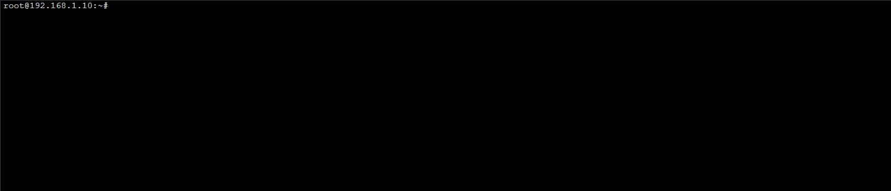
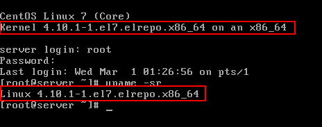
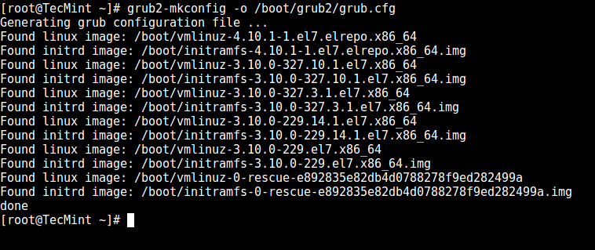
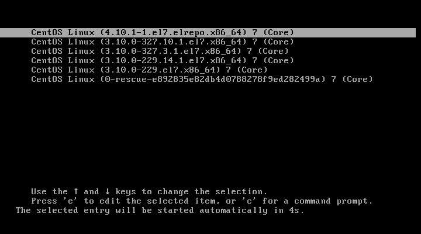
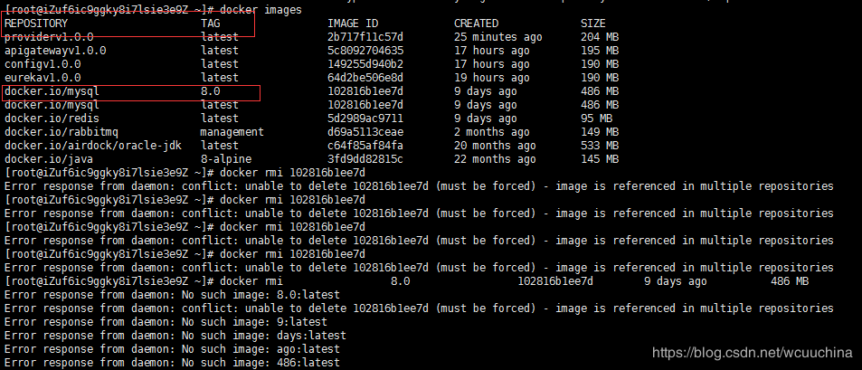
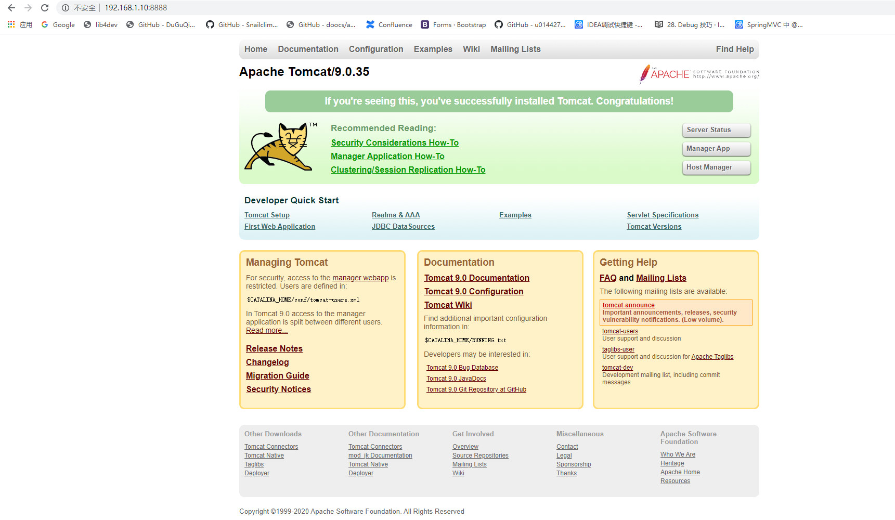

## 2.1 Linux

### 2.1.1 CentOS

#### 2.1.1.1 CentOS 7 清空终端屏幕

解决方案：

* 输出很多信息的命令行窗口：


* 执行命令：

```bash
root@192.168.1.10:~# reset
```

* 清空后的窗口:



#### 2.1.1.2 CentOS 7 删除多余的内核

解决方案：

1. 首先列出系统中正在使用的内核。

```bash
uname -a
```

2. 查询系统中全部的内核。

```bash
rpm -qa | grep kernel
```

3. 将需要删除的内核删除掉（多个内核可空格隔开，也可以写模糊的内核名称）。

```bash
yum -y remove 内核名称
```

4. 重启之后就可以看到内核被删掉了，同时多余的启动项也自动删掉了。

#### 2.1.1.3 CentOS 7 中安装或升级最新的内核

> 本文转载自 [Linux 中国](https://linux.cn/article-8310-1.html)

虽然有些人使用 `Linux` 来表示整个操作系统，但要注意的是，严格地来说，`Linux` 只是个内核。另一方面，发行版是一个完整功能的系统，它建立在内核之上，具有各种各样的应用程序工具和库。

在正常操作期间，内核负责执行两个重要任务：

* 作为硬件和系统上运行的软件之间的接口。

* 尽可能高效地管理系统资源。

为此，内核通过内置的驱动程序或以后可作为模块安装的驱动程序与硬件通信。

例如，当你计算机上运行的程序想要连接到无线网络时，它会将该请求提交给内核，后者又会使用正确的驱动程序连接到网络。

> 建议阅读： [如何在 Ubuntu 中升级内核](https://linux.cn/article-8284-1.html)

随着新的设备和技术定期出来，如果我们想充分利用它们，保持最新的内核就很重要。此外，更新内核将帮助我们利用新的内核函数，并保护自己免受先前版本中发现的漏洞的攻击。

准备好了在 `CentOS 7` 或其衍生产品（如 `RHEL 7` 和 `Fedora`）上更新内核了么？如果是这样，请继续阅读！

1. 检查已安装的内核版本。

让我们安装了一个发行版，它包含了一个特定版本的内核。为了展示当前系统中已安装的版本，我们可以：

```bash
uname -sr
```

下面的图片展示了在一台 `CentOS 7` 服务器上的输出信息：


如果我们现在进入 [Linux 内核官网](https://www.kernel.org/)，在撰写本文时，我们看到最新的内核版本是 `4.10.1`（其他版本可以从同一网站获得）。

还要考虑的一个重要的事情是内核版本的生命周期 - 如果你当前使用的版本接近它的生命周期结束，那么在该日期后将不会提供更多的 `bug` 修复。关于更多信息，请参阅[内核发布页](https://www.kernel.org/category/releases.html)。

2. 在 `CentOS 7` 中升级内核。

大多数现代发行版提供了一种使用 [yum等包管理系统](http://www.tecmint.com/20-linux-yum-yellowdog-updater-modified-commands-for-package-mangement/) 和官方支持的仓库升级内核的方法。

但是，这只会升级内核到仓库中可用的最新版本 - 而不是在 [Linux 内核官网](https://www.kernel.org/) 中可用的最新版本。不幸的是，`Red Hat` 只允许使用前者升级内核。

与 `Red Hat` 不同，`CentOS` 允许使用 `ELRepo`，这是一个第三方仓库，可以将内核升级到最新版本。

要在 `CentOS 7` 上启用 `ELRepo` 仓库，请运行：

```bash
rpm --import https://www.elrepo.org/RPM-GPG-KEY-elrepo.org
rpm -Uvh http://www.elrepo.org/elrepo-release-7.0-2.el7.elrepo.noarch.rpm
```


仓库启用后，你可以使用下面的命令列出可用的内核相关包：

```bash
yum --disablerepo="*" --enablerepo="elrepo-kernel" list available
```


接下来，安装最新的主线稳定内核：

```bash
yum --enablerepo=elrepo-kernel install kernel-ml
```


最后，重启机器并应用最新内核，接着运行下面的命令检查最新内核版本：

```bash
uname -sr
```



3. 设置 `GRUB` 默认的内核版本。

为了让新安装的内核成为默认启动选项，你需要如下修改 GRUB 配置：

打开并编辑 `/etc/default/grub` 并设置 `GRUB_DEFAULT=0`。意思是 `GRUB` 初始化页面的第一个内核将作为默认内核。

```text
GRUB_TIMEOUT=5
GRUB_DISTRIBUTOR="$(sed 's, release .*$,,g' /etc/system-release)"
GRUB_DEFAULT=0
GRUB_DISABLE_SUBMENU=true
GRUB_TERMINAL_OUTPUT="console"
GRUB_CMDLINE_LINUX="crashkernel=auto rd.lvm.lv=centos/root rd.lvm.lv=centos/swap rhgb quiet"
GRUB_DISABLE_RECOVERY="true"
```

接下来运行下面的命令来重新创建内核配置。

```bash
grub2-mkconfig -o /boot/grub2/grub.cfg
```



重启并验证最新的内核已作为默认内核。



恭喜你！你已经在 `CentOS 7` 中升级内核了！

4. 总结

本文中，我们解释了如何轻松升级系统上的 `Linux` 内核。我们还没讲到另外一个方法，因为它涉及从源代码编译内核，这可以写成一本书，并且不推荐在生产系统上这么做。

虽然它是最好的学习体验之一，并且允许细粒度配置内核，但是你可能会让你的系统不可用，并且可能必须从头重新安装它。

如果你仍然有兴趣构建内核作为学习经验，你可以在 [Kernel Newbies](https://kernelnewbies.org/KernelBuild) 页面中获得指导。

一如既往，如果你对本文有任何问题或意见，请随时使用下面的评论栏。

作者简介：

我是一个计算机上瘾的家伙，并且是开源和 `Linux` 系统软件的粉丝，有大约 4 年的 `Linux` 发行版桌面、服务器和 `bash` 脚本的经验。

[via](http://www.tecmint.com/install-upgrade-kernel-version-in-centos-7/)

作者：`Matei Cezar` 译者：`geekpi` 校对：`wxy`

本文由 `LCTT` 原创编译，`Linux中国` 荣誉推出

## 4.6 Maven

### 4.6.1 Maven的标准settings.xml文件

```xml
<?xml version="1.0" encoding="UTF-8"?>
<settings xmlns="http://maven.apache.org/SETTINGS/1.0.0"
    xmlns:xsi="http://www.w3.org/2001/XMLSchema-instance" xsi:schemaLocation="http://maven.apache.org/SETTINGS/1.0.0 http://maven.apache.org/xsd/settings-1.0.0.xsd">
 
    <!-- 本地仓库的位置 -->
    <localRepository>${user.home}/.m2/repository</localRepository>
   
    <!-- Apache Maven 配置 -->
    <pluginGroups/>
    <proxies/>
 
    <!-- 私服发布的用户名密码 -->
    <servers>
        <server>
            <id>releases</id>
            <username>deployment</username>
            <password>He2019</password>
        </server>
        <server>
            <id>snapshots</id>
            <username>deployment</username>
            <password>He2019</password>
        </server>
    </servers>
     
    <!-- 阿里云镜像 -->
    <mirrors>
        <mirror>
            <id>alimaven</id>
            <name>aliyun maven</name>
            <!-- https://maven.aliyun.com/repository/public/ -->
            <url>http://maven.aliyun.com/nexus/content/groups/public/</url>
            <mirrorOf>central</mirrorOf>
        </mirror>
    </mirrors>
 
    <!-- 配置: java8, 先从阿里云下载, 没有再去私服下载  -->
    <!-- 20190929 hepengju 测试结果: 影响下载顺序的是profiles标签的配置顺序(后面配置的ali仓库先下载), 而不是activeProfiles的顺序 -->
    <profiles>
        <!-- 全局JDK1.8配置 -->
        <profile>
            <id>jdk1.8</id>
            <activation>
                <activeByDefault>true</activeByDefault>
                <jdk>1.8</jdk>
            </activation>
            <properties>
                <project.build.sourceEncoding>UTF-8</project.build.sourceEncoding>
                <maven.compiler.source>1.8</maven.compiler.source>
                <maven.compiler.target>1.8</maven.compiler.target>
                <maven.compiler.compilerVersion>1.8</maven.compiler.compilerVersion>
            </properties>
        </profile>
 
         
        <!-- Nexus私服配置: 第三方jar包下载, 比如oracle的jdbc驱动等 -->
        <profile>
            <id>dev</id>
            <repositories>
                <repository>
                    <id>nexus</id>
                    <url>http://nexus.hepengju.cn:8081/nexus/content/groups/public/</url>
                    <releases>
                        <enabled>true</enabled>
                    </releases>
                    <snapshots>
                        <enabled>true</enabled>
                    </snapshots>
                </repository>
            </repositories>
            <pluginRepositories>
                <pluginRepository>
                    <id>public</id>
                    <name>Public Repositories</name>
                    <url>http://nexus.hepengju.cn:8081/nexus/content/groups/public/</url>
                </pluginRepository>
            </pluginRepositories>
        </profile>
         
        <!-- 阿里云配置: 提高国内的jar包下载速度 -->
        <profile>
            <id>ali</id>
            <repositories>
                <repository>
                    <id>alimaven</id>
                    <name>aliyun maven</name>
                    <url>http://maven.aliyun.com/nexus/content/groups/public/</url>
                    <releases>
                        <enabled>true</enabled>
                    </releases>
                    <snapshots>
                        <enabled>true</enabled>
                    </snapshots>
                </repository>
            </repositories>
            <pluginRepositories>
                <pluginRepository>
                    <id>alimaven</id>
                    <name>aliyun maven</name>
                    <url>http://maven.aliyun.com/nexus/content/groups/public/</url>
                </pluginRepository>
            </pluginRepositories>
        </profile>
 
    </profiles>
     
    <!-- 激活配置 -->
    <activeProfiles>
        <activeProfile>jdk1.8</activeProfile>
        <activeProfile>dev</activeProfile>
        <activeProfile>ali</activeProfile>
    </activeProfiles>
</settings>
```

## 4.5 Docker

### 4.5.1 将镜像源更改为国内的镜像源

1. 修改文件路径 `/etc/docker/daemon.json`。

> 通过 `SmarTTY` 智能终端进行修改，也可以用 `vim` 命令进行修改。

2. 添加国内镜像源以及 `DNS`。

```text
"registry-mirrors": [
"https://kfwkfulq.mirror.aliyuncs.com",
"https://2lqq34jg.mirror.aliyuncs.com",
"https://pee6w651.mirror.aliyuncs.com",
"https://registry.docker-cn.com",
"http://hub-mirror.c.163.com"
],
"dns": ["8.8.8.8","8.8.4.4"]
```

3. 重启 `Docker` 服务。

```docker
systemctl restart docker
```

### 4.5.2 删除相同IMAGE ID镜像的方法

> 本文转载自 [CSDN](https://blog.csdn.net/wcuuchina/article/details/86062142)

当指定的版本和最新版本相同的时候，会有相同的 `IMAGE ID`。


将指定的 `IMAGE ID` 进行删除时，因为 `IMAGE ID` 的镜像存在多个，所以会存在错误信息：

```text
Error response from daemon: conflict: unable to delete 102816b1ee7d (must be forced) - image is referenced in multiple repositories
```

所以指定删除的方式应该改为 `REPOSITORY:TAG`。



脚本如下：

```docker
docker rmi docker.io/mysql:8.0
```


### 4.5.3 删除已经安装的包

1. 下面以 `Docker` 为列：

```bash
yum list installed | grep docker
```

本机安装过旧版本：

`docker.x86_64`、`docker-client.x86_64`、`docker-common.x86_64`。

2. 删除安装的软件包。

写法一：

```bash
yum -y remove docker.x86_64                        
yum -y remove docker-client.x86_64                  
yum -y remove docker-common.x86_64
```

写法二：

```bash
yum -y remove docker.x86_64 docker-client.x86_64 docker-common.x86_64
```

写法三：模糊删除所有关于docker的包

```bash
yum -y remove docker
```

### 4.5.4 Tomcat外部访问报HTTP Status 404 – Not Found

问题：默认从官方镜像源拉取的镜像，`Tomcat`版本 `9.0.35`、`8.5.55`、`7` 都出现 `404` 的情况。


解决方案：

1. 启动容器。

* 【-d】：后台运行。
* 【-p】：映射端口。
* 【tomcat:latest】：以冒号隔开指定版本，默认不写就是 `latest`。

```bash
root@192.168.1.10:~# docker run -d -p 8888:8080 tomcat:latest
```

2. 查看运行中的容器。

> 容器的【CONTAINER ID】`30d13830ee5a` 可以简写为 `30`，或者其他位数，估计只要保重唯一，应该都可以执行成功，具体没有深究。

```bash
root@192.168.1.10:~# docker ps
CONTAINER ID        IMAGE               COMMAND             CREATED             STATUS              PORTS                    NAMES
30d13830ee5a        tomcat:latest       "catalina.sh run"   18 minutes ago      Up 18 minutes       0.0.0.0:8888->8080/tcp   hopeful_rosalind
```

3. 以交互方式进入容器。

* 【exec】：`Run a command in a running container`(在运行的容器中运行命令)。
* 【exec -i】：`--interactive`（相互作用的）       `Keep STDIN open even if not attached`（即使没有连接，也要保持STDIN打开）。
* 【exec -t】：`--tty`        `Allocate a pseudo-TTY`（分配一个 冒充的终端设备）。
* 【bash】：打开容器内的一个终端进程。

```bash
root@192.168.1.10:~# docker exec -it 30d13830ee5a bash
root@30d13830ee5a:/usr/local/tomcat#
```

4. 修改 `Tomcat` 中的 `webapp` 文件夹为 `webapp2`。

```bash
root@30d13830ee5a:/usr/local/tomcat# mv webapps weapps2
```

5. 修改 `Tomcat` 中的 `webapp.dist` 文件夹为 `webapp`。

```bash
root@30d13830ee5a:/usr/local/tomcat# mv webapps.dist webapps
```

> 4、5两个步骤修改文件夹的原因是 `Tomcat` 资源文件应该在 `webapps` 下，拉取的镜像中的文件夹为 `webapps.dist`，所以此处做了修改。

6. 退出，回到根目录。

```bash
root@30d13830ee5a:/usr/local/tomcat# exit
exit
root@192.168.1.10:/#
```

7. 将修改后的容器提交生成一个新镜像。

* 【-m】：提交时的说明文字。
* 【-a】：提交的镜像作者。

```bash
root@192.168.1.10:~# docker ps
CONTAINER ID        IMAGE               COMMAND             CREATED             STATUS              PORTS                    NAMES
30d13830ee5a        tomcat:latest       "catalina.sh run"   49 minutes ago      Up 49 minutes       0.0.0.0:8888->8080/tcp   hopeful_rosalind
root@192.168.1.10:~# docker commit -m="update mv webapps.dist webapps" -a="jack" 30d13830ee5a mytomcat:latest
sha256:427d4f3065ba2c2d4a0bbdf08e04d7dbdea747b8a06c886921b2b677b05e3097
```

8. 访问 `Tomcat`。


