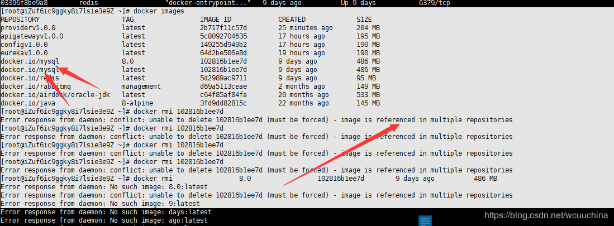
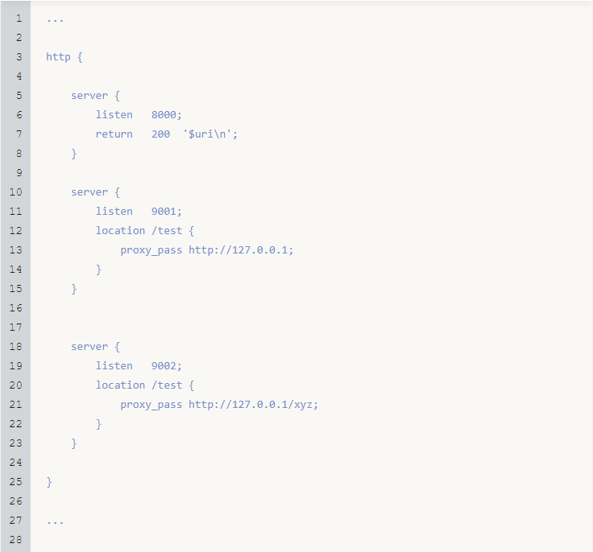

## 4.5 Docker

### 4.5.1 将镜像源更改为国内的镜像源

1. 修改文件路径 `/etc/docker/daemon.json`。

> 通过 `SmarTTY` 智能终端进行修改，也可以用 `vim` 命令进行修改。

2. 添加国内镜像源以及 `DNS`。

```text
"registry-mirrors": [
"https://kfwkfulq.mirror.aliyuncs.com",
"https://2lqq34jg.mirror.aliyuncs.com",
"https://pee6w651.mirror.aliyuncs.com",
"https://registry.docker-cn.com",
"http://hub-mirror.c.163.com"
],
"dns": ["8.8.8.8","8.8.4.4"]
```

3. 重启 `Docker` 服务。

```docker
systemctl restart docker
```

### 4.5.2 删除相同IMAGE ID镜像的方法

> 本文转载自 [CSDN](https://blog.csdn.net/wcuuchina/article/details/86062142)

当指定的版本和最新版本相同的时候，会有相同的 `IMAGE ID`。



将指定的 `IMAGE ID` 进行删除时，因为 `IMAGE ID` 的镜像存在多个，所以会存在错误信息：

```text
Error response from daemon: conflict: unable to delete 102816b1ee7d (must be forced) - image is referenced in multiple repositories
```

所以指定删除的方式应该改为 `REPOSITORY:TAG`。


脚本如下：

```docker
docker rmi docker.io/mysql:8.0
```


### 4.5.3 Tomcat外部访问报HTTP Status 404 – Not Found

问题：默认从官方镜像源拉取的镜像，`Tomcat`版本 `9.0.35`、`8.5.55`、`7` 都出现 `404` 的情况。


解决方案：

1. 启动容器。

```bash
root@192.168.1.10:~# docker run -d -p 8888:8080 tomcat:latest
```

```txt
参数说明：
-d 后台运行。
-p 映射端口。
tomcat:latest 以冒号隔开指定版本，默认不写就是 `latest`。
```

2. 查看运行中的容器。

> 容器的【CONTAINER ID】`30d13830ee5a` 可以简写为 `30`，或者其他位数，估计只要保重唯一，应该都可以执行成功，具体没有深究。

```bash
root@192.168.1.10:~# docker ps
CONTAINER ID        IMAGE               COMMAND             CREATED             STATUS              PORTS                    NAMES
30d13830ee5a        tomcat:latest       "catalina.sh run"   18 minutes ago      Up 18 minutes       0.0.0.0:8888->8080/tcp   hopeful_rosalind
```

3. 以交互方式进入容器。

```bash
root@192.168.1.10:~# docker exec -it 30d13830ee5a bash
root@30d13830ee5a:/usr/local/tomcat#
```

```txt
参数说明：
exec Run a command in a running container (在运行的容器中运行命令)。
exec -i --interactive (相互作用的) Keep STDIN open even if not attached (即使没有连接，也要保持STDIN打开)。
exec -t --tty Allocate a pseudo-TTY (分配一个 冒充的终端设备)。
bash 打开容器内的一个终端进程。
```

4. 修改 `Tomcat` 中的 `webapp` 文件夹为 `webapp2`。

```bash
root@30d13830ee5a:/usr/local/tomcat# mv webapps weapps2
```

5. 修改 `Tomcat` 中的 `webapp.dist` 文件夹为 `webapp`。

```bash
root@30d13830ee5a:/usr/local/tomcat# mv webapps.dist webapps
```

> 4、5两个步骤修改文件夹的原因是 `Tomcat` 资源文件应该在 `webapps` 下，拉取的镜像中的文件夹为 `webapps.dist`，所以此处做了修改。

6. 退出，回到根目录。

```bash
root@30d13830ee5a:/usr/local/tomcat# exit
exit
root@192.168.1.10:/#
```

7. 将修改后的容器提交生成一个新镜像。

```bash
root@192.168.1.10:~# docker ps
CONTAINER ID        IMAGE               COMMAND             CREATED             STATUS              PORTS                    NAMES
30d13830ee5a        tomcat:latest       "catalina.sh run"   49 minutes ago      Up 49 minutes       0.0.0.0:8888->8080/tcp   hopeful_rosalind
root@192.168.1.10:~# docker commit -m="update mv webapps.dist webapps" -a="jack" 30d13830ee5a mytomcat:latest
sha256:427d4f3065ba2c2d4a0bbdf08e04d7dbdea747b8a06c886921b2b677b05e3097
```

```txt
参数说明：
-m 提交时的说明文字。
-a 提交的镜像作者。
```

8. 访问 `Tomcat`。


## 4.6 Maven

### 4.6.1 配置远程公共仓库、私服

```xml
<?xml version="1.0" encoding="UTF-8"?>
<settings xmlns="http://maven.apache.org/SETTINGS/1.0.0"
    xmlns:xsi="http://www.w3.org/2001/XMLSchema-instance" xsi:schemaLocation="http://maven.apache.org/SETTINGS/1.0.0 http://maven.apache.org/xsd/settings-1.0.0.xsd">
 
    <!-- 本地仓库的位置 -->
    <localRepository>D:\1-ProgramFiles\1-DevTools\apache-maven-3.6.3\repository</localRepository>
    
    <!-- 本地私服用户名、密码 -->
    <servers>
        <server>
            <id>nexus</id>
            <username>admin</username>
            <password>1</password>
        </server>
    </servers>

    <!-- 本地私服镜像 -->
    <mirrors>
        <mirror>
            <id>nexus</id>
            <name>nexus repository</name>
            <url>http://localhost:8081/repository/Jack-Group/</url>
            <mirrorOf>central</mirrorOf>
        </mirror>
    </mirrors>
 
    <profiles>
        <!-- 全局JDK1.8配置 -->
        <profile>
            <id>jdk1.8</id>
            <activation>
                <activeByDefault>true</activeByDefault>
                <jdk>1.8</jdk>
            </activation>
            <properties>
                <project.build.sourceEncoding>UTF-8</project.build.sourceEncoding>
                <maven.compiler.source>1.8</maven.compiler.source>
                <maven.compiler.target>1.8</maven.compiler.target>
                <maven.compiler.compilerVersion>1.8</maven.compiler.compilerVersion>
            </properties>
        </profile>
        <!-- 私服配置 -->
        <profile>
            <id>nexus</id>
            <repositories>
                <repository>
                    <id>nexus</id>
                    <name>nexus repository</name>
                    <url>http://localhost:8081/repository/Jack-Group/</url>
                    <releases>
                        <enabled>true</enabled>
                    </releases>
                    <snapshots>
                        <enabled>true</enabled>
                    </snapshots>
                </repository>
            </repositories>
            <pluginRepositories>
                <pluginRepository>
                    <id>nexus</id>
                    <name>nexus repository</name>
                    <url>http://localhost:8081/repository/Jack-Group/</url>
                </pluginRepository>
            </pluginRepositories>
        </profile>
    </profiles>
     
    <!-- 激活配置 -->
    <activeProfiles>
        <activeProfile>jdk1.8</activeProfile>
        <activeProfile>nexus</activeProfile>
    </activeProfiles>
</settings>
```

### 4.6.2 Unrecognised tag: 'servers' (position: START_TAG seen ...<mirrors>\r\n

> 因为配置本地私服，设置了私服的用户名、密码时，错把 `<servers>` 标签放到了 `<mirrors>` 中，所以出现了这个问题。

修改标签位置后的 `XML`。

```xml
<servers>
    <server>
        <id>nexus</id>
        <username>admin</username>
        <password>1</password>
    </server>
</servers> 
<mirrors>
    <mirror>
        <id>nexus</id>
        <name>nexus repository</name>
        <url>http://localhost:8081/repository/Jack-Group/</url>
        <mirrorOf>central</mirrorOf>
    </mirror>
</mirrors>
  ```

### 4.6.3 No archetype found in remote catalog. Defaulting to internal catalog


> 自定义的 `archetype` 作为模板创建项目时，提示找不到 `archetype`，参考了 [程序员大本营](https://www.pianshen.com/article/36231356087/) 的文章，解决了问题。

公共步骤：

1. 首先下载 [archetype-catalog.xml](https://repo1.maven.org/maven2/archetype-catalog.xml) 。

2. 放到 `Maven` 仓库根目录。

示例：`D:\1-ProgramFiles\1-DevTools\apache-maven-3.6.3\repository\archetype-catalog.xml`。

解决方案一：

新建项目选择模板后，添加属性名 `archetypeCatalog` 和值 `local`，然后点击 `Finish`。


解决方案二：

1. 依次找到 `File` → `New Projects Settings` → `Settings for New Projects...` → `Build,Execution,Deployment` → `Build Tools` → `Maven` → `Runner`。

2. 设置 `VM Options` 为 `-DarchetypeCatalog=local`。


### 4.6.4 局部指定项目 JDK

> 以下提供两种方式局部指定项目 `JDK`，全局指定请查看 [4.6.1 配置远程公共仓库、私服](docs/04-PS03-Server-side-correlation.md#_461-配置远程公共仓库、私服) 。

方式一

```xml
<properties>
    <maven.compiler.target>14</maven.compiler.target>
    <maven.compiler.source>14</maven.compiler.source>
</properties>
```

方式二

```xml
<build>
    <plugins>
        <plugin>
            <groupId>org.apache.maven.plugins</groupId>
            <artifactId>maven-compiler-plugin</artifactId>
            <configuration>
                <source>14</source>
                <target>14</target>
            </configuration>
        </plugin>
    </plugins>
</build>
```

### 4.6.5 Cannot prepare the release because you have local modifications

> 通过配置 `maven scm` 进行项目版本管理，创建分支时提示本地有文件变动，发布项目到远程库失败。既然有变动，将本地项目再次提交远程库，然后再次创建分支，顺利通过。

### 4.6.6 搭建 Maven 私服

> 参考 [博客园](https://www.cnblogs.com/kongweifeng/p/9369936.html) 这篇文章搭建的私服，后面有时间写一份自己的搭建过程。

[Nexus 私服下载地址](https://www.sonatype.com/download-nexus-repo-oss)

[Nexus 帮助文档](https://help.sonatype.com/repomanager3)

### 4.6.7 创建 archetype 时提示 Unknown lifecycle phase ".xxx.xxx"

完整错误信息如下：

```powershell
PS D:\1-ProgramFiles\1-DevTools\IntelliJ IDEA 2020.1.1\IdeaProjects\gitDemo> mvn -s "D:\1-ProgramFiles\1-DevTools\apache-maven-3.6.3\conf\settings.xml" archetype:create-from-project -DpackageName=org.naijuw.gitDemo
...........................................................................省略打印信息...........................................................................
[ERROR] Unknown lifecycle phase ".naijuw.gitDemo". You must specify a valid lifecycle phase or a goal in the format <plugin-prefix>:<goal> or <plugin-group-id>:<plugin-artifact-id>[:<plugin-version>]:<goal>. Available lifecycle phases are: validate, initialize, generate-sources, process-sources, generate-resources, process-resources, compile, process-classes, generate-test-sources, process-test-sources, generate-test-resources, process-test-resources, test-compile, process-test-classes, test, prepare-package, package, pre-integration-test, integration-test, post-integration-test, verify, install, deploy, pre-clean, clean, post-clean, pre-site, site, post-site, site-deploy. -> [Help 1]
[ERROR]
[ERROR] To see the full stack trace of the errors, re-run Maven with the -e switch.
[ERROR] Re-run Maven using the -X switch to enable full debug logging.
[ERROR]
[ERROR] For more information about the errors and possible solutions, please read the following articles:
[ERROR] [Help 1] http://cwiki.apache.org/confluence/display/MAVEN/LifecyclePhaseNotFoundException
```

解决方案：

修改命令为：

```powershell
PS D:\1-ProgramFiles\1-DevTools\IntelliJ IDEA 2020.1.1\IdeaProjects\gitDemo> mvn -s "D:\1-ProgramFiles\1-DevTools\apache-maven-3.6.3\conf\settings.xml" archetype:create-from-project -DpackageName="org.naijuw.gitDemo"
```

## 4.7 Git

### 4.7.1 提交项目到码云远程仓库提示没有权限

错误如下：

```git
$ git push -u origin master
git@gitee.com: Permission denied (publickey).
fatal: Could not read from remote repository.

Please make sure you have the correct access rights
and the repository exists.
```

解决方案：

1. 在 `Git` 客户端输入如下命令：

```git
$ ssh-keygen -t rsa -C "xxxxx@xxxxx.com" # 双引号内为你的邮箱地址
```

2. 查看你的 `public key`。

```git
$ cat ~/.ssh/id_rsa.pub
```

3. 在码云 [SSH公钥](http://gitee.com/keys) 中添加你的 `public key`。


4. 添加后，在 `Git` 中输入如下命令:

```git
$ ssh -T git@gitee.com
```

如果提示以下信息，证明 `public key` 添加成功。

```git
Hi yourname! You've successfully authenticated, but GITEE.COM does not provide shell access.
```

## 4.8 Nginx

### 4.8.1 ./configure: No such file or directory


> 编译 `nginx` 时，提示没有此文件或目录，[CSDN](https://blog.csdn.net/testcs_dn/article/details/39253869) 上有一篇提到，解压的过程中文件损坏了，所以重新下载解压缩就可以了。

解决方案：

```bash
# 下载 nginx 安装包
root@192.168.1.10:~# wget http://nginx.org/download/nginx-1.18.0.tar.gz 
# 解压安装包
root@192.168.1.10:~# tar -xzf nginx-1.18.0.tar.gz
```

### 4.8.2 ./configure: error: C compiler cc is not found


> 编译 `nginx` 时，提示编译的命令找不到，[CSDN](https://blog.csdn.net/testcs_dn/article/details/51461750) 上有一篇提到，需要安装 `gcc` 编译器。

解决方案：

```bash
root@192.168.1.10:~# yum -y install gcc gcc-c++ autoconf automake make
```

### 4.8.3 nginx: [emerg] bind() to 0.0.0.0:80 failed (98: Address already in use)


> 之前安装过其他软件，占用了 80 端口，这里修改 `nginx` 端口号。

解决方案：

1. 首先进入 `nginx` 安装目录。

```bash
root@192.168.1.10:~/nginx/sbin# cd /root/nginx/conf/
```

2. 然后通过 `Smartty` 客户端工具，双击文件进行编辑，修改端口为不被占用的端口即可。


### 4.8.4 访问 403 错误


> 在 [CSDN](https://www.cnblogs.com/unidentified/p/11906002.html) 上看到一篇文章，需要修改 `nginx` 配置文件赋予访问权限。

解决方案：

1. 在配置文件中添加 `user root;`。


2. 重新启动 `nginx` 服务并访问，成功来到了 `nginx` 欢迎页。


### 4.8.5 include 指令

> 拆分多个文件，配置不同的指令，方便维护。

```conf
# 包含其他配置文件，包括了8091.conf 和 8092.conf
# 绝对路径设置
#include /root/nginx/conf.d/*.conf;
# 相对路径设置
include ../conf.d/*.conf;
```

> `include` 标签放在 `server` 标签之后。

### 4.8.6 nginx: [emerg] unknown directive "if(" in /root/nginx/conf/nginx.conf:47


> 修改 `nginx.conf` 文件后，重新加载配置文件时，提示未知的指令，在 [CSDN](https://blog.csdn.net/doubleqinyan/article/details/90263448) 找到了答案，`if` 和 `(` 要有空格。

### 4.8.7 nginx: [emerg] unknown directive "set_real_ip_from" in /root/nginx/conf/nginx.conf:120


> 重新加载 `nginx` 配置文件时，提示未知的指令 `directive`，刚开始装 `nginx` 的时候，已经编译 `realip` 模块，不清楚为什么缺失，重新安装下吧。

```bash
# 编译 realip 模块
root@192.168.1.6:~/nginx-1.18.0# ./configure --prefix=/root/nginx --with-http_realip_module
# 安装模块
root@192.168.1.6:~/nginx-1.18.0# make && sudo make install
```

### 4.8.8 四层反向代理示例

`nginx.conf` 配置文件：

```bash
user root;

# 启动的worker进程数
worker_processes  2;

# 设置每个worker进程的最大连接数，它决定了Nginx的并发能力
events {
    worker_connections  1024;
}

stream {
	
	server {
		listen 9000;
		return '9000 server get ip: $remote_addr!\n';
	}
	
	server {
		listen 90;
		# 注意，只写ip和port，不要加上［http:]之类的，这里是四层的协议
		proxy_pass 127.0.0.1:9000;
	}
}
```

通过 telnet 访问时遇到下图这个问题：


排查：

1. 安装 telnet：CentOS 不安装前也能访问，Windows也已经启用了这个功能。

2. 防火墙：早已关闭。

3. 端口：发现 `./nginx -s reload` 完全没有生效，修改配置文件后，端口还是原来的 `8093`。

停止 `nginx` 服务，查看运行中服务。然后重启 `nginx` 服务，再次查看运行中服务，发现 `9000`、`90` 两个端口已经在运行中。 

```bash
root@192.168.1.6:~/nginx/sbin# ./nginx -s stop
root@192.168.1.6:~/nginx/sbin# netstat -tunpl
Active Internet connections (only servers)
Proto Recv-Q Send-Q Local Address           Foreign Address         State       PID/Program name    
tcp        0      0 127.0.0.1:25            0.0.0.0:*               LISTEN      1280/master         
tcp        0      0 0.0.0.0:22              0.0.0.0:*               LISTEN      1168/sshd           
tcp6       0      0 ::1:25                  :::*                    LISTEN      1280/master         
tcp6       0      0 :::22                   :::*                    LISTEN      1168/sshd           
udp        0      0 0.0.0.0:68              0.0.0.0:*                           986/dhclient        
root@192.168.1.6:~/nginx/sbin# ./nginx
root@192.168.1.6:~/nginx/sbin# netstat -tunpl
Active Internet connections (only servers)
Proto Recv-Q Send-Q Local Address           Foreign Address         State       PID/Program name    
tcp        0      0 127.0.0.1:25            0.0.0.0:*               LISTEN      1280/master         
tcp        0      0 0.0.0.0:90              0.0.0.0:*               LISTEN      19785/nginx: master 
tcp        0      0 0.0.0.0:9000            0.0.0.0:*               LISTEN      19785/nginx: master 
tcp        0      0 0.0.0.0:22              0.0.0.0:*               LISTEN      1168/sshd           
tcp6       0      0 ::1:25                  :::*                    LISTEN      1280/master         
tcp6       0      0 :::22                   :::*                    LISTEN      1168/sshd           
udp        0      0 0.0.0.0:68              0.0.0.0:*                           986/dhclient        
```

使用 `telnet` 访问 两个端口。

```cmd
C:\Users\89349>telnet 192.168.1.6 9000
```


```cmd
C:\Users\89349>telnet 192.168.1.6 90
```


!> `reload` 有时会不生效，如果修改配置文件没有生效，停止 `nginx` 服务，然后启动 `nginx` 服务。

### 4.8.9 七层反向代理示例

> 在慕课网学习 [Nginx 反向代理](http://www.imooc.com/wiki/nginxlesson/reverseproxy.html)，根据示例代码操作一遍，访问 `url` 地址时出现 `502 Bad Gateway`，查看日志得知，代理地址的端口出现问题。

官方示例：



环境说明：<br/>
系统：`CentOS 7.8`<br/>
Nginx：`1.18.0`

执行的命令：


`error.log` 信息：

```log
2020/08/20 18:34:53 [error] 26405#0: *57 connect() failed (111: Connection refused) while connecting to upstream, client: 192.168.1.6, server: , request: "GET /space/rose HTTP/1.1", upstream: "http://127.0.0.1:80/space/rose", host: "192.168.1.6:8094"
```

`nginx.conf` 完整配置（排查修改后的配置）：

```conf
user root;

# 启动的worker进程数
worker_processes  2;

# 设置每个worker进程的最大连接数，它决定了Nginx的并发能力
events {
    worker_connections  1024;
}

# http块配置
http {
    #include       mime.types;
    #default_type  application/octet-stream;
	
    #sendfile        on;

	# 重要参数，是一个请求完成之后还要保持连接多久，不是请求时间多久，
    # 目的是保持长连接，减少创建连接过程给系统带来的性能损耗
    #keepalive_timeout  65;

	# server块配置     	
	
    server {
    	listen 8093;
    	return 200 '$uri\n';
    }
    
    server {
    	listen 8094;
    	location /space {
    		proxy_pass http://127.0.0.1:8093;	
    	}
    }
		
	server {
    	listen 8095;
    	location /space {
    		proxy_pass http://127.0.0.1:8093/jack;	
    	}
    }		
}
```

最终运行效果：

```bash
root@192.168.1.6:~# curl http://192.168.1.6:8093/space/captain
/space/captain
root@192.168.1.6:~# curl http://192.168.1.6:8094/space/jack
/space/jack
root@192.168.1.6:~# curl http://192.168.1.6:8095/space/jack
/rose/jack
```

!> 一开始没有看日志，一个劲儿的百度，浪费很多时间。同一个错误，原因有可能不同。还有一个就是，慕课网的 `wiki` 错误太多，不过，这些坑也让我解决了很多问题。以后有日志的尽量看日志，没有日志再百度。

### 4.8.10 Nginx 常用命令

> 部分内容转载自 [慕课网](http://www.imooc.com/wiki/nginxlesson/architecture1.html) 。

```bash
# 查看版本信息
./nginx -v
# 查看详细信息
./nginx -V 
# 启动
./nginx
# 快速停止
./nginx -s stop
# 完整有序的停止
./nginx -s quit
# 重新加载配置文件
./nginx -s reload
# 检查配置文件是否语法错误
./nginx -tc /root/nginx/conf/nginx.conf # -t 校验文件；-c 指定配置文件
# 重新打开日志
./nginx -s reopen
```

```bash
# 查看 nginx 进程状态
root@192.168.1.6:~/nginx/sbin# ps -ef | grep nginx
root      3077     1  0 23:52 ?        00:00:00 nginx: master process ./nginx
root      3078  3077  0 23:52 ?        00:00:00 nginx: worker process
root      3079  3077  0 23:52 ?        00:00:00 nginx: worker process
root      3128  1414  0 23:52 pts/1    00:00:00 bash -c cd "/root/nginx/sbin" && bash -i -c "ps -ef | grep nginx"
root      3139  3128  0 23:52 pts/1    00:00:00 bash -i -c ps -ef | grep nginx
root      3149  3139  0 23:52 pts/1    00:00:00 grep --color=auto nginx
# 关闭进程号等于 3078 的 Worker 进程
root@192.168.1.6:~/nginx/sbin# kill -SIGTERM 3078
# 可以看到原先的 Worker 进程被杀死后，Nginx 的主进程又立马拉起来一个新的 Worker 进程提供服务。这说明 Nginx 是非常可靠的，只要 Master 进程还在就会保证 Worker 进程持续存在并提供服务
root@192.168.1.6:~/nginx/sbin# ps -ef | grep nginx
root      3077     1  0 23:52 ?        00:00:00 nginx: master process ./nginx
root      3195  3077  0 23:53 ?        00:00:00 nginx: worker process
root      3196  3077  0 23:53 ?        00:00:00 nginx: worker process
root      3257  1414  0 23:53 pts/1    00:00:00 bash -c cd "/root/nginx/sbin" && bash -i -c "ps -ef | grep nginx"
root      3268  3257  0 23:53 pts/1    00:00:00 bash -i -c ps -ef | grep nginx
root      3278  3268  0 23:53 pts/1    00:00:00 grep --color=auto nginx
# 向主进程发送 SIGHUP 信号，等价于 -s reload 操作。可以看到除了 Master 进程外，所有其他进程已经是新启动的进程了。
root@192.168.1.6:~/nginx/sbin# kill -SIGHUP 3077
root@192.168.1.6:~/nginx/sbin# ps -ef | grep nginx
root      3077     1  0 23:52 ?        00:00:00 nginx: master process ./nginx
root      3411  3077  0 23:56 ?        00:00:00 nginx: worker process
root      3412  3077  0 23:56 ?        00:00:00 nginx: worker process
root      3495  1414  0 23:57 pts/1    00:00:00 bash -c cd "/root/nginx/sbin" && bash -i -c "ps -ef | grep nginx"
root      3506  3495  0 23:57 pts/1    00:00:00 bash -i -c ps -ef | grep nginx
root      3516  3506  0 23:57 pts/1    00:00:00 grep --color=auto nginx
# 向主进程发生 SIGTERM 信号，等价于 -s stop 操作，即停止 Nginx 服务，关闭所有进程
root@192.168.1.6:~/nginx/sbin# kill -SIGTERM 3077
root@192.168.1.6:~/nginx/sbin# ps -ef | grep nginx
root      3011  1414  0 23:51 pts/1    00:00:00 bash -c cd "/root/nginx/sbin" && bash -i -c "ps -ef | grep nginx"
root      3022  3011  0 23:51 pts/1    00:00:00 bash -i -c ps -ef | grep nginx
root      3032  3022  0 23:51 pts/1    00:00:00 grep --color=auto nginx
# 启动 nginx
root@192.168.1.6:~/nginx/sbin# ./nginx
root@192.168.1.6:~/nginx/sbin# ps -ef | grep nginx
root      3077     1  0 23:52 ?        00:00:00 nginx: master process ./nginx
root      3411  3077  0 23:56 ?        00:00:00 nginx: worker process
root      3412  3077  0 23:56 ?        00:00:00 nginx: worker process
root      3790  1414  0 23:59 pts/1    00:00:00 bash -c cd "/root/nginx/sbin" && bash -i -c "ps -ef | grep nginx"
root      3801  3790  0 23:59 pts/1    00:00:00 bash -i -c ps -ef | grep nginx
root      3811  3801  0 23:59 pts/1    00:00:00 grep --color=auto nginx
root@192.168.1.6:~/nginx/sbin# ll ../logs/access.log
-rw-r--r--. 1 root root 14253 Aug 26 23:03 ../logs/access.log
root@192.168.1.6:~/nginx/sbin# rm -rf ../logs/access.log
root@192.168.1.6:~/nginx/sbin# ll ../logs/access.log
ls: cannot access ../logs/access.log: No such file or directory
# 向主进程发生 USR1 信号，等价于 -s repoen 操作，即重新打开日志文件
root@192.168.1.6:~/nginx/sbin# kill -USR1 3077
# 可以看到，在移除 Nginx 的 access.log 日志后，在向 Nginx 主进程发送 USR1 信号，Nginx 会重新生成一个新的 access.log 日志。
root@192.168.1.6:~/nginx/sbin# ll ../logs/access.log
-rw-r--r--. 1 root root 0 Aug 27 00:09 ../logs/access.log
```

### 4.8.11 Nginx 重新编译添加模块

> 本文转载自 [慕课网](https://www.imooc.com/article/284566)，部分内容略有调整。

环境说明

```txt
系统 CentOS 7.8
Nginx 源码路径 /root/nginx-1.18.0/src
Nginx 编译路径 /root/nginx-1.18.0/
Nginx 安装路径 /root/nginx/
```

1. 首先查询 `nginx` 编译了哪些模块。

> `./nginx -v` 是查询版本信息；`./nginx -V` 是查询详细信息。

```bash
root@192.168.1.6:~/nginx/sbin# ./nginx -V
nginx version: nginx/1.18.0
built by gcc 4.8.5 20150623 (Red Hat 4.8.5-39) (GCC) 
built with OpenSSL 1.0.2k-fips  26 Jan 2017
TLS SNI support enabled
configure arguments: --prefix=/root/nginx --with-http_ssl_module --with-http_stub_status_module --with-http_gzip_static_module --with-stream --with-http_realip_module --with-http_flv_module --with-http_random_index_module --with-mail --with-pcre --with-http_realip_module
```

2. 停止正在运行的 `nginx` 并备份安装路径下的 `nginx` 。

```bash
root@192.168.1.6:~/nginx/sbin# ./nginx -s stop
root@192.168.1.6:~/nginx/sbin# cp nginx nginx.bak
```

3. 添加 `http_secure_link` 模块作为示例：

```bash
root@192.168.1.6:~/nginx/sbin# cd /root/nginx-1.18.0/
root@192.168.1.6:~/nginx-1.18.0# ./configure  --prefix=/root/nginx            \--with-http_secure_link_module               \--with-http_ssl_module                             
 \--with-http_stub_status_module               \--with-http_gzip_static_module               \--with-stream                                \--with-http_realip_module           
         \--with-http_flv_module                       \--with-http_random_index_module              \--with-mail                                  \--with-pcre
```

> `\` 表示两行之间没有换行，还有一点需要注意的是，结尾处不要有 `\`，否则会出现如下错误：

```bash
bash: -c: line 0: unexpected EOF while looking for matching `"'
bash: -c: line 1: syntax error: unexpected end of file
```

4. 编译。

> 第一次安装 `nginx` 的时候需要 `make && make install`，增加新模块只需要 `make` 。

```bash
root@192.168.1.6:~/nginx-1.18.0# make
```

5. 拷贝刚才编译的 `nginx` 到安装目录。

```bash
root@192.168.1.6:~/nginx-1.18.0# cp /objs/nginx /root/nginx/sbin/
cp: overwrite ‘nginx’? y
```

5.启动 `nginx` 并查看 `nginx` 的编译模块。

```bash
root@192.168.1.6:~/nginx-1.18.0# cd ../nginx/sbin/
root@192.168.1.6:~/nginx/sbin# ./nginx
root@192.168.1.6:~/nginx/sbin# ./nginx -V
nginx version: nginx/1.18.0
built by gcc 4.8.5 20150623 (Red Hat 4.8.5-39) (GCC) 
built with OpenSSL 1.0.2k-fips  26 Jan 2017
TLS SNI support enabled
configure arguments: --prefix=/root/nginx --with-http_secure_link_module --with-http_ssl_module --with-http_stub_status_module --with-http_gzip_static_module --with-stream --with-http_realip_module --with-http_flv_module --with-http_random_index_module --with-mail --with-pcre
```

有一些模块是需要去下载安装包的，但是总体的思路是一样的。比如我需要安装 `echo-nginx-module` 这个模块。

```bash
root@192.168.1.6:~/nginx-1.18.0# wget -P /root/software/ https://github.com/openresty/echo-nginx-module/archive/v0.62rc1.tar.gz
root@192.168.1.6:~/nginx-1.18.0# cd /root/software/
root@192.168.1.6:~/software# tar -xzf v0.62rc1.tar.gz
...........................................................................................
root@192.168.1.6:~/nginx-1.18.0# ./configure  --prefix=/root/nginx            \--with-http_secure_link_module               \--with-http_ssl_module                       \--wit
h-http_stub_status_module               \--with-http_gzip_static_module               \--with-stream                                \--with-http_realip_module                  
  \--with-http_flv_module                       \--with-http_random_index_module              \--with-mail                                  \--with-pcre                        
          \--add-module=/root/software/echo-nginx-module-0.62rc1
...........................................................................................          
```

> 其他操作和 `http_secure_link` 模块添加时一样，只是在 `./configure` 的最后加了一行 `--add-module=/root/software/echo-nginx-module-0.62rc1` 。

### 4.8.12 secure_link 防盗链

> 本文转载自 [慕课网](http://www.imooc.com/wiki/nginxlesson/chain.html) ，`md5url.sh` 脚本参考 [博客园](https://www.cnblogs.com/panwenbin-logs/p/8728327.html) ，记录学习过程。

准备一个静态图片 `B210.png`，放到 `Nginx` 服务器上，全路径为 `/root/test/B210.png` 。

```bash
# 将物理机中的一张图片上传到 CentOS 中
root@192.168.1.6:~/test# wget http://192.168.1.3:3000/images/B210.png
```

`nginx.conf` 配置如下:

```conf
user root;

# 启动的worker进程数
worker_processes  2;

# 设置每个worker进程的最大连接数，它决定了Nginx的并发能力
events {
    worker_connections  1024;
}

http {
  
    server {
       listen  8093;

       location / {
           #return 200 "$remote_addr";
           root /root/test;
       }
    }

    server {
       listen 8094;

       location ~* .(jpg|png|flv|mp4)$  {
          secure_link $arg_md5,$arg_expires;
          secure_link_md5 "$secure_link_expires$uri$remote_addr secret";

          # 空字符串，校验不通过
          if ($secure_link = "") {
             return 403;
          }

          # 时间过期
          if ($secure_link = "0") {
             return 410;
          }

          # 校验通过，访问对的静态资源
          root /root/test;
       }
    }

}
```

首先，在浏览器上访问 `8093` 端口，我们可以获取对应的 `$remote_addr` 变量值(打开 `return` 的注释配置)，结果为 `192.168.1.3`，这是客户端请求时的对外 `IP`。访问浏览器上访问 `8093` 端口，`URI=/B210.png`， 可以看到这个静态图片。


接下来，我们在访问 `8094` 端口，`URI=/B210.png` 时，可以发现返回 `403` 页面，说明安全模块生效。


手动拼接访问链接：

找一个 `60` 秒过期的时间戳为 `1598454158`，按照 `secure_link_md5` 指令格式，通过 `shell` 命令生成 md5 值：

```bash
root@192.168.1.6:~/nginx/sbin# echo -n '1598454158/B210.png192.168.1.3 secret' | openssl md5 -binary | openssl base64 | tr +/ -_ | tr -d =
vjs5PfT1gxoDoQHrOvc73g
```

访问链接：http://192.168.1.6:8094/B210.png?md5=vjs5PfT1gxoDoQHrOvc73g&expires=1598454158

使用 `shell` 脚本自动生成访问链接：

```bash
# 创建 md5url.sh 脚本文件
root@192.168.1.6:~/nginx# touch md5url.sh
```

`md5url.sh` 脚本内容：

```sh
#!/bin/bash
server_name="192.168.1.6:8094"  # 服务器的地址
uri="/B210.png" # 测试文件 uri
remote_addr="192.168.1.3" # 客户端IP
timestamp=$(date -d "+60 seconds" +%s) # 定义过期时间为60秒
encrypted_string="secret" # 自定义加密串，和 nginx 的配置文件中加密串相同
res=$(echo -n "${timestamp}${uri}${remote_addr} ${encrypted_string}"|openssl md5 -binary|openssl base64|tr +/ -_|tr -d =)  # 生成MD5值
echo "http://${server_name}${uri}?md5=${res}&expires=${timestamp}" # 打印访问链接
```

```bash
# 添加权限
root@192.168.1.6:~/nginx# chmod +x md5url.sh
# 生成访问链接
root@192.168.1.6:~/nginx# sh md5url.sh
http://192.168.1.6:8094/B210.png?md5=FSs6IIZT94ePfFf2hImTIA&expires=1598572924
```

生成访问链接后，再次访问时，就可以看到静态图片了。


访问链接过期后，访问时无法查看图片，返回 `410` 状态码，说明 `Nginx` 成功检测到这个密钥值已经过期。


### 4.8.13 部署 Python 项目

> 本文转载自 [慕课网](http://www.imooc.com/wiki/nginxlesson/nginxpython.html) ，部分内容略有调整。

使用 `Django` 框架搭建一个简易的 `Web` 工程，然后基于 `Nginx` 服务部署 `Python Web` 项目。

1. 安装虚拟环境 `pyenv` 。

首先要知道，使用虚拟环境逐渐成了 `Python` 项目开发中的一种主流方式。 `pyenv` 可以帮我们生成多个 `Python` 的虚拟环境，这样我可以在同一台机器上使用 `python2` 或者 `python3` 或者 `python3` 的不同版本，避免不同项目因为依赖模块版本问题发生冲突。只要使用时，切换到那个具体的版本环境即可。下面来看在 `CentOS` 上如何安装并使用 `pyenv` :

```bash
# 安装 git
root@192.168.1.8:~# yum install git
root@192.168.1.8:~# git clone https://github.com/pyenv/pyenv.git ~/.pyenv
```

在 `/root/.bashrc` 文件最后加上如下 `2` 行。

```bashrc
PATH="~/.pyenv/bin:$PATH"
eval "$(pyenv init -)"
```

```bash
# 使配置生效
root@192.168.1.8:~# source ~/.bashrc
# 安装 pyenv-virtualenv
root@192.168.1.8:~# git clone https://github.com/pyenv/pyenv-virtualenv.git $(pyenv root)/plugins/pyenv-virtualenv
```

在 `/root/.bashrc` 文件最后加上如下 `1` 行。

```bashrc
eval "$(pyenv virtualenv-init -)"
```

```bash
# 使配置生效
root@192.168.1.8:~# source ~/.bashrc
# 查看 pyenv 的版本
root@192.168.1.8:~# pyenv --version
# 查看 pyenv 已经托管的 python 版本
root@192.168.1.8:~# pyenv versions
```

安装 `python 3.8.1`，同时建立一个以该版本为基础的虚拟环境：

> 因为 `python 3.8.1` 下载过慢，使用 `wget` 从国内源下载后安装。

```bash
# 安装 python 3.8.1 版本
root@192.168.1.8:~# wget https://npm.taobao.org/mirrors/python/3.8.1/Python-3.8.1.tar.xz
# 在 .pyenv 下创建 cache 目录
root@192.168.1.8:~# mkdir /.pyenv/cache
# 将文件移动到 .pyenv/cache 目录下，或者提前在 .pyenv 下创建 cache 目录，通过 wget 参数 -p 指定下载路径
root@192.168.1.8:~# mv Python-3.8.1.tar.xz .pyenv/cache
root@192.168.1.8:~# pyenv install 3.8.1
# 建立一个虚拟环境，python 版本选择 3.8.1
root@192.168.1.8:~# pyenv virtualenv 3.8.1 env-3.8.1
# 激活该虚拟环境，运行命令无法进入虚拟环境，尚不清楚原因
#root@192.168.1.8:~# pyenv activate env-3.8.1
# 目前通过全局指定 python 的版本来实现进入虚拟环境
root@192.168.1.8:~# pyenv global 3.8.1
root@192.168.1.8:~# pyenv versions
  system
* 3.8.1 (set by /root/.pyenv/version)
  3.8.1/envs/env-3.8.1
  env-3.8.1
# 查看该环境下python版本，没配置环境变量需要通过以下方式访问
#root@192.168.1.8:~# /root/.pyenv/versions/3.8.1/bin/python3.8
# 查看 python 版本
#root@192.168.1.8:~# python
```

全局指定 `python` 版本后，再使用 `python` 就是 `3.8.1` 版本的了，`pip` 命令也是该虚拟环境下的命令。所有 `pip` 安装的模块都会被安装到该虚拟环境下，而不是主环境中。

接下来，我们通过 `django` 框架创建一个简单的 `web` 项目，操作系统是 `CentOS 7.8` 。

```bash
# 进入虚拟环境，目前无效
#root@192.168.1.8:~# pyenv activate env-3.8.1
# 安装 django 2.2 版本
root@192.168.1.8:~/.pyenv# pip install django==2.2 -i https://pypi.tuna.tsinghua.edu.cn/simple
# 使用 django-admin 命令创建项目
root@192.168.1.8:~# django-admin startproject test_nginx
root@192.168.1.8:~# cd test_nginx
# 创建第一个应用
root@192.168.1.8:~/test_nginx# django-admin startapp first
```

创建 `django` 的 `web` 工程和第一个应用后，我们看到工程的结构目录如下：

```bash
root@192.168.1.8:~/test_nginx# tree .
.
├── first
│   ├── admin.py
│   ├── apps.py
│   ├── __init__.py
│   ├── migrations
│   │   └── __init__.py
│   ├── models.py
│   ├── tests.py
│   └── views.py
├── manage.py
└── test_nginx
    ├── __init__.py
    ├── settings.py
    ├── urls.py
    └── wsgi.py

3 directories, 12 files
```

为了让工程顺利跑起来，我们需要调整下工程中数据库的配置，在 `test_nginx/settings.py` 中，找到 `DATABASES` 变量的赋值语句，并修改成数据库相关配置，改为使用 `mysql` 提供数据库服务，因此我们需要额外准备一台有 `mysql` 服务的机器。具体修改如下图所示：

```python
DATABASES = {
    #'default': {
    #    'ENGINE': 'django.db.backends.sqlite3',
    #    'NAME': os.path.join(BASE_DIR, 'db.sqlite3'),
    #}
    'default': {
        'ENGINE': 'django.db.backends.mysql',
        'NAME': 'nginx-test',
        'USER': 'root',
        'PASSWORD': '1',
        'HOST': '192.168.1.8',
        'PORT': '3307',
    }
}
```

最后，我们可以使用命令行启动该 `django` 服务了。

```bash
# 安装依赖
root@192.168.1.8:~/test_nginx# yum install mysql-devel
root@192.168.1.8:~/test_nginx# pip install mysqlclient -i https://pypi.tuna.tsinghua.edu.cn/simple
# 首先要生成django系统给我们准备好的一些数据表
root@192.168.1.8:~/test_nginx# python manage.py migrate
Operations to perform:
  Apply all migrations: admin, auth, contenttypes, sessions
Running migrations:
  Applying contenttypes.0001_initial... OK
  Applying auth.0001_initial... OK
  Applying admin.0001_initial... OK
  Applying admin.0002_logentry_remove_auto_add... OK
  Applying admin.0003_logentry_add_action_flag_choices... OK
  Applying contenttypes.0002_remove_content_type_name... OK
  Applying auth.0002_alter_permission_name_max_length... OK
  Applying auth.0003_alter_user_email_max_length... OK
  Applying auth.0004_alter_user_username_opts... OK
  Applying auth.0005_alter_user_last_login_null... OK
  Applying auth.0006_require_contenttypes_0002... OK
  Applying auth.0007_alter_validators_add_error_messages... OK
  Applying auth.0008_alter_user_username_max_length... OK
  Applying auth.0009_alter_user_last_name_max_length... OK
  Applying auth.0010_alter_group_name_max_length... OK
  Applying auth.0011_update_proxy_permissions... OK
  Applying sessions.0001_initial... OK
# 交互式启动django服务
root@192.168.1.8:~/test_nginx# python manage.py runserver 0.0.0.0:8000
Watching for file changes with StatReloader
Performing system checks...

System check identified no issues (0 silenced).
August 31, 2020 - 17:32:33
Django version 2.2, using settings 'test_nginx.settings'
Starting development server at http://0.0.0.0:8000/
Quit the server with CONTROL-C.
```

访问 `8000` 端口，报错如下：


同样是 `test_nginx/settings.py` 中的配置问题，默认是只允许本机访问，要开放的话，可以在 `settings.py` 中的修改 `ALLOWED_HOSTS` 的赋值，具体如下：

```pyton
# ALLOWED_HOSTS = []
# 添加 *，允许其他主机访问 django 服务
ALLOWED_HOSTS = ['*']
```


基于 `Nginx` 完成 `Django` 工程的部署

```bash
# 激活虚拟环境，目前无效，指定 python 版本后，默认已经是虚拟环境
#root@192.168.1.8:~/test_nginx/test_nginx# pyenv activate env-3.8.1
# 安装 uwsgi 服务
root@192.168.1.8:~/test_nginx/test_nginx# pip install uwsgi -i https://pypi.tuna.tsinghua.edu.cn/simple
# 进入工程目录
root@192.168.1.8:~/test_nginx/test_nginx# cd ../
root@192.168.1.8:~/test_nginx# mkdir uwsgi
root@192.168.1.8:~/test_nginx# touch uwsgi/uwsgi.ini
# 编辑uwsgi.ini
root@192.168.1.8:~/test_nginx# vim uwsgi/uwsgi.ini
root@192.168.1.8:~/test_nginx# cat uwsgi/uwsgi.ini
[uwsgi]
# 指定监听端口
socket = :8000
# 重要配置
chdir = /root/test_nginx
# 重要，要有wsgi.py文件              
module = test_nginx.wsgi              

master = true
# 启动进程数
processes = 5
threads = 5
vacuum = true
stats=%(chdir)/uwsgi/uwsgi.status
pidfile=%(chdir)/uwsgi/uwsgi.pid
# 启动 uwsgi 服务, 使用 -d 参数可以放到后台运行
root@192.168.1.8:~/test_nginx# uwsgi -d --ini uwsgi/uwsgi.ini
```

`uwsgi` 服务的其它操作。

```bash
# 重启
root@192.168.1.8:~/test_nginx# uwsgi --reload uwsgi/uwsgi.pid
# 停止
root@192.168.1.8:~/test_nginx# uwsgi --stop uwsgi/uwsgi.pid
# 如果进程杀不死，使用 pkill 命令，-f 正则表达式模式将执行与完全进程参数字符串；-9 强制终止
root@192.168.1.8:~/test_nginx# pkill -f uwsgi -9
```

配置 `nginx.conf`，将请求转发到 `uwsgi` 服务处理。

```conf
user root;

# 启动的worker进程数
worker_processes  2;

# 设置每个worker进程的最大连接数，它决定了Nginx的并发能力
events {
    worker_connections  1024;
}

# http块配置
http {
    include       mime.types;
    default_type  application/octet-stream;
	
    #sendfile        on;

	# 重要参数，是一个请求完成之后还要保持连接多久，不是请求时间多久，
    # 目的是保持长连接，减少创建连接过程给系统带来的性能损耗
    keepalive_timeout  65;

	# server块配置
	server {
	   listen         8093;
	   server_name    127.0.0.1
	   charset UTF-8;
	   access_log      /root/nginx/logs/web_access.log;
	   error_log       /root/nginx/logs/web_error.log;
	
	   client_max_body_size 75M;
	
	   # 最重要的部分
	   location / {
	       include uwsgi_params;          # 通过uwsgi转发请求
	       uwsgi_pass 127.0.0.1:8000;     # 和前面配置django服务的socket端口保持一致
	       uwsgi_read_timeout 15;         # 设置请求超时时间
	   }
	}
}    
```

重启 `nginx` 服务后，访问 `8093` 端口，我们就可以看到前面访问 `8000` 端口的结果了。不同的是，前面是交互式的，使用的是 `django` 内置的 `uwsgi` 服务。但是线上环境，一般不会这样去部署 `django` 服务，而是使用 `nginx + uwsgi` 配合部署 `django web` 服务。


### 4.8.14 搭建内部 Yum、Pip 源

> 本文转载自 [慕课网](http://www.imooc.com/wiki/nginxlesson/nginxpractice.html) ，部分内容略有调整。

一、环境说明

| 序号 | 服务器名称 |    系统    |   内网IP    |               功能               |
| :--: | :--------: | :--------: | :---------: | :------------------------------: |
|  1   |   测试1    | `CentOS 7.8` | 192.168.1.8 |      `yum` 源地址、`pip` 源地址      |
|  2   |   测试2    | `CentOS 7.8` | 192.168.1.6 | 模拟客户端，访问 `yum` 源和 `pip` 源 |

二、搭建内部 `Yum` 源

熟悉 `CentOS` 操作系统的人都知道，`CentOS` 中默认的软件包管理工具是 `Yum` ，安装某个软件，我们只需要输入如下命令即可：

```bash
sudo yum install 软件包
```

使用 `Yum` 工具的好处就是，它能自动帮我们处理依赖关系，连同依赖包一起下载安装。由于默认的是使用的国外的源，往往为了加快下载速度，我们会选择使用国内的 `Yum` 源。比较有名的有清华源、阿里源、163源等等。这些网站提供的软件包都是凌晨从国外的最全的 `Yum` 源地址同步，然后更新索引，提供给国内用户免费使用。往往在生产环境上部署服务时，为了安全性，除了一台虚拟机能联通外网外，其余机器都处于内网环境，是无法联通外界网络的，为了在这些机器上能统一安装某些服务，我们还需要在内网构建自己的 `Yum` 源。

构建 `Yum` 源的步骤非常简单，按照如下步骤走：

* 准备好 `yum` 源包

```bash
sudo yum install nginx --downloadonly --downloaddir=./
```

这样会将 `Yum` 源对应的 `nginx` 包以及相关依赖下载下来，但并不安装。我们要的就是这些 `rpm` 包。按照上面的方式，下载我们所有想要安装软件的 `rpm` 包，然后将其全部放入到目录 `yum_source` 下，最后连同包和目录压缩成 `yum_source.zip` 文件。

* 上传到某个服务器

上传到 `测试1` 的 `/data` 目录(可以是任意地址)下，并解压，又重新得到 `yum_source` 目录，目录下全是我们需要的 `rpm` 包，可以用目录将这些 rpm 包分类，比如 `ansible` 及其依赖包就放入 `/data/yum_source/ansible` 目录下，这样看起来会比较清晰，而不是所有的包都混在同一个目录下。这样，我们的 `yum` 源其实就构建好了，源地址就是 `/data/yum_source`。

* 构建索引

接下来，我们使用 `createrepo` 这个命令来构建 `yum` 源的索引。这个命令需要单独安装，所以首先需要找一台能联网的机器，将 `createrepo` 所依赖的 `rpm` 下载下来，然后将其放入到 `测试1` 的 `/data/yum_source/createrepo` 目录下。然后我们进入 `/data/yum_source/createrepo` 目录，直接使用 `yum localinstall createrepo-xxx.noarch.rpm` 即可安装该命令。

```bash
# 如果无权限进入，可以改下权限，或者后面得指令使用绝对路径
cd /data/yum_source/createrepo/
# 根据下载的包对应安装
sudo yum localinstall createrepo-0.9.9-28.el7.noarch.rpm
# 如果没有找到当前目录下的依赖，可以直接用rpm -ivh安装这个目录下的所有依赖包
sudo rpm -ivh *.rpm
# 有了createrepo命令，我们用-v参数来对yum源目录建立索引
sudo createrepo -v /data/yum_source
```

下图中的 repodata 就是 createrepo 命令给整个目录生成的索引文件。


* Nginx作为静态资源服务器

万事俱备，只差 `Nginx` 作为静态资源服务器来让我们访问到 `yum` 源中的资源。这对 `Nginx` 来说就是轻而易举的事情。进入 `Nginx` 的路径，修改 `nginx.conf` 配置文件，内容如下：

```bash
# 进入nginx的配置文件目录
cat nginx.conf

user  root;
# 根据探测机器cpu核数设置
worker_processes  1;

events {
    worker_connections  1024;
}

http {
    include       mime.types;
    default_type  application/octet-stream;

    sendfile        on;

    keepalive_timeout  65;

    server {
        listen       8093;
        server_name  localhost;

        root /data/yum_source;
        autoindex on;
        index index.html index.htm;
    }
}
```

最核心的地方，就是我们加了一个监听 `8093` 的端口配置，将 `8093` 端口过来的请求转向 `/data/yum_source` 目录下的静态文件。我们本地访问这个主机的 `8093` 端口，如下图所示：


那么如何让 `测试2` 机器使用这个 `yum` 源呢？很简单，只需要将 `测试2` 的 `/etc/yum.repos.d/` 目录下的所有 `repo` 文件备份保存到其他位置，然后新建一个 `repo` 文件，将里面的地址指向这个 `测试1` 即可。具体操作参考下面的 `shell` 命令：

```bash
mkdir /etc/yum.repos.d/bak
mv /etc/yum.repos.d/*.repo  /etc/yum.repos.d/bak
# 新建 internal.repo 文件，并写入 yum 源地址
vim /etc/yum.repos.d/internal.repo
cat /etc/yum.repos.d/internal.repo
[Local-Yum]
name=internal yum
baseurl=http://192.168.1.8:8093/
enabled=1
priority=1
gpgcheck=0
gpgkey=http://192.168.1.8:8093/release.asc
```

注意这里我们将源名称命名为 `Local-Yum` ，接下来我们在 `测试2` 上使用 `yum` 命令安装某个服务(要求 `测试1` 中必须要有该软件的 `rpm` 包)：

```bash
yum clean all
yum install nginx
```

从下图中，可以看到我们的内部源确实生效了，使用的是我们定义的内部源 `Local-Yum` 。此外使用内网源可以大大加快下载软件的速度，提升工作效率。


三、搭建内部 `Pip` 源

搭建好 `yum` 源之后，我们来看 `pip` 源的搭建过程，其实方式也是差不多。不过这里我们要使用一个开源的工具来帮我们做这件事情（类似于前面的 `createrepo` ），这样会使得 `pip` 源的搭建非常方便。

* 下载开源工具

```bash
yum install git -y
# 如果机器无法联网，则直接去下载最新的包，然后传到主机上去
git clone https://github.com/wolever/pip2pi
cd pip2pi
# 使用多个版本安装的原因是，python2.7 生成的依赖清单文件中，有好多包，官方、第三方源找不到，所以使用高版本的 python3.8 生成较新的依赖包文件
python setup.py install
python3.8 setup.py install
```

* 使用该工具

```bash
# 下载 ansible 以及依赖，这些文件构成了我们 pip 源的一部分
pip2tgz data/pip_source/ ansible -i https://pypi.tuna.tsinghua.edu.cn/simple
# 生成依赖清单文件
pip freeze > requirements.txt
# 下载清单文件列表中的包
pip2tgz data/pip_source/ -r requirements.txt -i https://pypi.tuna.tsinghua.edu.cn/simple
# 生成 simple 目录
/usr/bin/dir2pi data/pip_source/
```


!> 使用高版本 `pip2tgz` 下载包，生成目录使用低版本的 `dir2pi`，高版本生成目录报错，不清楚什么意思，先记录下来。


下面这个问题，我没遇到，先记录在这里。

!> 如果出现 `TypeError: ‘module’ object is not callable` 这样的错误信息，主要是 `pip` 版本太高导致的，需要将 `pip` 降级。解决方案如下：

```bash
# 卸载高版本的pip
python -m pip uninstall pip
# yum安装旧版本的pip
yum install python-pip
```

就是简简单单的这几个命令，`pip` 源文件已经准备好了。我们找台能联网的机器，部署该命令，然后下载我们想要的 `python` 模块文件及其依赖。最后使用 `dir2pi` 给这个 `pip` 目录生成索引以及 `html` 文件。

* 使用 `nginx` 做静态资源服务器

最后就是将这个目录打包并上传到对应的 `测试1` 上去，放到 `/data` 目录下，解压得到 `pip` 源目录 `/data/pip_source`。接下来，使用 `nginx` 作为静态资源服务器，将某个端口的根路径指向这里即可。为此，在 `nginx` 中在添加一个端口的配置：

```conf
# 这个和 yum 还不一样，因为 /data/pip_source 下有生成了的 index.html 页面，在 simple 目录中
server {
    listen       8094;
    server_name  localhost;

    root /data/pip_source;
    autoindex on;
    autoindex_exact_size off;
    autoindex_localtime on;
    location /{

    }
}
```

修改 `nginx` 的配置后重启，再访问 `测试1` 的 `8094` 端口，结果如下：


可以回过头来，看看网上第三方 `pip` 源的地址，都是带上了 `simple` ，比如：

清华源: https://pypi.tuna.tsinghua.edu.cn/simple<br/>
阿里源: https://mirrors.aliyun.com/pypi/simple<br/>
豆瓣源: http://pypi.douban.com/simple

这样子的形式和我们搭建的 `pip` 源好像一致，难道他们也是用这样的工具搭建 `pip` 源？

* 使用内部 `pip` 源

使用方式和前面使用第三方 `pip` 源一样，加上 `-i` 参数，指定 `pip` 源地址和端口，如下命令是在 `测试2` 上用 `pip` 安装 `ansible` 工具，使用的正是 `测试1` 作为 `pip` 源。

```bash
pip3.8 install ansible -i http://192.168.1.8:8094/simple/ --trusted-host 192.168.1.8
```

测试安装的 `ansible` 以及依赖，如果用不到，可以通过以下命令卸载：

```bash
pip3.8 uninstall ansible
pip3.8 uninstall jinja2
pip3.8 uninstall PyYAML
pip3.8 uninstall cryptography
pip3.8 uninstall MarkupSafe
pip3.8 uninstall cffi
pip3.8 uninstall six
pip3.8 uninstall pycparser
```

从执行结果看，我们成功使用内部的 `pip` 源安装了 `ansible` 工具，而且下载速度非常快，接近百兆每秒的速度，其下载速度瓶颈主要在于内部的网络带宽。

