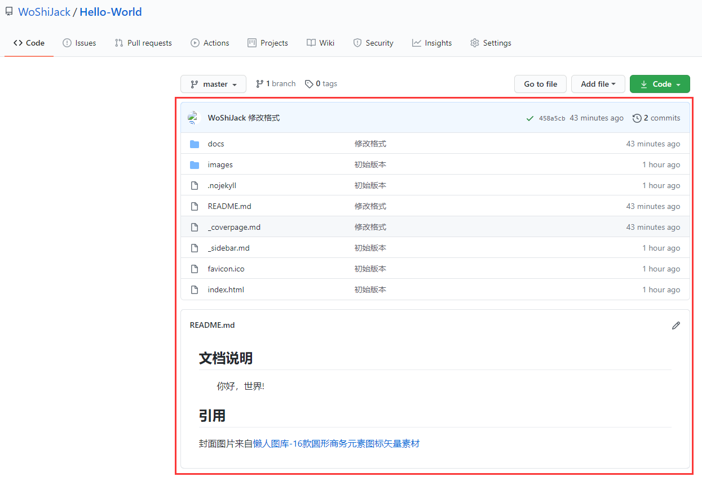

## 4.1 &nbsp;&nbsp;数据库

### 4.1.1 &nbsp;&nbsp;MySQL

#### 4.1.1.1 &nbsp;&nbsp;1130-Host ‘主机名’ is not allowed to connect to this MySQL server

错误提示如下：


解决方案：

```sql
-- 1. 更改需要登录用户的 ‘host’ 为 ‘%’。
update user set host = '%' where user ='root';

-- 2. 刷新 ‘MySQL’ 的系统权限相关表。
flush privileges;
```

> 执行后，再次连接测试。如果还不行，重启 `MySQL` 服务。

#### 4.1.1.2 &nbsp;&nbsp;2003-Can't connect to MySQL server on ‘IP’(10060)

错误提示如下：


> 如上图所示，原因是防火墙拦截了 `MySQL` 的端口号，导致访问不通。

解决方案：

1. `控制面板` → `系统和安全`。


2. 点击 `Windows Defender 防火墙`。


3. 点击 `高级设置`。


4. 点击 `入站规则`，然后 `新建规则`。


5. 选择 `端口`，点击 `下一步`。


6. 默认 `TCP`，`特定本地端口` 录入 `MySQL` 的端口。


7. 默认 `允许连接`，点击 `下一步`。


8. 点击 `下一步`。


9. 最后录入 `名称`，点击 `完成`。


> 返回测试连接即可。

#### 4.1.1.3 &nbsp;&nbsp;The server time zone value '�й���׼ʱ��' is unrecognized or represents more than...

1. 数据库版本。
 
* `MySQL` 版本：8.0.19
* `Maven` 依赖版本：8.0.21

2. 数据源配置。

```xml
<!--配置数据源-->
<bean id="dataSource" class="com.mchange.v2.c3p0.ComboPooledDataSource">
    <property name="driverClass" value="com.mysql.cj.jdbc.Driver"></property>
    <property name="jdbcUrl" value="jdbc:mysql://localhost:3306/spring-learn"></property>
    <property name="user" value="root"></property>
    <property name="password" value="1"></property>
</bean>
```

3. 程序调用与数据库交互的方法时，出现如下错误：

```error
Caused by: com.mysql.cj.exceptions.InvalidConnectionAttributeException: The server time zone value '�й���׼ʱ��' is unrecognized or represents more than one time zone. You must configure either the server or JDBC driver (via the 'serverTimezone' configuration property) to use a more specifc time zone value if you want to utilize time zone support.
	at sun.reflect.GeneratedConstructorAccessor42.newInstance(Unknown Source)
	at sun.reflect.DelegatingConstructorAccessorImpl.newInstance(DelegatingConstructorAccessorImpl.java:45)
	at java.lang.reflect.Constructor.newInstance(Constructor.java:423)
	at com.mysql.cj.exceptions.ExceptionFactory.createException(ExceptionFactory.java:61)
	at com.mysql.cj.exceptions.ExceptionFactory.createException(ExceptionFactory.java:85)
	at com.mysql.cj.util.TimeUtil.getCanonicalTimezone(TimeUtil.java:132)
	at com.mysql.cj.protocol.a.NativeProtocol.configureTimezone(NativeProtocol.java:2120)
	at com.mysql.cj.protocol.a.NativeProtocol.initServerSession(NativeProtocol.java:2143)
	at com.mysql.cj.jdbc.ConnectionImpl.initializePropsFromServer(ConnectionImpl.java:1310)
	at com.mysql.cj.jdbc.ConnectionImpl.connectOneTryOnly(ConnectionImpl.java:967)
	at com.mysql.cj.jdbc.ConnectionImpl.createNewIO(ConnectionImpl.java:826)
	... 11 more
```

> 通过错误信息可知，需要配置 `serverTimezone` 的属性。

修改后的 `XML` 如下：

```xml
<!--配置数据源-->
<bean id="dataSource" class="com.mchange.v2.c3p0.ComboPooledDataSource">
    <property name="driverClass" value="com.mysql.cj.jdbc.Driver"></property>
    <property name="jdbcUrl" value="jdbc:mysql://localhost:3306/spring-learn?serverTimezone=Asia/Shanghai"></property>
    <property name="user" value="root"></property>
    <property name="password" value="1"></property>
</bean>
```

通过上面的修改，程序运行正常。不过还有一点需要注意的是，`MySQL 8.0` 版本和以前的版本驱动类名不一样，区别如下：

!> MySQL 8.0：com.mysql.cj.jdbc.Driver  
   MySQL 5.7：com.mysql.jdbc.Driver

#### 4.1.1.4 &nbsp;&nbsp;1251-Client does not support...

环境说明：

管理工具：`Navicat for MySQL 10.1.7`。

数据库版本：`MySQL 8.0.2`。

错误如下：


原因：`MySQL` 服务端要求认证插件的版本与客户端不一致造成的。

在命令行输入如下命令，查看系统用户对应的认证插件：

```bash
docker exec -it 9d bash
mysql -uroot -p
select user,plugin,host from mysql.user;
```


可以看到 `root` 用户使用的 `plugin是caching_sha2_password`，官方网站 `MySQL 8` 操作手册有如下说明：


`plugin` 的作用之一就是处理后的密码格式和长度是不一样的，类似于使用 `MD5` 加密和使用 `base64` 加密一样，对于同一个密码处理后的格式是不一样的。

根据官方提供的方案，解决方案有两个，一个方案是修改配置文件（或者通过数据库脚本修改），另一个方案是使用支持 `plugin` 的客户端进行访问。

解决方案一：

```sql
alter user 'root' identified with mysql_native_password by '1';
```


这行代码有两层含义：

1. 修改 `root` 的密码为'1'，摒弃或覆盖原来的旧密码。

2. 使用 `mysql_native_password` 对新密码进行编码。

如下图，修改完成后再用客户端登陆成功。


解决方案二：

使用 `DataGrip 2020.1.1` 连接。


#### 4.1.1.5 &nbsp;&nbsp;排序规则和字符集的修改

!> 在对数据库进行任何修改之前，请先备份数据。

执行脚本忽略外键约束。

```sql
SET FOREIGN_KEY_CHECKS=0;
-- 将查询到SQL语句放到此处
SET FOREIGN_KEY_CHECKS=1;
```

以下内容含义，`SQL` 脚本中相应替换：

```text
<DB>：数据库名称
<charset>：utf8 或 utf8mb4
<collation>：utf8_bin 或 utf8mb4_bin
```

更改数据库排序规则：

```sql
ALTER DATABASE <DB> CHARACTER SET <charset> COLLATE <collation>
```

更改表排序规则：

```sql
SELECT CONCAT('ALTER TABLE `',  table_name, '` CHARACTER SET <charset> COLLATE <collation>;')
FROM information_schema.TABLES AS T, information_schema.`COLLATION_CHARACTER_SET_APPLICABILITY` AS C
WHERE C.collation_name = T.table_collation
AND T.table_schema = '<DB>'
AND
(
    C.CHARACTER_SET_NAME != '<charset>'
    OR
    C.COLLATION_NAME != '<collation>'
);
```

更改 `varchar` 列的列排序规则 ：

```sql
SELECT CONCAT('ALTER TABLE `', table_name, '` MODIFY `', column_name, '` ', DATA_TYPE, '(', CHARACTER_MAXIMUM_LENGTH, ') CHARACTER SET <charset> COLLATE <collation>', (CASE WHEN IS_NULLABLE = 'NO' THEN ' NOT NULL' ELSE '' END), ';')
FROM information_schema.COLUMNS
WHERE TABLE_SCHEMA = '<DB>'
AND DATA_TYPE = 'varchar'
AND
(
    CHARACTER_SET_NAME != '<charset>'
    OR
    COLLATION_NAME != '<collation>'
);
```

更改非 `varchar` 列的列排序规则：

```sql
SELECT CONCAT('ALTER TABLE `', table_name, '` MODIFY `', column_name, '` ', DATA_TYPE, ' CHARACTER SET <charset> COLLATE <collation>', (CASE WHEN IS_NULLABLE = 'NO' THEN ' NOT NULL' ELSE '' END), ';')
FROM information_schema.COLUMNS
WHERE TABLE_SCHEMA = '<DB>'
AND DATA_TYPE != 'varchar'
AND
(
    CHARACTER_SET_NAME != '<charset>'
    OR
    COLLATION_NAME != '<collation>'
);
```

#### 4.1.1.6 &nbsp;&nbsp;MySQL 8.0 安装

一、下载 `MySQL`

1. 进入[MySQL官网](https://www.mysql.com/downloads/)。

2. 单击 `MySQL Community (GPL) Downloads »`。


3. `MySQL Community Server` 是解压版，`MySQL Installer for Windows` 是安装版，这里以解压版演示，点击进入下一步。


2. `Select Operating System:` 可以根据需求选择相应操作系统的压缩包，点击 `Download`。


3. 点击 `No thanks,just start my download` 开始下载。


二、`MySQL` 安装

1. 解压 `MySQL` 到需要安装的路径。

2. 进入 `bin` 目录，打开 `PowerShell`。

3. 初始化 `MySQL`。

```powershell
.\mysqld --initialize
```

4. 安装 `MySQL` 服务。

```powershell
.\mysqld --install
```
5. 启动 `MySQL` 服务。

```powershell
net start mysql
```

6. 登录 `MySQL`。

```powershell
.\mysql -u root -p
```

连续两次回车，返回ERROR。打开 `data` 目录下 `*.err` 文件，搜索 `password` 复制临时生成的密码。

7. 重新输入：

```powershell
.\mysql -u root -p 临时密码
```

8. 登录成功后，修改密码。
 
```powershell
ALTER USER 'root'@'localhost' IDENTIFIED WITH mysql_native_password BY '新密码';
```

如果返回 `Query OK, 0 rows affected`，则表示密码重置成功。

#### 4.1.1.7 &nbsp;&nbsp;1064 - You have an error in your SQL syntax; check the manual that corresponds to your MySQL server...

* 问题如下图所示，`primary key(id),` 这里多了一个逗号，去掉后运行成功。


#### 4.1.1.7 &nbsp;&nbsp;A ResourcePool could not acquire a resource from its primary factory or source

> 由于粗心，错把数据库名当作表名放到 `SQL` 语句中。


### 4.1.2 &nbsp;&nbsp;Oracle

### 4.1.3 &nbsp;&nbsp;SQL Server

### 4.1.4 &nbsp;&nbsp;管理工具

#### 4.1.4.1 &nbsp;&nbsp;DataGrip

##### 4.1.4.1.1 &nbsp;&nbsp;DataGrip 连接后看不到自己创建的数据库

1. 首先先连接自己的数据库。


2. 连接成功后，切换到 `Schemes` 页签，勾选自己的数据库。


3. 返回就能看到已勾选的数据库了。


## 4.2 &nbsp;&nbsp;编辑器

### 4.2.1 &nbsp;&nbsp;Visual Studio Code

#### 4.2.1.1 &nbsp;&nbsp;代码自动换行设置

1. `File`→ `Preferences` → `Settings`。


2. `User` → `Commonly Used`。

搜索 `Editor:WordWrap`，将 `off` 修改为 `on `即可。


### 4.2.2 &nbsp;&nbsp;IntelliJ IDEA

#### 4.2.2.1 &nbsp;&nbsp;启动Tomcat，控制台出现乱码

1. 设置 `IDEA Tomcat Server` 的编码。在菜单栏找到 `Run` → `Edit Configuration...`，选中配置的 `Tomcat`，找到 `Server` 选项卡 设置 `VM options` 为：

```text
-Dfile.encoding=utf-8
```


2. 在 `Help` → `Edit Custom VM OPtions...` 中加入:

```text
-Dfile.encoding=utf-8
```


3. 重启 `IntelliJ IDEA`。

#### 4.2.2.2 &nbsp;&nbsp;项目目录结构调整

1. 目录结构层次不够分明。


2. 将以下两个勾去掉。


3. 去掉【Flatten Packages】的勾会把【Hide Empty Middle Packages】的勾去掉，然后将显示出来的【Compact Middle Packages】勾也去掉。


4. 修改后的效果如下。


#### 4.2.2.3 &nbsp;&nbsp;快捷键

1. 【Ctrl+Tab】切换标签页。


2. 【Ctrl+W】选择当前光标位置单词，连续按会一步步扩大选择。


3. 【Ctrl+Shift+A】查找动作 / 设置。


4. 【Shift+Shift】全局搜索。


5. 【Ctrl+Shift+Enter】自动结束代码，行末自动添加分号（如果有分号就是换行）。


6. 【Alt+Insert】代码自动生成，如生成对象的 set / get 方法，构造函数，toString() 等（如果键盘是F键、Insert二合一的需要FN辅助）。


7. 【Ctrl+Shift+Space】代码补全。


8. 【Alt+Enter】IntelliJ IDEA 根据光标所在问题，提供快速修复选择，光标放在的位置不同提示的结果也不同。


9. 【Ctrl+Shift+Alt+T】弹出重构菜单。


10. 【Ctrl+Alt+O】优化导入的类，可以对当前文件和整个包目录使用。


11. 【Ctrl+Alt+S】配置自动清理。


12. 【Ctrl+Alt+L】格式化代码，可以对当前文件和整个包目录使用。


13. 【psvm】Main方法。


14. 【fori】for循环。


15. 【sout】打印。


#### 4.2.2.4 &nbsp;&nbsp;去掉屏幕右侧垂直白线


> 第一次安装的时候就有这条线，时间久了，越来越看不顺眼了，终于想起来对它动手了。

解决方案：

1. `Ctrl + Shift + S`，打开设置。

2. `Editor` → `General` → `Appearance`，取消 `Show hard wrap and visual guides（configured in Code Style options）` 前面的勾选，然后点击 `Apply`、`OK`。


> `Show method separators` 是方法与方法之间的分割线，如果不小心勾选了，可以取消勾选。

## 4.3 &nbsp;&nbsp;RabbitMQ

### 4.3.1 &nbsp;&nbsp;Docker下安装了RabbitMQ,无法访问web管理页面

原因：在拉取 `RabbitMQ` 时，默认拉取了 `latest` 版本，而这个不带 `web管理界面`，因此访问不到。

解决方案：

1. 在 `Docker` 下安装 `RabbitMQ`，运行脚本：

```docker
docker pull rabbitmq:management
docker run --name myrabbitmq -d -p 5672:5672 -p 15672:15672  rabbitmq:management
```

> * 【5672】：服务端口，通过程序连接 `RabbitMQ`，需要使用 `5672` 端口。  
> * 【15672】：控制台端口。访问控制台需要使用 `15672` 端口。

2. 再次访问 `http://IP:15672` 后，发现可以打开了。

> 默认用户和密码都是 `guest`，登录即可看到管理界面。


> *  关闭防火墙或者开放映射端口。  
> *  拉取 `manager` 版本的镜像。


## 4.4 &nbsp;&nbsp;Elasticsearch

### 4.4.1 &nbsp;&nbsp;Docker下安装了RabbitMQ，无法访问web管理页面

1. 因为是后台启动，输入命令查看启动错误日志。

```docker
docker logs e7
```


2. 根据日志得知内存出现问题，输入命令查找虚拟机内存文件。

```bash
find / -name jvm.options
```


3. 根据上图提示点击最后一个链接，然后将默认的 `2g` 改为 `1g`，保存，修改如下:


> 通过 `PortableSmartty-3.1` 智能终端修改。

4. 重新启动 `Elasticsearch` 后，访问效果如下：


## 4.5 &nbsp;&nbsp;Docker

### 4.5.1 &nbsp;&nbsp;将镜像源更改为国内的镜像源

1. 修改文件路径 `/etc/docker/daemon.json`。

> 通过 `SmarTTY` 智能终端进行修改，也可以用 `vim` 命令进行修改。

2. 添加国内镜像源以及 `DNS`。

```text
"registry-mirrors": [
"https://kfwkfulq.mirror.aliyuncs.com",
"https://2lqq34jg.mirror.aliyuncs.com",
"https://pee6w651.mirror.aliyuncs.com",
"https://registry.docker-cn.com",
"http://hub-mirror.c.163.com"
],
"dns": ["8.8.8.8","8.8.4.4"]
```

3. 重启 `Docker` 服务。

```docker
systemctl restart docker
```

### 4.5.2 &nbsp;&nbsp;删除相同IMAGE ID镜像的方法

> 本文转载自[CSDN](https://blog.csdn.net/wcuuchina/article/details/86062142)

当指定的版本和最新版本相同的时候，会有相同的 `IMAGE ID`。


将指定的 `IMAGE ID` 进行删除时，因为 `IMAGE ID` 的镜像存在多个，所以会存在错误信息：

```text
Error response from daemon: conflict: unable to delete 102816b1ee7d (must be forced) - image is referenced in multiple repositories
```

所以指定删除的方式应该改为 `REPOSITORY:TAG`。


脚本如下：

```docker
docker rmi docker.io/mysql:8.0
```


### 4.5.3 &nbsp;&nbsp;删除已经安装的包

1. 下面以 `Docker` 为列：

```bash
yum list installed | grep docker
```

本机安装过旧版本：

`docker.x86_64`、`docker-client.x86_64`、`docker-common.x86_64`。

2. 删除安装的软件包。

写法一：

```bash
yum -y remove docker.x86_64                        
yum -y remove docker-client.x86_64                  
yum -y remove docker-common.x86_64
```

写法二：

```bash
yum -y remove docker.x86_64 docker-client.x86_64 docker-common.x86_64
```

写法三：模糊删除所有关于docker的包

```bash
yum -y remove docker
```

### 4.5.4 &nbsp;&nbsp;Tomcat外部访问报HTTP Status 404 – Not Found

问题：默认从官方镜像源拉取的镜像，`Tomcat`版本 `9.0.35`、`8.5.55`、`7` 都出现 `404` 的情况。


解决方案：

1. 启动容器。

* 【-d】：后台运行。
* 【-p】：映射端口。
* 【tomcat:latest】：以冒号隔开指定版本，默认不写就是 `latest`。

```bash
root@192.168.1.10:~# docker run -d -p 8888:8080 tomcat:latest
```

2. 查看运行中的容器。

> 容器的【CONTAINER ID】`30d13830ee5a` 可以简写为 `30`，或者其他位数，估计只要保重唯一，应该都可以执行成功，具体没有深究。

```bash
root@192.168.1.10:~# docker ps
CONTAINER ID        IMAGE               COMMAND             CREATED             STATUS              PORTS                    NAMES
30d13830ee5a        tomcat:latest       "catalina.sh run"   18 minutes ago      Up 18 minutes       0.0.0.0:8888->8080/tcp   hopeful_rosalind
```

3. 以交互方式进入容器。

* 【exec】：`Run a command in a running container`(在运行的容器中运行命令)。
* 【exec -i】：`--interactive`（相互作用的）       `Keep STDIN open even if not attached`（即使没有连接，也要保持STDIN打开）。
* 【exec -t】：`--tty`        `Allocate a pseudo-TTY`（分配一个 冒充的终端设备）。
* 【bash】：打开容器内的一个终端进程。

```bash
root@192.168.1.10:~# docker exec -it 30d13830ee5a bash
root@30d13830ee5a:/usr/local/tomcat#
```

4. 修改 `Tomcat` 中的 `webapp` 文件夹为 `webapp2`。

```bash
root@30d13830ee5a:/usr/local/tomcat# mv webapps weapps2
```

5. 修改 `Tomcat` 中的 `webapp.dist` 文件夹为 `webapp`。

```bash
root@30d13830ee5a:/usr/local/tomcat# mv webapps.dist webapps
```

> 4、5两个步骤修改文件夹的原因是 `Tomcat` 资源文件应该在 `webapps` 下，拉取的镜像中的文件夹为 `webapps.dist`，所以此处做了修改。

6. 退出，回到根目录。

```bash
root@30d13830ee5a:/usr/local/tomcat# exit
exit
root@192.168.1.10:/#
```

7. 将修改后的容器提交生成一个新镜像。

* 【-m】：提交时的说明文字。
* 【-a】：提交的镜像作者。

```bash
root@192.168.1.10:~# docker ps
CONTAINER ID        IMAGE               COMMAND             CREATED             STATUS              PORTS                    NAMES
30d13830ee5a        tomcat:latest       "catalina.sh run"   49 minutes ago      Up 49 minutes       0.0.0.0:8888->8080/tcp   hopeful_rosalind
root@192.168.1.10:~# docker commit -m="update mv webapps.dist webapps" -a="jack" 30d13830ee5a mytomcat:latest
sha256:427d4f3065ba2c2d4a0bbdf08e04d7dbdea747b8a06c886921b2b677b05e3097
```

8. 访问 `Tomcat`。


## 4.6 &nbsp;&nbsp;Maven

### 4.6.1 &nbsp;&nbsp;Maven的标准settings.xml文件

```xml
<?xml version="1.0" encoding="UTF-8"?>
<settings xmlns="http://maven.apache.org/SETTINGS/1.0.0"
    xmlns:xsi="http://www.w3.org/2001/XMLSchema-instance" xsi:schemaLocation="http://maven.apache.org/SETTINGS/1.0.0 http://maven.apache.org/xsd/settings-1.0.0.xsd">
 
    <!-- 本地仓库的位置 -->
    <localRepository>${user.home}/.m2/repository</localRepository>
   
    <!-- Apache Maven 配置 -->
    <pluginGroups/>
    <proxies/>
 
    <!-- 私服发布的用户名密码 -->
    <servers>
        <server>
            <id>releases</id>
            <username>deployment</username>
            <password>He2019</password>
        </server>
        <server>
            <id>snapshots</id>
            <username>deployment</username>
            <password>He2019</password>
        </server>
    </servers>
     
    <!-- 阿里云镜像 -->
    <mirrors>
        <mirror>
            <id>alimaven</id>
            <name>aliyun maven</name>
            <!-- https://maven.aliyun.com/repository/public/ -->
            <url>http://maven.aliyun.com/nexus/content/groups/public/</url>
            <mirrorOf>central</mirrorOf>
        </mirror>
    </mirrors>
 
    <!-- 配置: java8, 先从阿里云下载, 没有再去私服下载  -->
    <!-- 20190929 hepengju 测试结果: 影响下载顺序的是profiles标签的配置顺序(后面配置的ali仓库先下载), 而不是activeProfiles的顺序 -->
    <profiles>
        <!-- 全局JDK1.8配置 -->
        <profile>
            <id>jdk1.8</id>
            <activation>
                <activeByDefault>true</activeByDefault>
                <jdk>1.8</jdk>
            </activation>
            <properties>
                <project.build.sourceEncoding>UTF-8</project.build.sourceEncoding>
                <maven.compiler.source>1.8</maven.compiler.source>
                <maven.compiler.target>1.8</maven.compiler.target>
                <maven.compiler.compilerVersion>1.8</maven.compiler.compilerVersion>
            </properties>
        </profile>
 
         
        <!-- Nexus私服配置: 第三方jar包下载, 比如oracle的jdbc驱动等 -->
        <profile>
            <id>dev</id>
            <repositories>
                <repository>
                    <id>nexus</id>
                    <url>http://nexus.hepengju.cn:8081/nexus/content/groups/public/</url>
                    <releases>
                        <enabled>true</enabled>
                    </releases>
                    <snapshots>
                        <enabled>true</enabled>
                    </snapshots>
                </repository>
            </repositories>
            <pluginRepositories>
                <pluginRepository>
                    <id>public</id>
                    <name>Public Repositories</name>
                    <url>http://nexus.hepengju.cn:8081/nexus/content/groups/public/</url>
                </pluginRepository>
            </pluginRepositories>
        </profile>
         
        <!-- 阿里云配置: 提高国内的jar包下载速度 -->
        <profile>
            <id>ali</id>
            <repositories>
                <repository>
                    <id>alimaven</id>
                    <name>aliyun maven</name>
                    <url>http://maven.aliyun.com/nexus/content/groups/public/</url>
                    <releases>
                        <enabled>true</enabled>
                    </releases>
                    <snapshots>
                        <enabled>true</enabled>
                    </snapshots>
                </repository>
            </repositories>
            <pluginRepositories>
                <pluginRepository>
                    <id>alimaven</id>
                    <name>aliyun maven</name>
                    <url>http://maven.aliyun.com/nexus/content/groups/public/</url>
                </pluginRepository>
            </pluginRepositories>
        </profile>
 
    </profiles>
     
    <!-- 激活配置 -->
    <activeProfiles>
        <activeProfile>jdk1.8</activeProfile>
        <activeProfile>dev</activeProfile>
        <activeProfile>ali</activeProfile>
    </activeProfiles>
</settings>
```

## 4.7 &nbsp;&nbsp;Log4j

### 4.7.1 &nbsp;&nbsp;Log4j:ERROR Category option " 1 " not a decimal integer.

原因：是 `log4j.properties` 配置文件中的空格造成的。

修改前：

```properties
log4j.appender.stdout.layout.ConversionPattern =  %d{ABSOLUTE} %5p %c{ 1 }:%L - %m%n
```

将{1}中的空格去掉，修改的内容如下：

```properties
log4j.appender.stdout.layout.ConversionPattern =  %d{ABSOLUTE} %5p %c{1}:%L - %m%n
```

## 4.8 &nbsp;&nbsp;Spring Boot

### 4.8.1 &nbsp;&nbsp;Failed to bind properties under 'spring.datasource' to javax.sql.DataSource

`Spring Boot` 整合 `Druid` 时，引入了 `Druid` 的数据源，在配置文件 `application.yml` 中配置了相关配置:

```yml
spring :
  datasource:
    username: root
    password: 1
    url: jdbc:mysql://192.168.1.10:3307/jdbc
    driver-class-name: com.mysql.jdbc.Driver
    initialization-mode: always
    type: com.alibaba.druid.pool.DruidDataSource
    # schema:
    #   - classpath:department.sql
    # 数据源其他配置
    initialSize: 5
    minIdle: 5
    maxActive: 20
    maxWait: 60000
    timeBetweenEvictionRunsMillis: 60000
    minEvictableIdleTimeMillis: 300000
    validationQuery: SELECT 1 FROM DUAL
    testWhileIdle: true
    testOnBorrow: false
    testOnReturn: false
    poolPreparedStatements: true
    # 配置监控统计拦截的filters，去掉后监控界面sql无法统计，'wall'用于防火墙
    filters: stat,wall,log4j
    maxPoolPreparedStatementPerConnectionSize: 20
    useGlobalDataSourceStat: true
    connectionProperties: druid.stat.mergeSql=true;druid.stat.slowSqlMillis=500
```

`DruidConfig.java`。

```java
package com.woshijack.springboot.config;
 
import com.alibaba.druid.pool.DruidDataSource;
import com.alibaba.druid.support.http.StatViewServlet;
import com.alibaba.druid.support.http.WebStatFilter;
import org.springframework.boot.context.properties.ConfigurationProperties;
import org.springframework.boot.web.servlet.FilterRegistrationBean;
import org.springframework.boot.web.servlet.ServletRegistrationBean;
import org.springframework.context.annotation.Bean;
import org.springframework.context.annotation.Configuration;
 
import javax.sql.DataSource;
import java.util.Arrays;
import java.util.HashMap;
import java.util.Map;
 
@Configuration
public class DruidConfig {
 
    @ConfigurationProperties(prefix="spring.datasource")
    @Bean
    public DataSource druid(){
        return new DruidDataSource();
    }
 
    @Bean
    public ServletRegistrationBean statViewServlet(){
        ServletRegistrationBean bean = new ServletRegistrationBean(new StatViewServlet(), "/druid/*");
        Map<Object, Object> initParams = new HashMap<>();
        initParams.put("loginUsername","admin");
        initParams.put("loginPassword","1");
        initParams.put("allow","");
        initParams.put("deny","192.168.1.10");
        bean.setInitParameters(initParams);
        return bean;
    }
 
    @Bean
    public FilterRegistrationBean webStatFilter(){
        FilterRegistrationBean bean = new FilterRegistrationBean();
        bean.setFilter(new WebStatFilter());
        Map<Object, Object> initParams = new HashMap<>();
        initParams.put("exclusions","*.js,*.css,/druid/*");
        bean.setInitParameters(initParams);
        bean.setUrlPatterns(Arrays.asList("/*"));
        return bean;
    }
}
```

启动报错如下：

根据错误提示得知，和 `log4j` 有关，在`pom` 文件中引入依赖。

```xml
<dependency>
    <groupId>log4j</groupId>
    <artifactId>log4j</artifactId>
    <version>1.2.17</version>
</dependency>
```

### 4.8.2 &nbsp;&nbsp;favicon.ico 图标不显示

> `Spring Boot` 版本为 `2.2.6`。

项目中 `favicon.ico` 的位置，其他路径设置不起效果。


登录页设置favicon.ico

```html
<link type="image/x-icon" rel="shortcut icon" href="/asserts/img/favicon.ico" th:href="@{/asserts/img/favicon.ico}">
```

登录后其他页面设置 `favicon.ico`。

```java
public class LoginHandlerInterceptor implements HandlerInterceptor {
    @Override
    public boolean preHandle(HttpServletRequest request, HttpServletResponse response, Object handler) throws Exception {
        // 登录后将 favicon.ico 添加到页面中
        String contextPath = request.getContextPath();
        StringBuilder link=new StringBuilder();
        link.append("<script>");
        link.append("var link = document.createElement('link');");
        link.append("link.type = 'image/x-icon';");
        link.append("link.rel = 'shortcut icon';");
        if (!StringUtils.isEmpty(contextPath)){
            link.append("link.href = '" +contextPath+"/asserts/img/favicon.ico';");
        }else {
            link.append("link.href = '/asserts/img/favicon.ico';");
        }
        link.append("document.getElementsByTagName('head')[0].appendChild(link);");
        link.append("</script>");
        response.setCharacterEncoding("UTF-8");//解决页面乱码问题
        response.getWriter().append(link);
        Object user = request.getSession().getAttribute("loginUser");
        if (user==null){
            request.setAttribute("msg","没有权限，请先登录");
            request.getRequestDispatcher("/index.html").forward(request,response);
            return false;
        }else {
            return true;
        }
    }
}
```

配置类中排除 `.ico` 的拦截。

```java
@Override
public void addInterceptors(InterceptorRegistry registry) {
    registry.addInterceptor(new LoginHandlerInterceptor()).addPathPatterns("/**")
    .excludePathPatterns("/index.html","/","/user/login","/**/*.css","/**/*.js","/**/*.svg","/**/*.ico");
}
```

### 4.8.3 &nbsp;&nbsp;server.servlet.context-path在指定配置文件上不起作用

!> `Spring Boot 2.x` 开始，`server.context-path` 改成 `server.servlet.context-path` 了。

resources下的配置文件：


D盘下的配置文件：


当执行如下命令时，访问路径的互补配置没有生效（暂时不清楚读取不到路径的原因，后续有机会研究研究）。

```powershell
java -jar fileload-0.0.1-SNAPSHOT.jar --spring.config.location=D:/application.properties
```


当指定端口的配置文件和访问路径，达到预期效果。

```powershell
java -jar fileload-0.0.1-SNAPSHOT.jar --spring.config.location=D:/application.properties --server.servlet.context-path=/jack02
```


### 4.8.4 &nbsp;&nbsp;Spring Boot 2.x 与1.x版本的嵌入式Servlet容器区别

```java
//在SpringBoot 1.x 中配置嵌入式的Servlet容器
@Bean
public EmbeddedServletContainerCustomizer embeddedServletContainerCustomizer(){
    return new EmbeddedServletContainerCustomizer() {

        //定制嵌入式的Servlet容器相关的规则
        @Override
        public void customize(ConfigurableEmbeddedServletContainer container) {
            container.setPort(8083);
        }
    };
}

//在SpringBoot 2.x 中配置嵌入式的Servlet容器
@Bean
public WebServerFactoryCustomizer webServerFactoryCustomizer(){
    return  new WebServerFactoryCustomizer<ConfigurableServletWebServerFactory>() {
        @Override
        public void customize(ConfigurableServletWebServerFactory factory) {
            factory.setPort(8083);
        }
    };
};
```    

`Spring Boot 2.x` 以上配置嵌入式 `Servlet` 容器时 `EmbeddedServletContainerCustomizer` 类被 `WebServerFactoryCustomizer` 替代以至于在项目中找不到 `EmbeddedServletContainerCustomizer`。

同时， `WebServerFactoryCustomizer` 需使用 `ConfigurableWebServerFactory` 对象实现对 `customize()` 方法的转换才能实现配置。

### 4.8.5 &nbsp;&nbsp;Spring Boot+JPA 项目启动失败，无法扫描到Repository

根据以下错误，搜了好多都是添加各种注解。

```text
Factory method 'mvcConversionService' threw exception; nested exception is org.springframework.beans.factory.BeanCreationException:

Error creating bean with name 'userRepository' defined in com.woshijack.springboot.repository.UserRepository defined in @EnableJpaRepositories.....
```

其实Spring Boot 项目启动开头的日志已经告诉了我们错误在哪里：

```text
HHH000342: Could not obtain connection to query metadata : Driver com.mysql.jdbc.Driver claims to not accept jdbcUrl, jdbc//192.168.1.10:3307/jpa
```

`application.yml` 修改前：

```yml
spring:
  datasource:
    username: root
    password: 1
    url: jdbc//192.168.1.10:3307/jpa
    driver-class-name: com.mysql.cj.jdbc.Driver
  jpa:
    hibernate:
      ddl-auto: update
    show-sql: true
```

`application.yml` 修改后：

```yml
spring:
  datasource:
    username: root
    password: 1
    url: jdbc:mysql://192.168.1.10:3307/jpa
    driver-class-name: com.mysql.cj.jdbc.Driver
  jpa:
    hibernate:
      ddl-auto: update
    show-sql: true
```


### 4.8.6 &nbsp;&nbsp;Spring Boot Configuration Annotation Processor not configured

问题：虽然提示了如下错误，但是不影响最终运行效果。


解决方案：

点击 `Open Documentation...` ，然后打开如下网页，将红框内容复制到 `pom.xml` 文件中。


上图中的依赖叫做注解处理器，配置注解处理器后，当执行类中已经定义了对象和该对象的字段，在 `application.properties` 文件中赋值时，可以提示需要赋值的信息：


### 4.8.7 &nbsp;&nbsp;Spring Boot应用启动时，不能加载执行resources文件下的SQL文件

在 `Spring Boot 2.0` 版本之前，如果把 `SQL` 文件直接放在 `resources` 文件夹下是可以直接被加载执行，完成数据库的创建和数据的插入,但是要符合相应的规则：

!> 1. 建表语句要命名为，`schema.sql` 或者 `schema-all.sql`。
!> 2. 数插入语句要命名为：`data.sql` 或者 `data-all.sql`。

如果你想使用其他命名的 `SQL` 文件，你可以在 `application.yml` 或者是 `application.properties` 文件中指定：

```yml
schema:
  - classpath:sql/department.sql
  - classpath:sql/employee.sql
```  
这样系统在启动的时候就会自动加载然后执行这些 `SQL` 文件，并且系统在每次启动的时候都会加载一次,也就是这些文件都会被执行一次。

但是在 `Spring Boot 2.0` 的版本之后，以上所有操作都失效了，`SQL` 文件是不会被执行的，我们还需要在配置文件中添加一个配置：

```yml
initialization-mode: always
```

这样就可以加载你的目标 `SQL` 文件了。


### 4.8.8 &nbsp;&nbsp;拦截器排除css，js，svg等静态资源

未排除静态资源的拦截器代码：

```java
@Override
public void addInterceptors(InterceptorRegistry registry) {
    registry.addInterceptor(new LoginHandlerInterceptor()).addPathPatterns("/**")
            .excludePathPatterns("/index.html","/","/user/login");
}
```


排除静态资源的拦截器代码:

```java
@Override
public void addInterceptors(InterceptorRegistry registry) {
    registry.addInterceptor(new LoginHandlerInterceptor()).addPathPatterns("/**")
            .excludePathPatterns("/index.html","/","/user/login","/**/*.css","/**/*.js","/**/*.svg");
}
```


### 4.8.9 &nbsp;&nbsp;删除表单报错：Request method 'POST' not supported


!> Spring Boot 2.2.X默认不支持put，delete等请求方式。

在配置文件 `application.properties` 中启用 `hiddenMethod` 过滤器。

```properties
# 启用hiddenMethod过滤器
spring.mvc.hiddenmethod.filter.enabled=true
```

`Java Controller` 删除方法：

```java
@DeleteMapping("/emp/{id}")
public String delete(@PathVariable("id") Integer id){
    employeeDao.delete(id);
    return "redirect:/emps";
}
```

`HTML` 相关代码：

```html
<button th:attr="del_uri=@{/emp/}+${emp.id}" class="btn btn-sm btn-danger delBtn">删除</button>
<form id="delEmpForm" method="post">
    <input type="hidden" name="_method" value="delete"/>
</form>
<script>
    $(".delBtn").click(function(){
        $("#delEmpForm").attr("action",$(this).attr("del_uri")).submit();
        return false;
    });
</script>
```

## 4.9 &nbsp;&nbsp;轻量级标记语言

### 4.9.1 &nbsp;&nbsp;Markdown

#### 4.9.1.1 &nbsp;&nbsp;首行缩进的两种方法

> 本文转载自[markdown中实现首行缩进的两种方法](https://www.jianshu.com/p/5827c325bc92)

由于 `Markdown` 语法主要考虑的是英文，所以对于中文的首行缩进并不太友好，以下两种方法都可以完美解决这个问题。

1. 输入法由半角切换为全角，两次空格之后就有两个汉字的缩进。

2. 在段落开头的位置，输入下面的代码，紧跟着输入内容即可，分号也不要忘掉。

 * 半方大的空白 `&ensp;` 或 `&#8194;`
 * 全方大的空白 `&emsp;` 或` &#8195;`
 * 不断行的空白格 `&nbsp;` 或 `&#160;`

> 缩进推荐使用 `&emsp;`。

## 4.10 &nbsp;&nbsp;文档网站生成器

### 4.10.1 &nbsp;&nbsp;docsify

#### 4.10.1.1 &nbsp;&nbsp;部署文档网站到 GitHub

1. 下载 [Git](https://git-scm.com/download/win)并安装。


> `Windows` 平台 `Git` 有两种版本，请任意选择。

2. 登录 `GitHub`，点击 `New repository` 新建仓库。


3. 输入 `仓库名称`，`描述信息（可选）`，选择 `公开` 还是 `私有`，然后 `创建`。


4. 页面跳转到仓库代码页签，有几种导入仓库的方式，选择其中一种。


```bash
git init // 初始化仓库
git add -A // 添加所有文件到暂存区
git commit -m "初始版本" // 把暂存区的文件提交给Git仓库并添加注释（-m 后面是提交内容的描述）
git remote add origin https://github.com/WoShiJack/Hello-World.git // 连接远程仓库
git push -u origin master // 推送到远程Hello-World仓库
```
> 最后一条命令运行后，会提示输入 `GitHub` 的账号、密码。如果没有错误信息，证明已经成功推送到远程仓库中了。

5. 刷新仓库页面，提交的代码已经显示。



6. 切换到 `Settings` 页签，页面下方找到 `GitHub Pages`，然后选择 `master branch`。


7. 页面自动刷新后，就可以看到部署的文档网站地址。


8. 访问该地址，如果没有问题，会显示网站信息。如果出现 `404`，不用担心，浏览器有缓存，过一会会自己刷新，或者换个浏览器访问就可以了。


