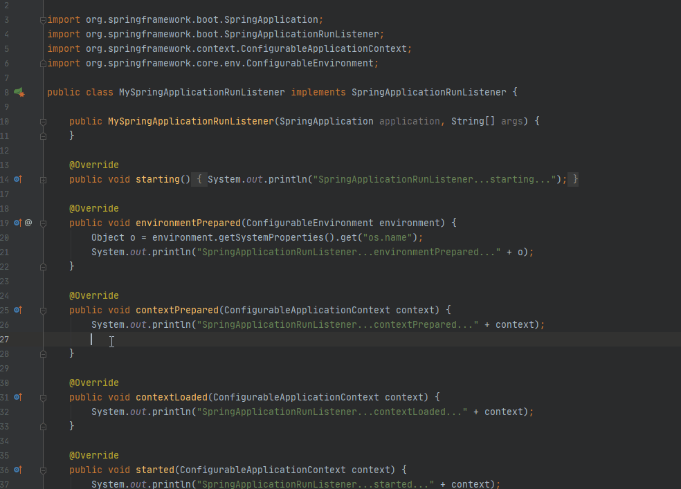
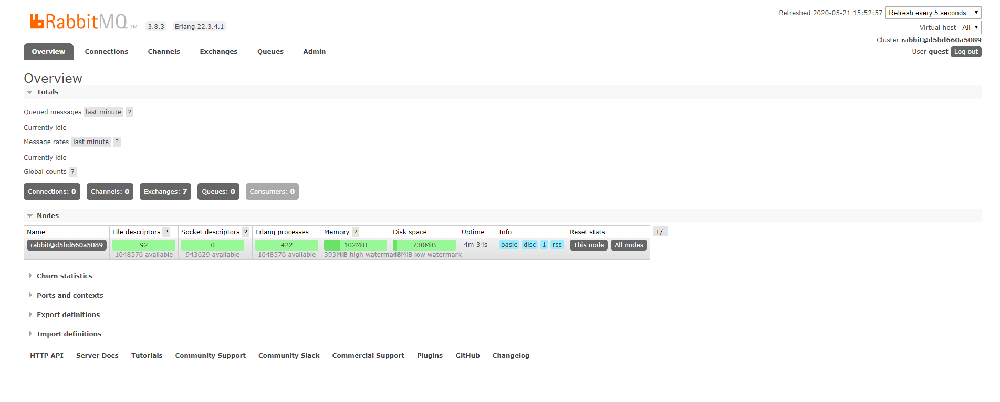
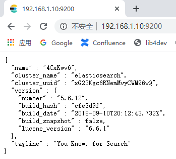
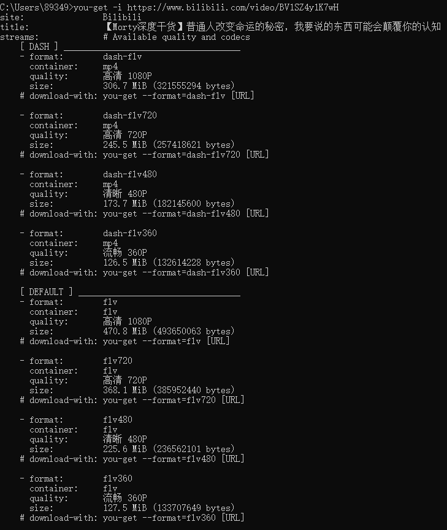

## 4.2 编辑器

### 4.2.1 Visual Studio Code

#### 4.2.1.1 代码自动换行设置

1. `File`→ `Preferences` → `Settings`。

  

2. `User` → `Commonly Used`。

  搜索 `Editor:WordWrap`，将 `off` 修改为 `on `即可。

  

#### 4.2.1.2 预览 Markdown 文档

> 本文转载自 [php中文网](https://www.php.cn/tool/vscode/440259.html) 。

1. 点击侧边栏第5个图标，然后在上方输入框内输入 `Markdown Shortcuts` 或者 `Markdown Theme Kit` ，紧接着右侧点击 `Install`，我这里已经是安装过的状态。

  

2. 按下 `Ctrl + Shift + V` 快捷键，会在标签页打开一个预览标签，双击相应内容可以跳转回 `Markdown` 文档。

  

### 4.2.2 IntelliJ IDEA

#### 4.2.2.1 启动Tomcat，控制台出现乱码

1. 设置 `IDEA Tomcat Server` 的编码。在菜单栏找到 `Run` → `Edit Configuration...`，选中配置的 `Tomcat`，找到 `Server` 选项卡 设置 `VM options` 为：

  ```text
  -Dfile.encoding=utf-8
  ```

  

2. 在 `Help` → `Edit Custom VM OPtions...` 中加入:

  ```text
  -Dfile.encoding=utf-8
  ```

  

3. 重启 `IntelliJ IDEA`。

#### 4.2.2.2 项目目录结构调整

1. 目录结构层次不够分明。

  

2. 将以下两个勾去掉。

  

3. 去掉【Flatten Packages】的勾会把【Hide Empty Middle Packages】的勾去掉，然后将显示出来的【Compact Middle Packages】勾也去掉。

  

4. 修改后的效果如下。

  

#### 4.2.2.3 快捷键

1. 【Ctrl+Tab】切换标签页。

  

2. 【Ctrl+W】选择当前光标位置单词，连续按会一步步扩大选择。

  

3. 【Ctrl+Shift+A】查找动作 / 设置。

  

4. 【Shift+Shift】全局搜索。

  

5. 【Ctrl+Shift+Enter】自动结束代码，行末自动添加分号（如果有分号就是换行）。

  

6. 【Alt+Insert】代码自动生成，如生成对象的 set / get 方法，构造函数，toString() 等（如果键盘是F键、Insert二合一的需要FN辅助）。

  

7. 【Ctrl+Shift+Space】代码补全。

  

8. 【Alt+Enter】IntelliJ IDEA 根据光标所在问题，提供快速修复选择，光标放在的位置不同提示的结果也不同。

  

9. 【Ctrl+Shift+Alt+T】弹出重构菜单。

  

10. 【Ctrl+Alt+O】优化导入的类，可以对当前文件和整个包目录使用。

  

11. 【Ctrl+Alt+S】配置自动清理。

  

12. 【Ctrl+Alt+L】格式化代码，可以对当前文件和整个包目录使用。

  

13. 【psvm】Main方法。

  

14. 【fori】for循环。

  

15. 【sout】打印。

  

#### 4.2.2.4 去掉屏幕右侧垂直白线


> 第一次安装的时候就有这条线，时间久了，越来越看不顺眼了，终于想起来对它动手了。

解决方案：

1. `Ctrl + Shift + S`，打开设置。

2. `Editor` → `General` → `Appearance`，取消 `Show hard wrap and visual guides（configured in Code Style options）` 前面的勾选，然后点击 `Apply`、`OK`。

  

  > `Show method separators` 是方法与方法之间的分割线，如果不小心勾选了，可以取消勾选。

#### 4.2.2.5 foreach 代码补全换行问题


> 输入 `foreach`，按 `Tab` 键补全代码出现了换行。

解决方案：

* `Ctrl + Alt + S` 进入 `Settings`，选中 `Live Templates`，然后展开 `Android`，选中 `foreach`，右下角取消勾选 `Reformat according to style`，最后点击 `OK`。

  

  > 编辑器中输入 `iter` 后，然后 `Tab`，也可以实现 `foreach` 的代码补全。

#### 4.2.2.6 删除自定义的 archetype

> 因为测试添加的 `archetype`，用不到了，所以想把它删除掉，但是 `IDEA` 中没有删除的地方，通过 [CSDN](https://blog.csdn.net/u012843189/article/details/83180007) 这篇博客了解到，可以从 `XML` 文件中将它清理掉。

解决方案：

1. 首先定位到 `XML` 文件位置： C:\Users\89349\AppData\Local\JetBrains\IntelliJIdea2020.1\Maven\Indices\UserArchetypes.xml

2. 如果有很多自定以的 `archetype`，可以将不需要的移除掉。

  

3. 移除掉后，重启 `IDEA` 后的效果。

  

#### 4.2.2.7 IDEA 终端不能运行 Maven 命令

> 参考 [博客园](https://www.cnblogs.com/wswyy/p/13084955.html) 解决此问题。

解决方案：

* `IDEA` 安装目录下，将主程序设置为以管理员身份运行，如下图：

  

## 4.3 RabbitMQ

### 4.3.1 Docker下安装了RabbitMQ,无法访问web管理页面

原因：在拉取 `RabbitMQ` 时，默认拉取了 `latest` 版本，而这个不带 `web管理界面`，因此访问不到。

解决方案：

1. 在 `Docker` 下安装 `RabbitMQ`，运行脚本：

  ```docker
  docker pull rabbitmq:management
  docker run --name myrabbitmq -d -p 5672:5672 -p 15672:15672  rabbitmq:management
  ```

  【5672】：服务端口，通过程序连接 `RabbitMQ`，需要使用 `5672` 端口。<br/>
  【15672】：控制台端口。访问控制台需要使用 `15672` 端口。

2. 再次访问 `http://IP:15672` 后，发现可以打开了。

  默认用户和密码都是 `guest`，登录即可看到管理界面。

  

  

注意事项：

* 关闭防火墙或者开放映射端口。  

* 拉取 `manager` 版本的镜像。

## 4.4 Elasticsearch

### 4.4.1 Docker下安装了RabbitMQ，无法访问web管理页面

1. 因为是后台启动，输入命令查看启动错误日志。

  ```docker
  docker logs e7
  ```

  

2. 根据日志得知内存出现问题，输入命令查找虚拟机内存文件。

  ```bash
  find / -name jvm.options
  ```

  

3. 根据上图提示点击最后一个链接，然后将默认的 `2g` 改为 `1g`，保存，修改如下:

  

  > 通过 `PortableSmartty-3.1` 智能终端修改。

4. 重新启动 `Elasticsearch` 后，访问效果如下：

  

## 4.7 Log4j

### 4.7.1 Log4j:ERROR Category option " 1 " not a decimal integer.

原因：因为`log4j.properties` 配置文件中有空格，所以出现了错误。

修改前：

```properties
log4j.appender.stdout.layout.ConversionPattern =  %d{ABSOLUTE} %5p %c{ 1 }:%L - %m%n
```

将{1}中的空格去掉，修改的内容如下：

```properties
log4j.appender.stdout.layout.ConversionPattern =  %d{ABSOLUTE} %5p %c{1}:%L - %m%n
```

### 4.7.2 Log4j2 could not find a logging implementation 

解决方案：

`Maven 依赖`

```xml
<dependencies>
    <dependency>
        <groupId>org.apache.logging.log4j</groupId>
        <artifactId>log4j-api</artifactId>
        <version>2.13.3</version>
    </dependency>
    <dependency>
        <groupId>org.apache.logging.log4j</groupId>
        <artifactId>log4j-core</artifactId>
        <version>2.13.3</version>
    </dependency>
<dependencies>        
```

`log4j.xml`

```xml
<?xml version="1.0" encoding="UTF-8"?>
<Configuration status="warn">
    <Appenders>
        <Console name="Console" target="SYSTEM_OUT">
            <PatternLayout pattern="[%-5p] %d %c - %m%n" />
        </Console>
        <File name="File" fileName="my.log">
            <PatternLayout pattern="%m%n" />
        </File>
    </Appenders>

    <Loggers>
        <Logger name="mh.sample2.Log4jTest2" level="INFO">
            <AppenderRef ref="File" />
        </Logger>
        <Root level="INFO">
            <AppenderRef ref="Console" />
        </Root>
    </Loggers>
</Configuration>
```

> `Maven 依赖、log4j.xml` 缺一不可，没有的话都会报错。


## 4.9 轻量级标记语言

### 4.9.1 Markdown

#### 4.9.1.1 首行缩进的两种方法

> 本文转载自 [简书](https://www.jianshu.com/p/5827c325bc92) 部分内容略有调整。

由于 `Markdown` 语法主要考虑的是英文，所以对于中文的首行缩进并不太友好，以下两种方法都可以完美解决这个问题。

1. 输入法由半角切换为全角，两次空格之后就有两个汉字的缩进（仅对中文有效）。

2. 在段落开头的位置，输入下面的代码，紧跟着输入内容即可，分号也不要忘掉。

  * 半方大的空白 `&ensp;` 或 `&#8194;`

  * 全方大的空白 `&emsp;` 或` &#8195;`

  * 不断行的空白格 `&nbsp;` 或 `&#160;`

> 缩进推荐使用 `全角空格`，因为搜索的时候不会出现第二种方法的代码。

#### 4.9.1.2 换行

序号|方法|说明
:---:|:---:|:---:
1|空格键|两个空格键 + 回车键
2|`<br/>`|换行符和 HTML 中的语法一样

#### 4.9.1.3 代码块缩进问题

> 对文档格式进行调整时，发现代码块无法缩进。反复尝试后发现，如果代码块之前有无序列表或者有序列表，使用两个半角空格就可以实现；如果代码块之前只有正文，则半角空格不起作用。

1. 有序列表。

  10. 解决方案：
  
    ```bash
    root@192.168.1.10:~# cat /etc/redhat-release
    ```
  
  

2. 正文。

  解决方案：
  
    ```bash
    root@192.168.1.10:~# cat /etc/redhat-release
    ```

  

> 从上面的示例可以看出，解决方案下的内容，缩进明显不同。

#### 4.9.1.4 超链接的全局声明

> 如果文档中多次出现同一个链接，就可以将链接提取出来，作为全局链接使用。

定义：

　　`[链接ID][链接]`

使用：

　　`[链接名称][链接ID]` 或者 `[链接名称][]`

> 不带 `链接ID` 的，我没去验证。可以猜到的是，文章中一个链接出现多次，可以使用；多个链接出现多次，就不适用了。

示例：

　　如果我们现在进入 [Linux 内核官网][GlobalLink-4.9.1.4-1]，在撰写本文时，我们看到最新的内核版本是 `4.10.1`（其他版本可以从同一网站获得）。

　　但是，这只会升级内核到仓库中可用的最新版本 - 而不是在 [Linux 内核官网][GlobalLink-4.9.1.4-1] 中可用的最新版本。不幸的是，`Red Hat` 只允许使用前者升级内核。

　　

[GlobalLink-4.9.1.4-1]: https://www.kernel.org/

> 需要注意的是，超链接的全局声明放在文档最后。另外，如果声明多个链接，`链接ID` 不要重复，我这里使用 `一个单词-章节ID-章节中第几个链接`，用中划线 `-` 拼接起来。

## 4.10 文档网站生成器

### 4.10.1 docsify

#### 4.10.1.1 部署文档网站到 GitHub

1. 下载 [Git](https://git-scm.com/download/win) 并安装。

  

  > `Windows` 平台 `Git` 有两种版本，请任意选择。

2. 登录 `GitHub`，点击 `New repository` 新建仓库。

  

3. 输入 `仓库名称`，`描述信息（可选）`，选择 `公开` 还是 `私有`，然后 `创建`。

  

4. 页面跳转到仓库代码页签，有几种导入仓库的方式，选择其中一种。

  

  ```git
  git init // 初始化仓库
  git add -A // 添加所有文件到暂存区
  git commit -m "初始版本" // 把暂存区的文件提交给Git仓库并添加注释（-m 后面是提交内容的描述）
  git remote add origin https://github.com/WoShiJack/Hello-World.git // 连接远程仓库
  git push -u origin master // 推送到远程Hello-World仓库
  ```

  > 最后一条命令运行后，会提示输入 `GitHub` 的账号、密码。如果没有错误信息，证明已经成功推送到远程仓库中了。

5. 刷新仓库页面，提交的代码已经显示。

  

6. 切换到 `Settings` 页签，页面下方找到 `GitHub Pages`，然后选择 `master branch`。

  

7. 页面自动刷新后，就可以看到部署的文档网站地址。

  

8. 访问该地址，如果没有问题，会显示网站信息。如果出现 `404`，不用担心，浏览器有缓存，过一会自动刷新，或者换个浏览器访问就可以了。

  

  

## 4.13 Python

### 4.13.1 ModuleNotFoundError: No module named '_pydev_bundle'

> 本文转载自 [CSDN](https://blog.csdn.net/gotowest123/article/details/103022022) 。

`PyCharm Console` 错误如下：


原因：<br/>
　　
  `Windows` 安装 `Python` 环境的时候，使用的是压缩包的版本。

解决方案：

　　从官方下载安装版本进行安装，然后在 `PyCharm` 中添加新的解释器。

> `ModuleNotFoundError: No module named 'xxx'` 这类错误也有可能是 `Python` 压缩包程序的问题。

### 4.13.2 can't open file 'migrate': [Errno 2] No such file or directory

> 执行命令 `python migrate` 提示找不到文件或目录，参考 [博客园](https://www.cnblogs.com/Zhao159461/p/11527734.html) 文章解决了此问题。

1. 选择 `Tools` → `Run manage.py Task...`，进入交互环境。

  

  

2. 运行命令以迁移模型。

  运行 `makemigrations AppDemo`。

  ```python
  manage.py@ProjectDemo > makemigrations AppDemo
  "D:\1-ProgramFiles\1-DevTools\PyCharm 2020.1.3\bin\runnerw64.exe" D:\1-ProgramFiles\1-DevTools\Python\Python38\python.exe "D:\1-ProgramFiles\1-DevTools\PyCharm 2020.1.  3\plugins\python\helpers\pycharm\django_manage.py" makemigrations AppDemo "D:/1-ProgramFiles/1-DevTools/PyCharm 2020.1.3/PycharmProjects/ProjectDemo"
  Tracking file by folder pattern:  migrations
  Migrations for 'AppDemo':
    AppDemo\migrations\0001_initial.py
      - Create model StudentsModel
  
  Following files were affected 
   D:\1-ProgramFiles\1-DevTools\PyCharm 2020.1.3\PycharmProjects\ProjectDemo\AppDemo\migrations\0001_initial.py
  Process finished with exit code 0
  ```

  运行 `migrate AppDemo`。

  ```python
  manage.py@ProjectDemo > migrate AppDemo
  "D:\1-ProgramFiles\1-DevTools\PyCharm 2020.1.3\bin\runnerw64.exe" D:\1-ProgramFiles\1-DevTools\Python\Python38\python.exe "D:\1-ProgramFiles\1-DevTools\PyCharm 2020.1.  3\plugins\python\helpers\pycharm\django_manage.py" migrate AppDemo "D:/1-ProgramFiles/1-DevTools/PyCharm 2020.1.3/PycharmProjects/ProjectDemo"
  Tracking file by folder pattern:  migrations
  Operations to perform:
    Apply all migrations: AppDemo
  Running migrations:
    Applying AppDemo.0001_initial... OK
  
  Process finished with exit code 0
  ```

  > 因为参考教程学习，按照同样命令操作，却少了一部分表。发现不加 `AppDemo` 应用名，直接运行，相应的表就生成（其实不生成这些表，不影响应用的访问）。

  运行 `migrate`。

  ```python
  manage.py@ProjectDemo > migrate
  "D:\1-ProgramFiles\1-DevTools\PyCharm 2020.1.3\bin\runnerw64.exe" D:\1-ProgramFiles\1-DevTools\Python\Python38\python.exe "D:\1-ProgramFiles\1-DevTools\PyCharm 2020.1.  3\plugins\python\helpers\pycharm\django_manage.py" migrate "D:/1-ProgramFiles/1-DevTools/PyCharm 2020.1.3/PycharmProjects/ProjectDemo"
  Tracking file by folder pattern:  migrations
  Operations to perform:
    Apply all migrations: AppDemo, admin, auth, contenttypes, sessions
  Running migrations:
    Applying contenttypes.0001_initial... OK
    Applying auth.0001_initial... OK
    Applying admin.0001_initial... OK
    Applying admin.0002_logentry_remove_auto_add... OK
    Applying admin.0003_logentry_add_action_flag_choices... OK
    Applying contenttypes.0002_remove_content_type_name... OK
    Applying auth.0002_alter_permission_name_max_length... OK
    Applying auth.0003_alter_user_email_max_length... OK
    Applying auth.0004_alter_user_username_opts... OK
    Applying auth.0005_alter_user_last_login_null... OK
    Applying auth.0006_require_contenttypes_0002... OK
    Applying auth.0007_alter_validators_add_error_messages... OK
    Applying auth.0008_alter_user_username_max_length... OK
    Applying auth.0009_alter_user_last_name_max_length... OK
    Applying auth.0010_alter_group_name_max_length... OK
    Applying auth.0011_update_proxy_permissions... OK
    Applying auth.0012_alter_user_first_name_max_length... OK
    Applying sessions.0001_initial... OK
  
  Process finished with exit code 0
  ```

3. 最终的数据库表列表。

  

  > 命令中的 `AppDemo` 不输也没什么影响。

### 4.13.3 REPL Communication 无限等待问题


> 本文转载自 [CSDN](https://blog.csdn.net/weixin_43325818/article/details/107357906) 。

　　使用 `PyCharm` 时，遇到了 `REPL Communication` 无限等待问题（如上图），且点击 `Stop`，也无法停止，之所以出现此问题，是因为 `Pycharm` 尝试从数据框和其他对象中读取前几个数据项，并将它们与 `显示变量` 选项卡中的变量名称内联。换言之，也就是与显示变量有关，变量无法显示。

解决方案：

1. `File` → `Settings...` → `Build, Execution, Deployment` → `Debugger` → `Data Views`，取消所有勾选。

  

2. `Build, Execution, Deployment` → `Python Debugger`，勾选所有内容。

  

3. `Build, Execution, Deployment` → `Console`，取消所有勾选。

  

4. `Python Console` 中，点击设置图标，勾选 `Simplified Variables View`（默认就是勾选）。

  

5. `Python Console` 中，点击设置图标，在 `Variables Loading Policy` 选中 `On demand`。

  

6. 如果完成以上的设置后，仍然出现此问题（小概率），点击重启按钮重启 `Python Console` 即可解决问题。

  

### 4.13.4  xxx.DoesNotExist: xxx matching query does not exist

> `Django` 的 `get` 方法是从数据库的取得一个匹配的结果，返回一个对象，如果记录不存在的话，它会报错。

```python
D:\1-ProgramFiles\1-DevTools\Python\Python38\python.exe "D:\1-ProgramFiles\1-DevTools\PyCharm 2020.1.3\plugins\python\helpers\pydev\pydevconsole.py" --mode=client --port=57125
import sys; print('Python %s on %s' % (sys.version, sys.platform))
import django; print('Django %s' % django.get_version())
sys.path.extend(['D:\\1-ProgramFiles\\1-DevTools\\PyCharm 2020.1.3\\PycharmProjects\\ProjectDemo', 'D:\\1-ProgramFiles\\1-DevTools\\PyCharm 2020.1.3\\plugins\\python\\helpers\\pycharm', 'D:\\1-ProgramFiles\\1-DevTools\\PyCharm 2020.1.3\\plugins\\python\\helpers\\pydev'])
if 'setup' in dir(django): django.setup()
import django_manage_shell; django_manage_shell.run("D:/1-ProgramFiles/1-DevTools/PyCharm 2020.1.3/PycharmProjects/ProjectDemo")
PyDev console: starting.
Python 3.8.5 (tags/v3.8.5:580fbb0, Jul 20 2020, 15:57:54) [MSC v.1924 64 bit (AMD64)] on win32
Django 3.1
from AppDemo.models import StudentsModel
... student = StudentsModel.objects.get(id=2)
Traceback (most recent call last):
  File "<input>", line 2, in <module>
  File "D:\1-ProgramFiles\1-DevTools\Python\Python38\lib\site-packages\django\db\models\manager.py", line 85, in manager_method
    return getattr(self.get_queryset(), name)(*args, **kwargs)
  File "D:\1-ProgramFiles\1-DevTools\Python\Python38\lib\site-packages\django\db\models\query.py", line 429, in get
    raise self.model.DoesNotExist(
AppDemo.models.StudentsModel.DoesNotExist: StudentsModel matching query does not exist.
```

### 4.13.5 'Meta.fields' must not contain non-model field names：xxx


原因：格式问题，需要过滤的字段应该用 `[]` 引起来，不写或者使用 `()`，都会出现这个问题。

```python
from rest_framework.viewsets import ModelViewSet

from AppDemo.models import StudentsModel
from AppDemo.serializers import StudentsSerializer


class StudentsViewSet(ModelViewSet):

    queryset = StudentsModel.objects.all()
    # 使用上一步创建的StudentsSerializer对模型进行序列化
    serializer_class = StudentsSerializer
    filter_fields = ['s_age']
```

### 4.13.6 关键字参数

> 初步了解 `Python` 时，发现函数的参数是 `**keywords`，有些不解，看过 [Python官网关于参数的文档](https://docs.python.org/3/tutorial/controlflow.html#unpacking-argument-lists) 后，原来这是这门语言关于特殊参数的定义，详细请看链接中的 `4.7.3.特殊参数 ~ 4.7.3.5.回顾`。

### 4.13.7 PyCharm 没有智能提示

> 因为 `Python` 是运行时才会识别类型，所以没有初始化的对象是没有提示的。可以在 `PyCharm` 的 `Python Console` 中运行代码，查看右侧对象初始化的状态。

### 4.13.8 下载 B站、腾讯等网站上的视频（非 VIP 视频）

> 本文转载自 [知乎](https://www.zhihu.com/question/310725414/answer/586853403) 、[CSDN](https://blog.csdn.net/Chanssl/article/details/83050959) 两篇文章。

1. 下载 [Python 3](https://www.python.org/downloads/) 最新版并安装。

2. 下载 [FFmpeg](https://ffmpeg.zeranoe.com/builds/) 。

  

  解压后并配置环境变量：

  

  `cmd` 中输入 `ffmpeg` 并回车，显示如下信息，即为配置成功。

  

  [FFmpeg 的介绍与使用](https://blog.csdn.net/u011330638/article/details/82392268) 。

3. 安装 `you-get` 。

  安装时出现如下错误：

  

  以下源任意指定一个：

  `阿里云` http://mirrors.aliyun.com/pypi/simple/<br/>
  `中国科技大学` https://pypi.mirrors.ustc.edu.cn/simple/<br/>
  `豆瓣` http://pypi.douban.com/simple/<br/>
  `清华大学` https://pypi.tuna.tsinghua.edu.cn/simple/<br/>
  `中国科学技术大学` http://pypi.mirrors.ustc.edu.cn/simple/

  ```cmd
  pip3.8 install you-get -i http://mirrors.aliyun.com/pypi/simple/ --trusted-host mirrors.aliyun.com
  ```

  

4. 使用 `you-get -i 视频链接` 查询能下载到的格式种类。

  ```cmd
  you-get -i https://www.bilibili.com/video/BV1SZ4y1K7wH
  ```

  

5. 如果 `步骤4` 中不包含 `format` 信息，则可直接使用使用 `you-get 视频链接` 下载视频，否则需要  `you-get --format=列表中的一种格式 视频链接` 进行下载。

  ```cmd
  you-get --format=dash-flv https://www.bilibili.com/video/BV1SZ4y1K7wH
  ```

  

6. 视频下载后的路径 `C:\Users\用户名` 。
