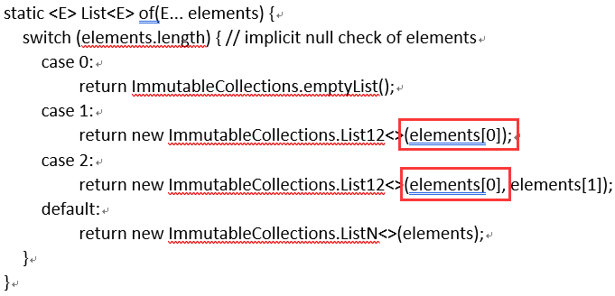
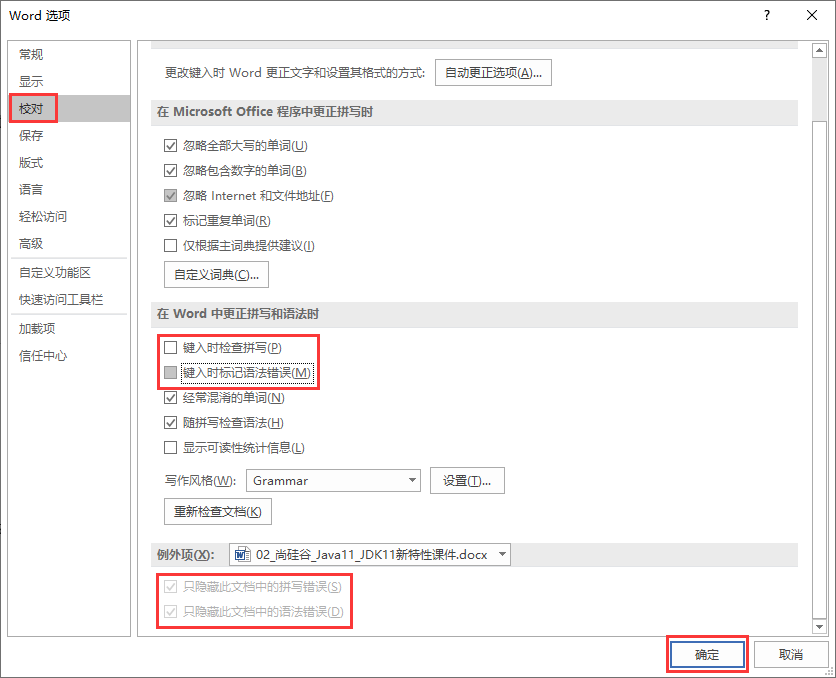
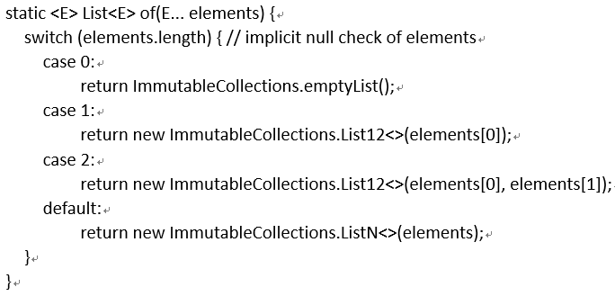
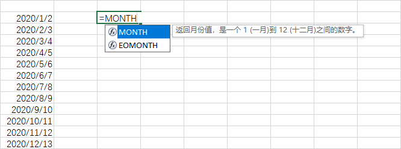
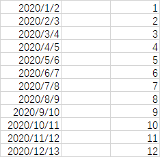
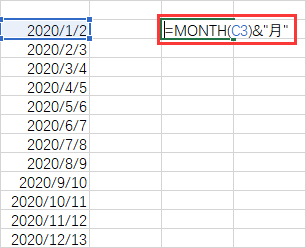
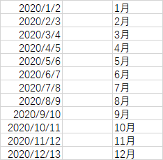
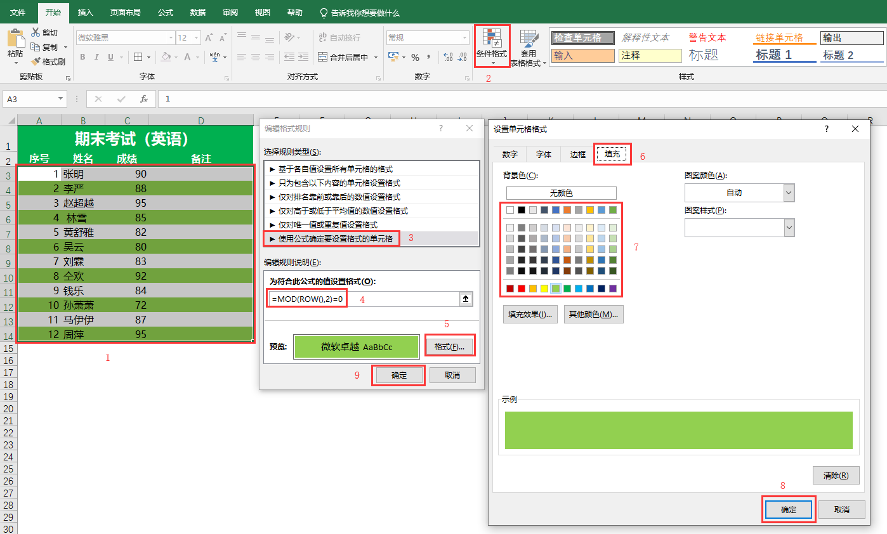
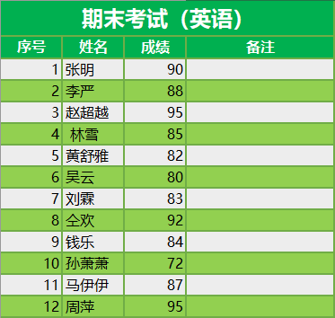

## 5.1 Office

### 5.1.1 Word

#### 5.1.1.1 Word 2019 打开排版错乱问题

> 排版错乱问题我在 `Word 2007` 和 `Word 2019` 上分别遇到一次，所以在此记录一下。

解决方案：

1. 关闭所有 `Word` 文档，然后把进程中的 `Word` 也杀掉（因为删除模板会提示删不掉）。

2. `Win + R`，输入 `%USERPROFILE%\AppData\Roaming\Microsoft\Templates` 并回车。

3. 此时会跳转到 `Word` 标准模板所在目录。

4. 将里面的所有文件以及文件夹删除即可。

5. 接着，重新打开 `Word`，模板所在目录会自动生成一个标准的模板。


#### 5.1.1.2 Word 2019 去除红色波浪线、蓝色双横线

> `Word` 文档会进行拼写语法检查，因为有些词语或者单词人为拼写错误，所以智能提示很好的检测到。有些内容虽然不符合语法拼写检查，但是这是我们想要的。

解决方案：

1. 下图为 `Word` 中的两种类型的检查提醒。



2. `文件` → `选项` → `校对`。

3. `键入时检查拼写` 对应蓝色双横线，`键入时标记语法错误` 对应红色波浪线，取消勾选，点击 `确定`。



4. 效果如下：



> 1. 上面的解决方案是全局修改。如果仅对当前 `Word` 生效，将 `只隐藏此文档中的拼写错误` 、`只隐藏此文档中的语法错误` 两项勾选即可，参考第二张图。<br/>
2. 拼写语法检查，正常打印是不会打印出来的，只是会影响阅读体验。

### 5.1.2 Excel

### 5.1.2.1 获取日期中月份

解决方案：

1. 有这么一组数据：

```text
2020/1/2
2020/2/3
2020/3/4
2020/4/5
2020/5/6
2020/6/7
2020/7/8
2020/8/9
2020/9/10
2020/10/11
2020/11/12
2020/12/13
```

2. 使用 `Excel` 中 `MONTH()` 函数。



3. 最终效果。



### 5.1.2.2 函数拼接汉字

解决方案：

1. 数据使用 `5.1.2.1` 示例的。

2. 在月份后拼接 `月` 字。



3. 最终效果。



> 拼接汉字时，`""`用英文的。

### 5.1.2.3 隔行换色

解决方案：

1. 选中需要隔行换色的数据，然后点击 `条件格式` → `新建规则` → `使用公式确定要设置格式的单元格`，输入 `=mod(row(),2)=0`,点击 `格式`，选择 `填充` 颜色，然后 `确定`。



2. 奇数行同上，公式改为 `=mod(row(),2)=1`。

3. 加上边框的最终效果。



### 5.1.3 PPT