# 多媒体处理工具 {docsify-ignore}

## 9.1 PhotoShop

### 9.1.1 分割图片

> 网上下载的矢量图是多个图标在一起的，需要自行抠图， `PhotoShop` 中有个切片工具可以实现这个需求。

环境：

* 操作系统：`Windows 10 专业版 64 位`
* Adobe Photoshop: `21.2.0`
* 矢量图格式：`eps`

解决方案：

1. 首先在 `PhotoShop` 中打开需要分割的图片，打开时会提示 `栅格化 EPS 格式`，点击 `确定`。

  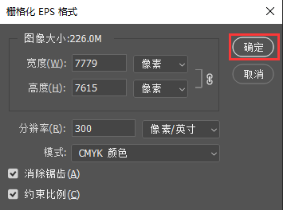

2. 右键弹出菜单选择 `切片工具`。

  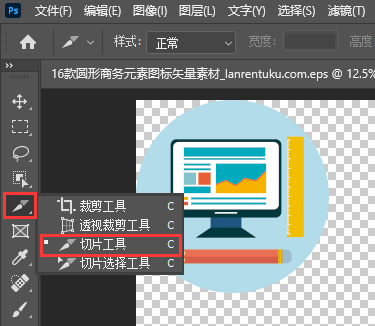

3. 图片上右键选择 `划分切片`。

  

4. 根据图标数量，输入 `水平`、`垂直` 的切片数量，点击 `确定`。

  

5. `文件` → `导出` → `存储为 Web ...`。

  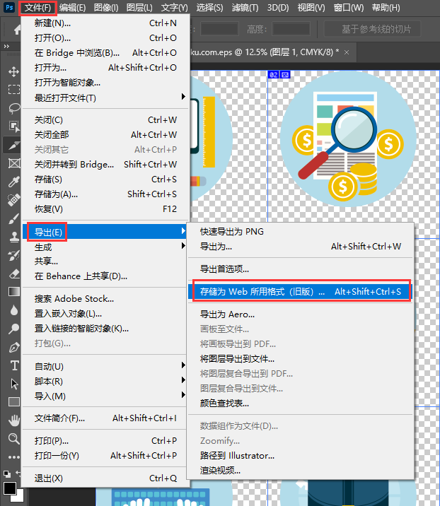

6. 格式可以修改成自己想要的，然后点击 `存储`，弹出框可以更改文件名和存储位置，最后点击 `保存`。

  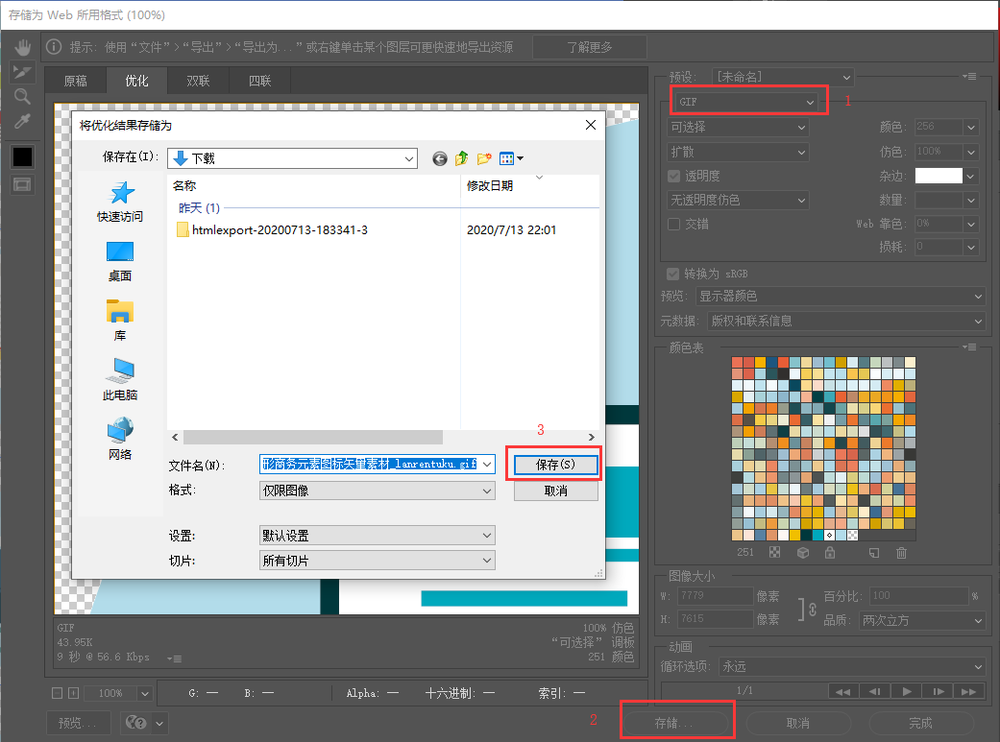

7. 分割后的图标如下：

  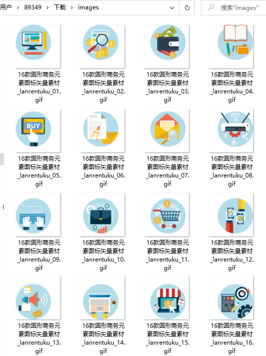

### 9.1.2 图标在画布中居中对齐

> 接着 1.3.1.1，划分切片后，得到的图标没有居中，下面我们用简单的方法处理下。

解决方案：

* 如图，图片紧挨着左上角

  

* `Ctrl + A` 选中，`Ctrl + X` 剪切，`Ctrl + V` 粘贴，然后 `Ctrl + S` 保存，最后收工。

  

### 9.1.3 去水印

> 2020年6月21日，在B站上观看了 `日环食` 的直播。当看到太阳变成环形那一刻，我果断截屏。可是图片上有各种水印，此时 `PhotoShop` 去水印的功能可以使用起来了。

1. `PhotoShop` 打开去水印的图片。

  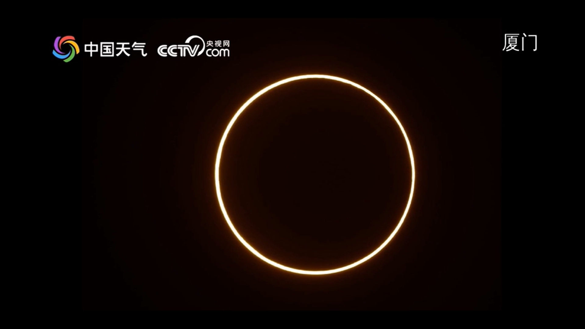

2. 选择 `矩形选框工具`。

  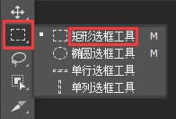

3. 将图片中需要去水印的地方框起来。

  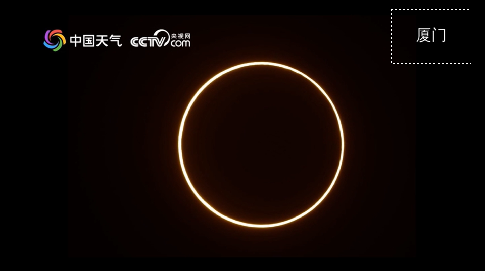

4. 按下 `Shift + F5`，点击 `确定`。

  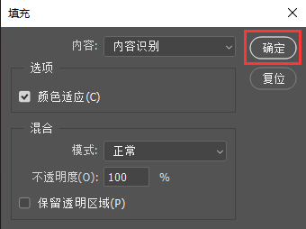

5. 最终效果。

  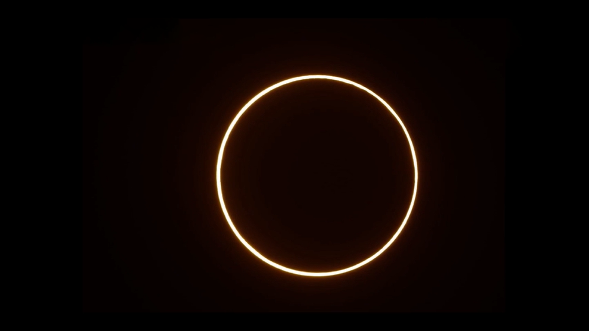

> `矩形选框工具` 可以去水印，也可以去掉弹幕。

### 9.1.4 字体大小已经调到 72 点，还是不够大

解决方案：

1. 如下图，发现字体大小只有 `72 点`。

  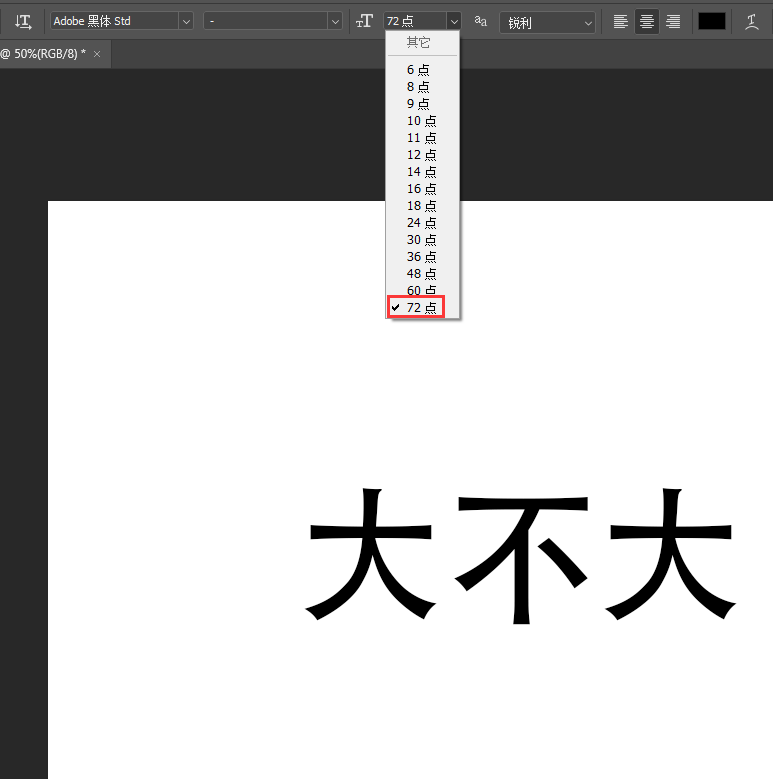

  <!--  -->
  <!-- 使用 img 标签可以实现同样的效果，但是 Docsify 的图片放大插件就失效了 -->
  <!--  -->

2. 通过一番搜索，发现只要在字体文本框内录入字体大小即可。

  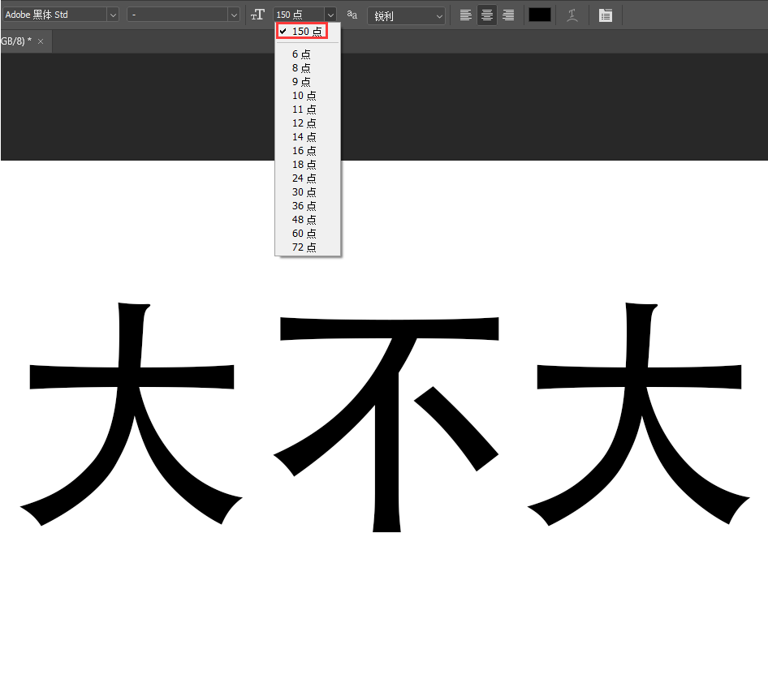

  > `Office` 设置字体大小同上。

### 9.1.5 图片中添加文字并居中

解决方案：

1. 如下图，添加文字的时候，文字没有居中。

  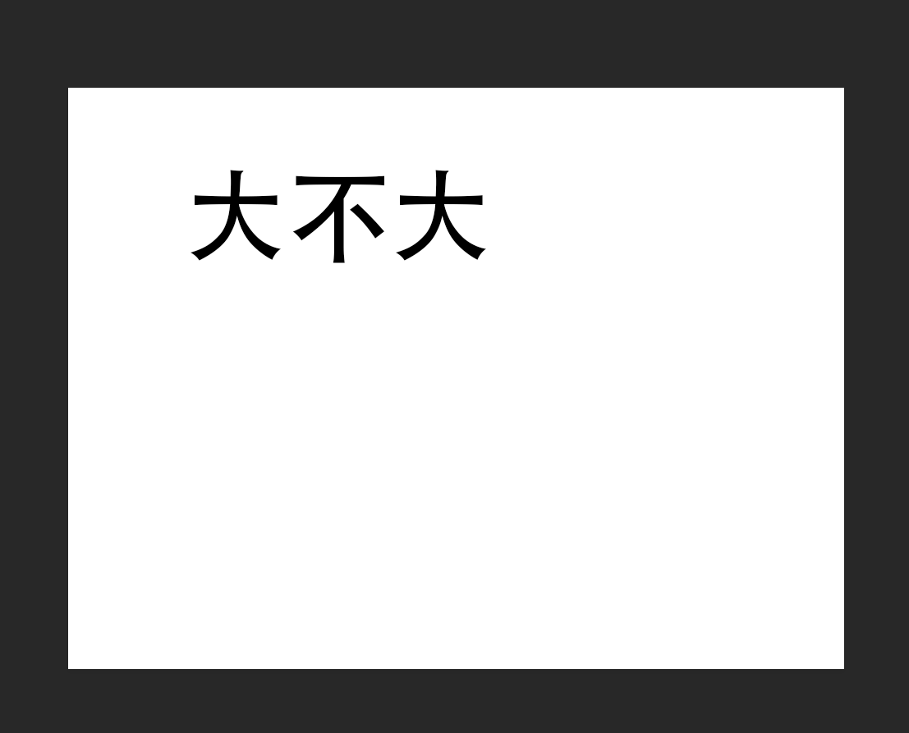

2. 同时选中右侧 `图层` 页签中的 `背景` 和 `文字`，然后选择左上方 `图层` → `对齐`中的 `水平居中` 和 `垂直居中`。

  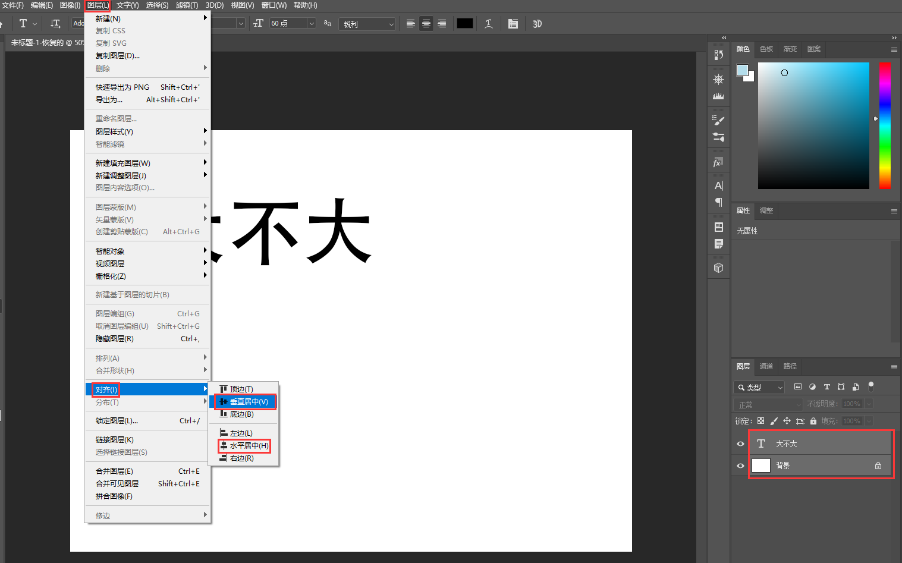

3. 最终效果。

  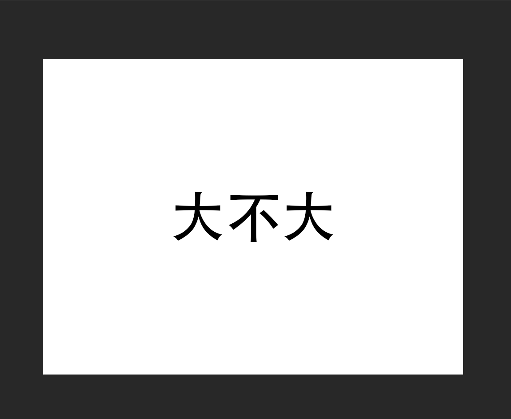

### 9.1.6 去掉图片中的内容，并保留底色

解决方案：

1. 如下图，底色上有其它内容。

  

2. 首先点击左上角 `移动工具`，`Ctrl + A` 全选，然后鼠标左键移动画布中的图片。如下图，图片已被选中。

  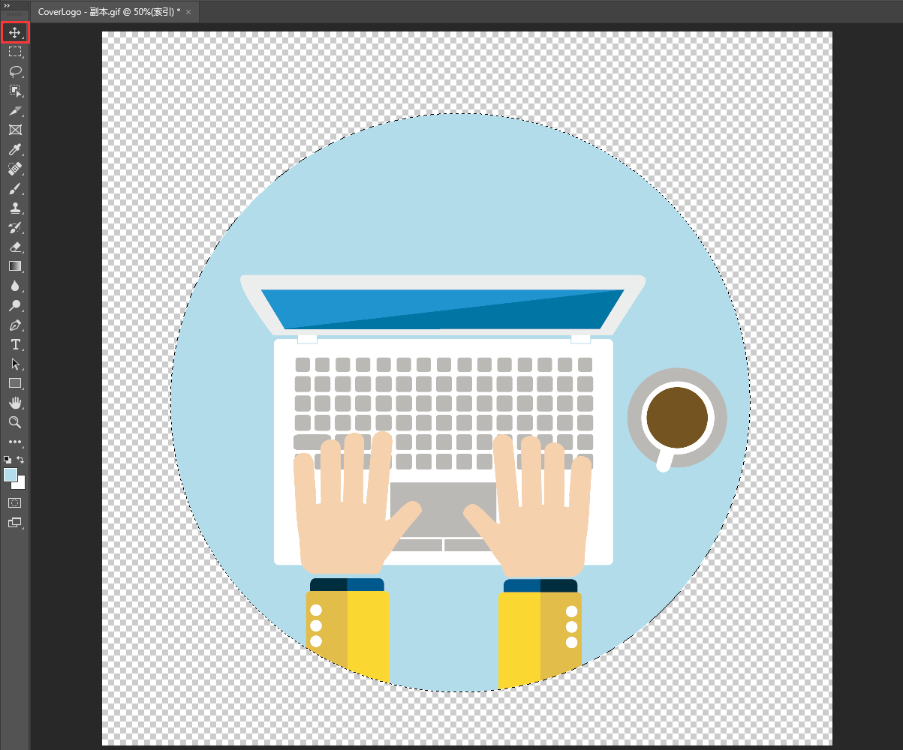

3. 选中 `吸管工具`，吸取背景色。

  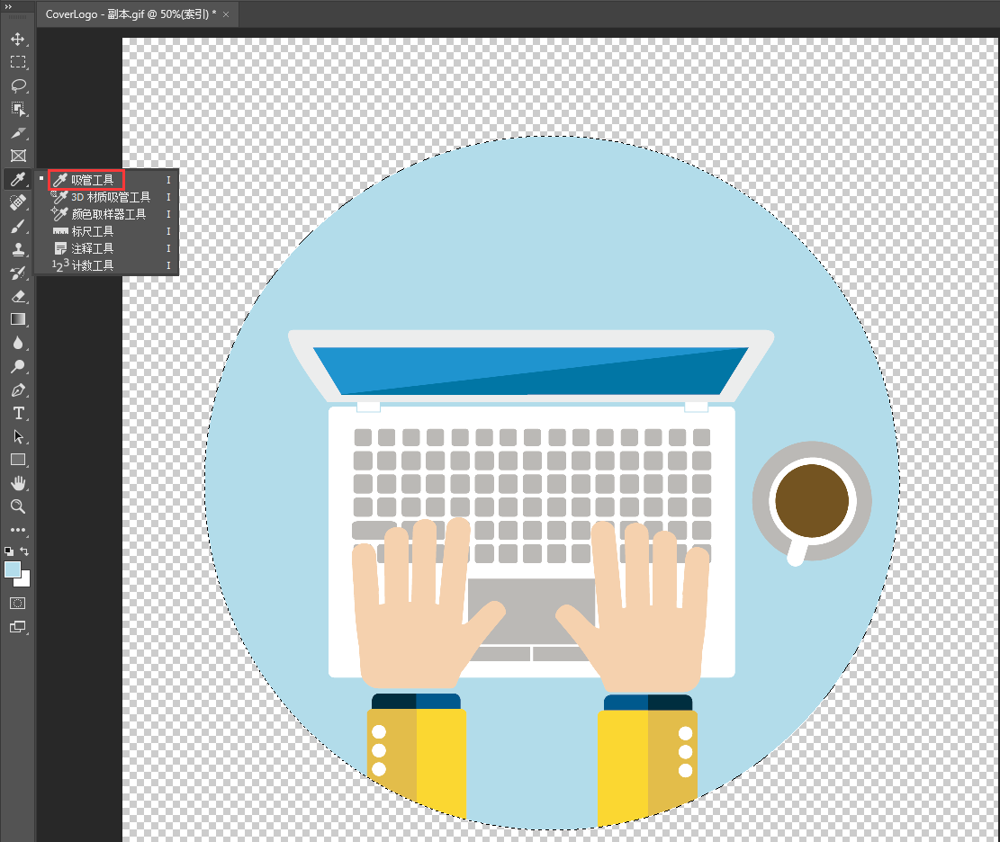

4. 同时按住 `Alt + Delete`，此时图片中只有背景色。

  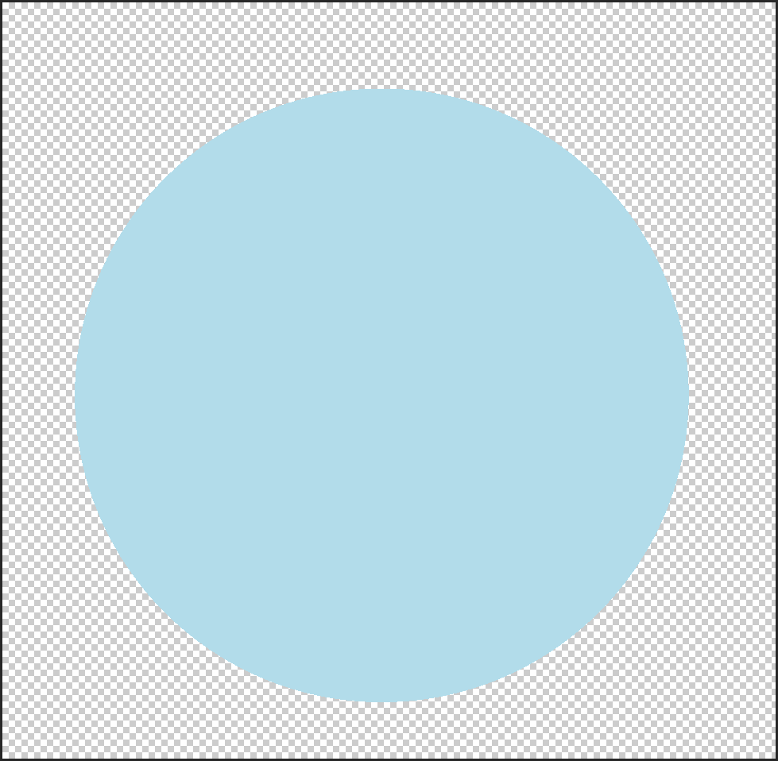

