## 7.1 Oracle VM VirtualBox

### 7.1.1 扩展虚拟硬盘容量

> `Oracle VM VirtualBox` 管理器没有提供可视化的方式修改硬盘容量，所以只能通过命令行的方式进行修改。

解决方案：

```powershell
PS C:\WINDOWS\system32> cd "C:\Program Files\Oracle\VirtualBox"
PS C:\Program Files\Oracle\VirtualBox>
PS C:\Program Files\Oracle\VirtualBox> .\VBoxManage list hdds
UUID:           f016e1d2-f88b-4942-9cc0-08a166e92324
Parent UUID:    base
State:          created
Type:           normal (base)
Location:       G:\VirtualBox VMs\Windows XP\Windows XP.vdi
Storage format: VDI
Capacity:       10240 MBytes
Encryption:     disabled
PS C:\Program Files\Oracle\VirtualBox> .\VBoxManage modifyhd f016e1d2-f88b-4942-9cc0-08a166e92324 --resize 11264
0%...10%...20%...30%...40%...50%...60%...70%...80%...90%...100%
```

> 修改硬盘容量可以通过 `Parent UUID` 或者 `Location`，两者任选其一。

!> 如果使用 `Location` 作为修改方式，路径中有空格或中文用 `""` 引起来，代码如下：

```powershell
PS C:\Program Files\Oracle\VirtualBox> .\VBoxManage modifyhd "G:\VirtualBox VMs\Windows XP\Windows XP.vdi" --resize 11264
0%...10%...20%...30%...40%...50%...60%...70%...80%...90%...100%
```

### 7.1.2 虚拟机无法启动

> 最近装了 `Windos 10 Linux 子系统`，导致和 `Oracle VM VirtualBox` 不兼容，所以禁用 `Hyper-V` 就可以正常运行虚拟机了。

解决方案：

```powershell
PS C:\WINDOWS\system32> bcdedit /set hypervisorlaunchtype off
操作成功完成。
```

> 如果运行虚拟机没有还是不能正常启动，请重启电脑。

### 7.1.3 安装 macOS Big Sur 11.0 Beta

> 之前一直用的 `VMware WorkStation`，听说 `Oracle VM VirtualBox` 比较轻。最近苹果的新系统出来了，在虚拟机安装体验一下。

一、环境准备：

* Windows 系统：`Windows 10 专业版 64 位`
* 虚拟机软件：`Oracle VM VirtualBox 6.1.10`
* macOS 系统：`macOS Big Sur Developer Beta.cdr`

二、安装步骤

1. `新建` → `专家模式`，设置虚拟机 `名称`、`文件夹`、`内存`（建议 4 GB 以上），选择 `现在创建虚拟硬盘`，点击 `创建`。


2. `文件大小` 至少 `50 GB`，点击 `创建`。

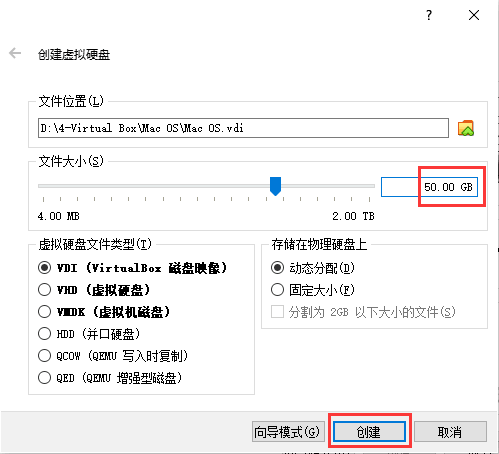

3. 取消 `软驱` 的勾选。

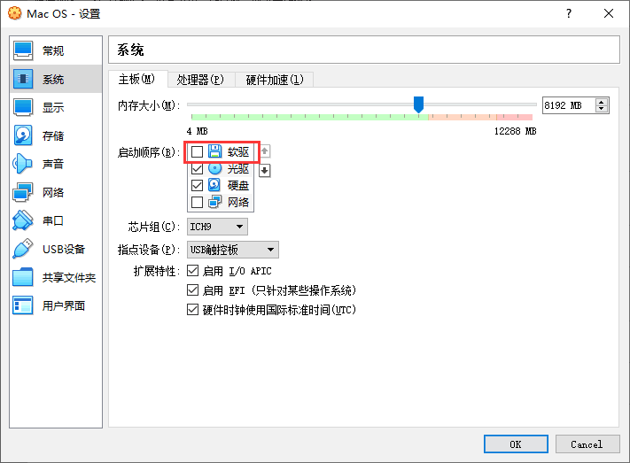

4. `处理器数量` 输入 `2`。

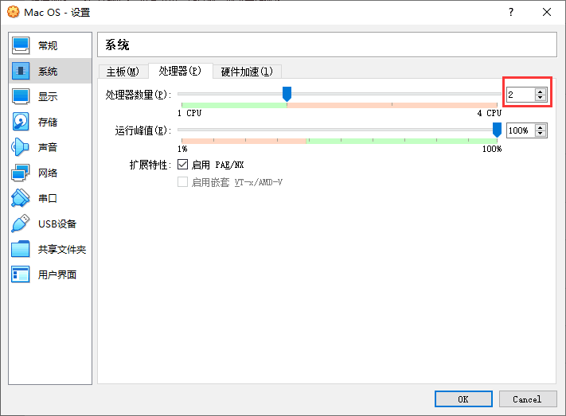

5. `显存大小` 改为 `128`，勾选 `启用3D加速`。

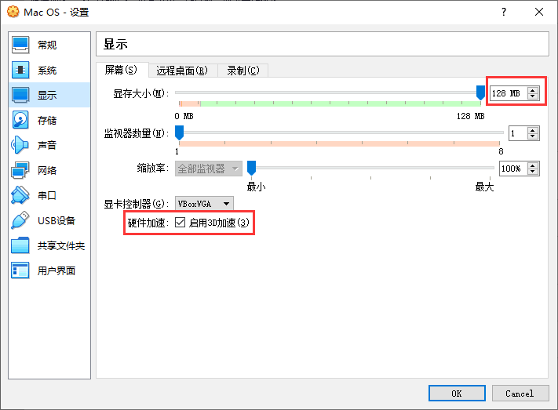

6. 选中 `没有盘片`，点击 `分配光驱` 后面的图标，点击 `选择虚拟盘`，找到并 `打开` 系统镜像文件，最后点击 `OK`。

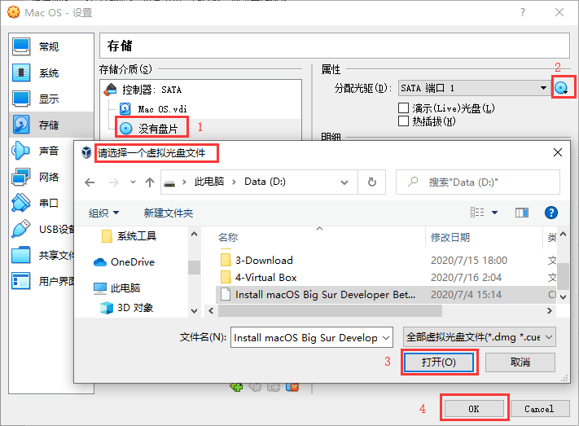

7. 关闭 `VirtualBox`，打开 `Wndows PowerShell`，输入如下命令：

```powershell
PS C:\Users\89349> cd "C:\Program Files\Oracle\VirtualBox\"
PS C:\Program Files\Oracle\VirtualBox> VBoxManage modifyvm "Mac OS" --cpuid-set 00000001 000106e5 00100800 0098e3fd bfebfbff
PS C:\Program Files\Oracle\VirtualBox> .\VBoxManage modifyvm "Mac OS" --cpuid-set 00000001 000106e5 00100800 0098e3fd bfebfbff
PS C:\Program Files\Oracle\VirtualBox> .\VBoxManage setextradata "Mac OS" "VBoxInternal/Devices/efi/0/Config/DmiSystemProduct" "iMac19,1"
PS C:\Program Files\Oracle\VirtualBox> .\VBoxManage setextradata "Mac OS" "VBoxInternal/Devices/efi/0/Config/DmiSystemVersion" "1.0"
PS C:\Program Files\Oracle\VirtualBox> .\VBoxManage setextradata "Mac OS" "VBoxInternal/Devices/efi/0/Config/DmiBoardProduct" "Mac-AA95B1DDAB278B95"
PS C:\Program Files\Oracle\VirtualBox> .\VBoxManage setextradata "Mac OS" "VBoxInternal/Devices/smc/0/Config/DeviceKey" "ourhardworkbythesewordsguardedpleasedontsteal(c)AppleComputerInc"
PS C:\Program Files\Oracle\VirtualBox> .\VBoxManage setextradata "Mac OS" "VBoxInternal/Devices/smc/0/Config/GetKeyFromRealSMC" 1
PS C:\Program Files\Oracle\VirtualBox> .\VBoxManage setextradata "Mac OS" VBoxInternal2/EfiGraphicsResolution 1920x1080

```

> 1. 最后一条命令是设置虚拟机系统的分辨率大小，分辨率大小可根据实际情况进行调整。  
> 2. 命令中的 `Mac OS` 是虚拟机的名称。每条命令执行后，没有任何提示，则表示成功；否则表示失败。

8. 如果没有安装过其它虚拟机系统，默认就是 `macOS` 的镜像，点击 `启动`。

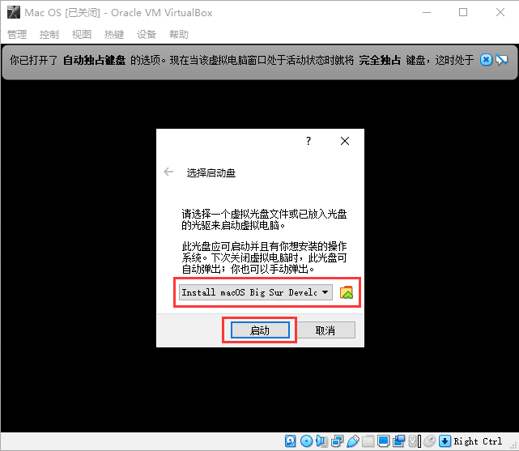

9. 启动后，显示如下界面，等待执行完成。


10. 进入安装界面，选择 `语言`，点击 `→`。

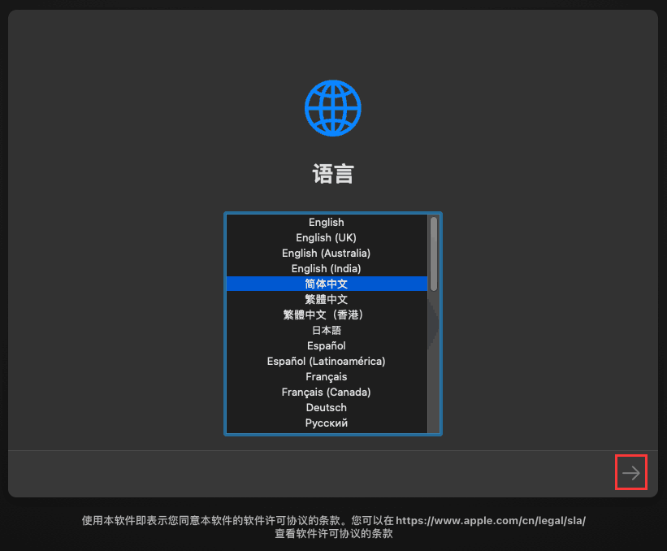

11. 选择 `磁盘工具`，点击 `继续`。

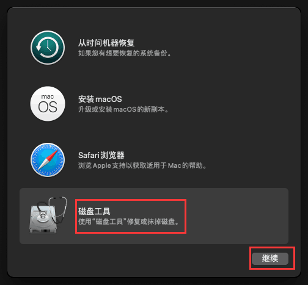

12. 选择第一个磁盘（VBOX HARDDISK Media），点击 `抹掉`，输入磁盘 `名称`，然后再点击 `抹掉`。

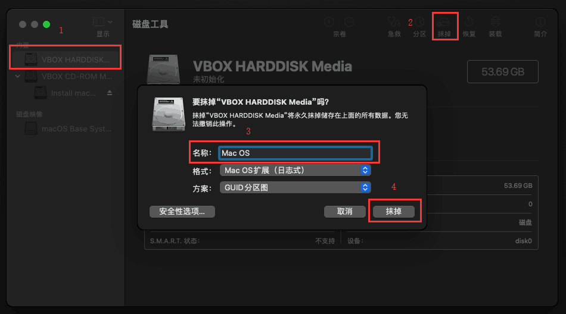

13. 关闭 `磁盘工具`，选择 `安装macOS`，点击 `继续`。

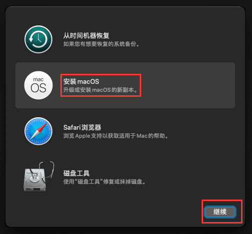

14. 点击 `同意` 协议。

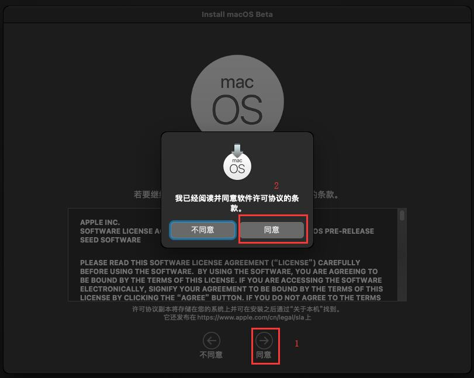

15. 选中 `Mac OS` 磁盘，点击 `安装`。

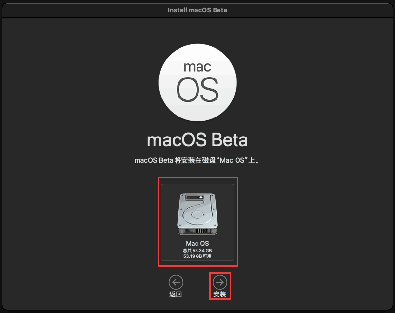

16. 进度走完后，系统会重新启动，紧接着继续安装系统。

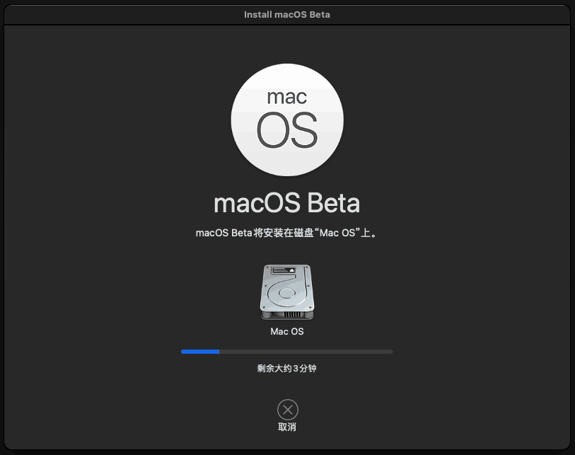

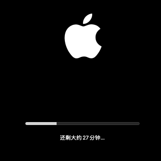

17. 等待安装进度完成（这个过程挺漫长，其实安装过程一直在进行，虚拟机系统文件一直在刷新 `大小` 和 `修改时间`）。

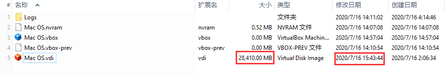

18. `选择国家或地区`、`语言与输入法`、`数据与隐私`，点击 `继续`；`辅助功能`、`迁移助理`，点击 `以后`。


19. `跳过` 登录，点击 `稍后设置`。


20. `条款与条件`，点击`同意`。


21. 输入 `全名`、`密码`（`账户名称` 会以 `全名` 小写形式带出），点击 `继续`。


22. 连续点击`继续`。


23. 根据提示按相应的 `键`，然后点击  `完成`。


24. 点击 `🍎` 图标，选择 `关机`。


25. 点击 `设置`，选中 `光驱`，点击 `光驱图标`，选择 `移除虚拟盘`。


> 苹果虚拟机使用欠佳，有能力上黑苹果，有 `money` 上白苹果。