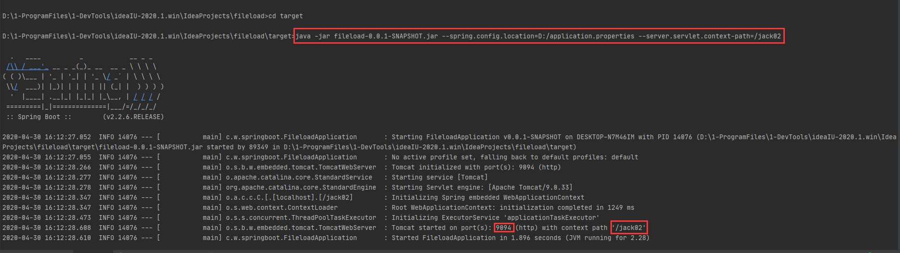

## 2020-6-20

问题：server.servlet.context-path在指定配置文件上不起作用。

!> `Spring Boot 2.x` 开始，`server.context-path` 改成 `server.servlet.context-path` 了。

resources下的配置文件：


D盘下的配置文件：


当执行如下命令时，访问路径的互补配置没有生效（暂时不清楚读取不到路径的原因，后续有机会研究研究）。

```powershell
java -jar fileload-0.0.1-SNAPSHOT.jar --spring.config.location=D:/application.properties
```


当指定端口的配置文件和访问路径，达到预期效果。

```powershell
java -jar fileload-0.0.1-SNAPSHOT.jar --spring.config.location=D:/application.properties --server.servlet.context-path=/jack02
```



## 2020-08-17

问题：安装工具包时提示“This system is not registered with an entitlement server. You can use subscription-manager to register.”。


> 在 [CSDN](https://blog.csdn.net/otmqixi/article/details/81564515) 看到这篇文章，写的很详细，后面有时间整理自己的安装步骤。

1. 查询已经安装的 `yum` 源。

```bash
root@192.168.1.10:~# rpm -qa | grep yum
```

2. 删除 `yum` 源。

```bash
root@192.168.1.10:~# rpm -qa|grep yum|xargs rpm -e --nodeps
```

3. 下载 `yum`。

> 因为我的系统是 `CentOS 7.8`，所以查找相应的版本进行安装。

3个网络源地址：

[阿里云网络源地址](https://mirrors.aliyun.com/centos/7/os/x86_64/Packages/)<br/>
[网易163网络源地址](http://mirrors.163.com/)<br/>
[CentOS网络源地址](http://centos.ustc.edu.cn/centos/)

```bash
root@192.168.1.10:~# wget http://mirrors.163.com/centos/7.8.2003/os/x86_64/Packages/yum-3.4.3-167.el7.centos.noarch.rpm
root@192.168.1.10:~# wget http://mirrors.163.com/centos/7.8.2003/os/x86_64/Packages/yum-metadata-parser-1.1.4-10.el7.x86_64.rpm
root@192.168.1.10:~# wget http://mirrors.163.com/centos/7.8.2003/os/x86_64/Packages/yum-plugin-fastestmirror-1.1.31-53.el7.noarch.rpm
```

4. 为了防止几个包安装时有互相依赖，使用命令一次性安装三个包。

```bash
root@192.168.1.10:~# rpm -ivh yum-*
```

5. 检查 `yum` 是否安装成功。

```bash
root@192.168.1.10:~# rpm -qa |grep yum
```

6. 重命名文件 `CentOS-Base.repo` 为 `CentOS-Base.repo.backup`。

```bash
root@192.168.1.10:/etc# mv /etc/yum.repos.d/CentOS-Base.repo /etc/yum.repos.d/CentOS-Base.repo.backup
```

7. 下载 `CentOS7-Base-163.repo`。

```bash
root@192.168.1.10:/etc/yum.repos.d# wget http://mirrors.163.com/.help/CentOS7-Base-163.repo
```

8. 生成缓存。

```bash
root@192.168.1.10:/etc/yum.repos.d# yum clean all
root@192.168.1.10:/etc/yum.repos.d# yum makecache
```

9. 查询 `yum` 源是否替换成功。

```bash
root@192.168.1.10:/etc/yum.repos.d# yum repolist all
```

!> 替换 `yum` 源后，还是提示未注册，目前不影响使用，暂时不在这上面浪费时间了。

## 2020-08-19

问题：在慕课网学习 [Nginx](http://www.imooc.com/wiki/nginxlesson/httpmodule01.html) 时，`realip` 模块示例输出的结果和教程不一致。

1. 慕课网 `Nginx realip 模块` 示例：


2. `nginx.conf` 完整配置信息如下：

```conf
user root;

# 启动的worker进程数
worker_processes  2;

#pid        logs/nginx.pid;

# 设置每个worker进程的最大连接数，它决定了Nginx的并发能力
events {
    worker_connections  1024;
}

# http块配置
http {
    include       mime.types;
    default_type  application/octet-stream;

    sendfile        on;

	# 重要参数，是一个请求完成之后还要保持连接多久，不是请求时间多久，
    # 目的是保持长连接，减少创建连接过程给系统带来的性能损耗
    keepalive_timeout  65;

	# server块配置  
    server {
    	listen 8093;
    	server_name localhost;
    	set_real_ip_from 218.81.9.202;
    	real_ip_recursive off;
    	real_ip_header X-Forwarded-For;
    	location / {
    		return 200 "client real ip:  $remote_addr\n";
    	}
    }
	
}
```

3. 内网虚拟机 `CentOS 7.8` 已经通过 `花生壳` 域名映射 80 端口。


4. `real_ip_recursive` 开启或者关闭，使用 `curl` 进行访问，始终返回的是真实的内网地址。

```bash
root@192.168.1.6:~# curl -H "X-Forwarded-For: 1.1.1.1,218.81.9.202" http://192.168.1.6:8093
client real ip:  192.168.1.6
root@192.168.1.6:~# curl -H "X-Forwarded-For: 1.1.1.1,218.81.9.202" http://2490dx4425.wicp.vip
client real ip:  192.168.1.3
root@192.168.1.5:~# curl -H "X-Forwarded-For: 1.1.1.1,218.81.9.202" http://192.168.1.6:8093
client real ip:  192.168.1.5
root@192.168.1.5:~# curl -H "X-Forwarded-For: 1.1.1.1,218.81.9.202" http://2490dx4425.wicp.vip
client real ip:  192.168.1.3
```


