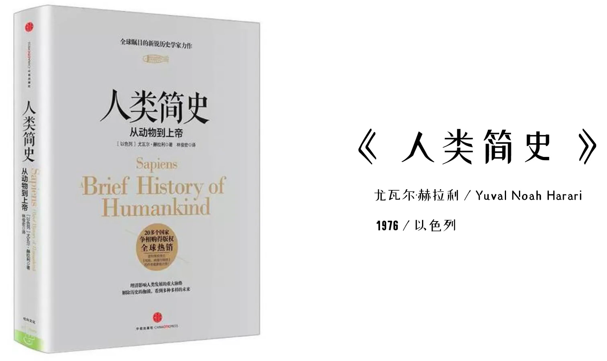
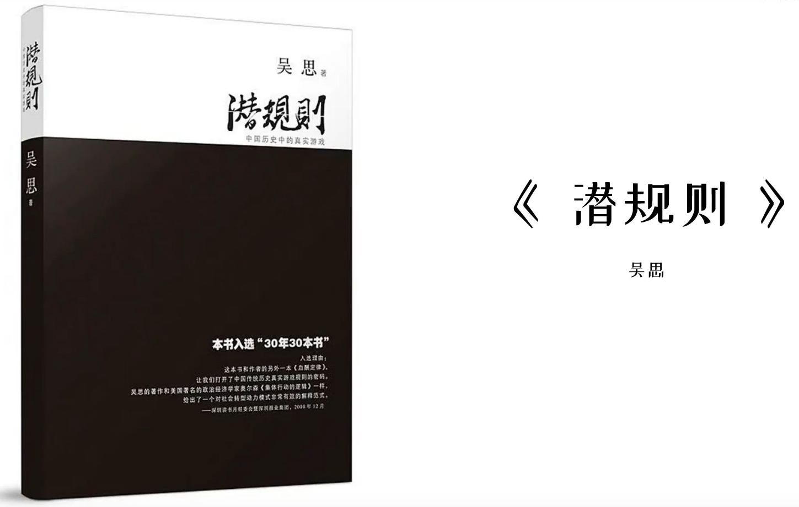
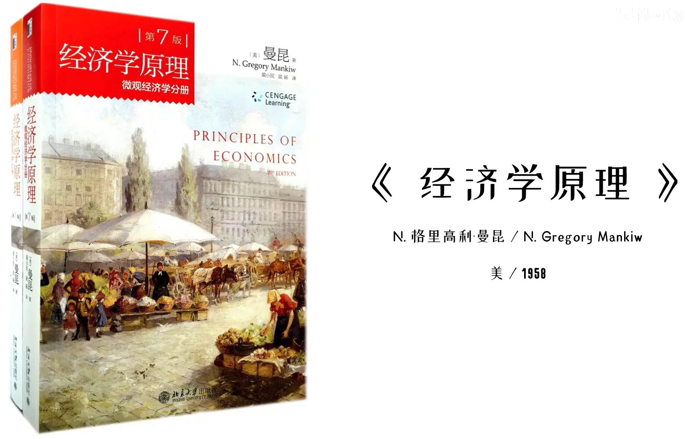
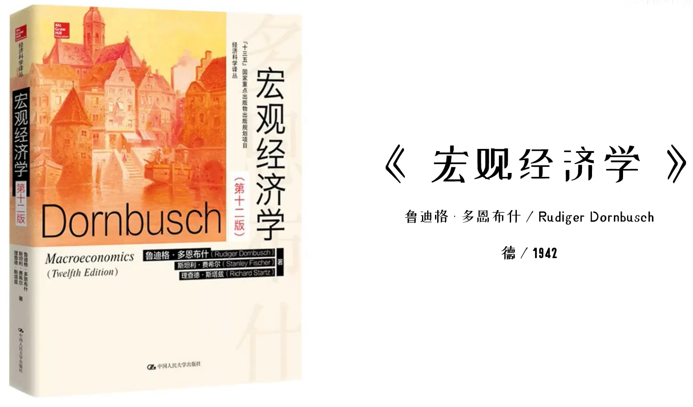
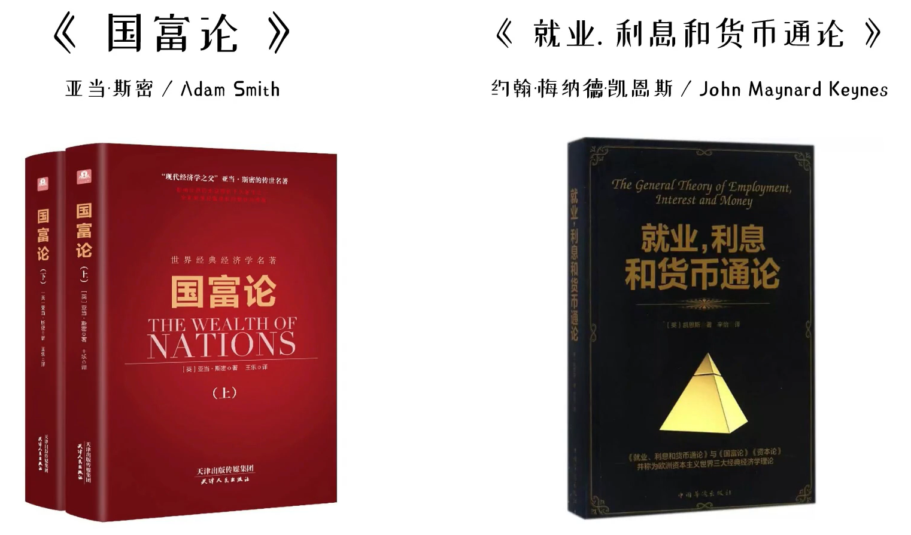
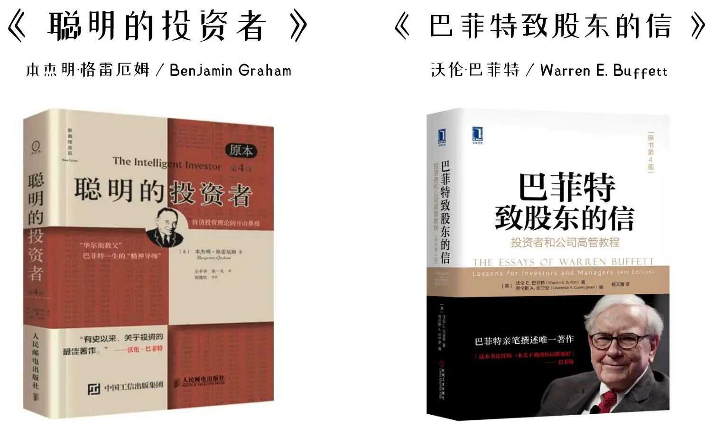
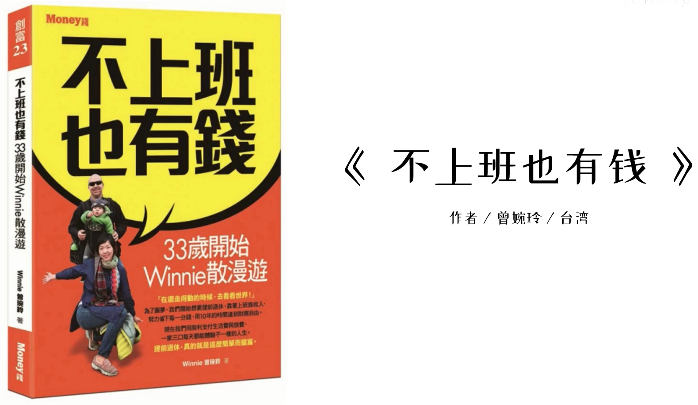
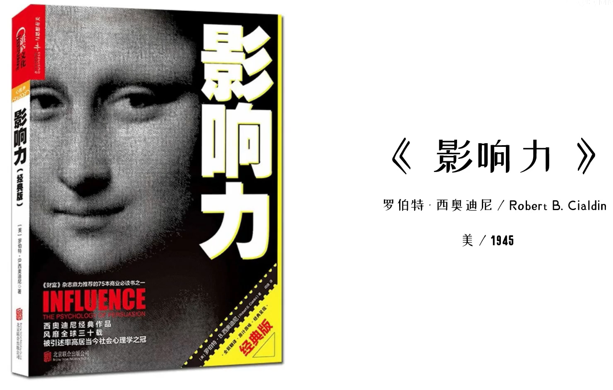

# 1 历史

## 1.1 人类简史 
 

## 1.2 潜规则

# 2 经济学

## 2.2 经济学原理（上、下两册）

 
## 2.3 宏观经济学

 
## 2.4 国富论、就业，利息和货币通论

 
# 3 金融与投资

## 3.1 小狗钱钱、财务自由之路

## 3.2 聪明的投资者、巴菲特致股东的信

 
## 3.3 不上班也有钱（已看完）

 
# 4 商业和营销

如果有创业的想法，可以从运营、营销，行为经济学等类型的书籍看起。

# 5 心里学

## 5.1 影响力

几年前看过开头，没坚持看完。
 
## 5.2 社会心里学

 
# 6 个人专业领域

学深、学透。

# 7 成长路上的三个陷阱

* 不要沉迷于碎片化学习。
* 谨慎消耗自己的精力，将精力花在产生实际价值的地方。
* 道理很重要，但是落地的最终是具体的方法。
