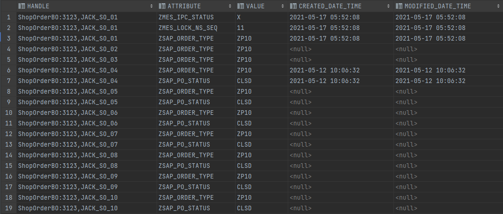

## 5-19

问题：Oracle INSERT ALL INTO 插入重复行问题。

数据库插入前，有19条数据，用批量插入后，每插入一条都翻19倍。



```sql
INSERT ALL
INTO WIP.CUSTOM_FIELDS (HANDLE, ATTRIBUTE, VALUE, CREATED_DATE_TIME, MODIFIED_DATE_TIME)
VALUES ('ShopOrderBO:3123,JACK_SO_01', 'ZSAP_ZZDPH', '1', null, null)
INTO WIP.CUSTOM_FIELDS (HANDLE, ATTRIBUTE, VALUE, CREATED_DATE_TIME, MODIFIED_DATE_TIME)
VALUES ('ShopOrderBO:3123,JACK_SO_01', 'ZSAP_ZZSCD', '1', null, null)

INTO WIP.CUSTOM_FIELDS (HANDLE, ATTRIBUTE, VALUE, CREATED_DATE_TIME, MODIFIED_DATE_TIME)
VALUES ('ShopOrderBO:3123,JACK_SO_02', 'ZSAP_ZZDPH', '2', null, null)
INTO WIP.CUSTOM_FIELDS (HANDLE, ATTRIBUTE, VALUE, CREATED_DATE_TIME, MODIFIED_DATE_TIME)
VALUES ('ShopOrderBO:3123,JACK_SO_02', 'ZSAP_ZZSCD', '2', null, null)

INTO WIP.CUSTOM_FIELDS (HANDLE, ATTRIBUTE, VALUE, CREATED_DATE_TIME, MODIFIED_DATE_TIME)
VALUES ('ShopOrderBO:3123,JACK_SO_03', 'ZSAP_ZZDPH', '3', null, null)
INTO WIP.CUSTOM_FIELDS (HANDLE, ATTRIBUTE, VALUE, CREATED_DATE_TIME, MODIFIED_DATE_TIME)
VALUES ('ShopOrderBO:3123,JACK_SO_03', 'ZSAP_ZZSCD', '3', null, null)

INTO WIP.CUSTOM_FIELDS (HANDLE, ATTRIBUTE, VALUE, CREATED_DATE_TIME, MODIFIED_DATE_TIME)
VALUES ('ShopOrderBO:3123,JACK_SO_04', 'ZSAP_ZZDPH', '4', null, null)
INTO WIP.CUSTOM_FIELDS (HANDLE, ATTRIBUTE, VALUE, CREATED_DATE_TIME, MODIFIED_DATE_TIME)
VALUES ('ShopOrderBO:3123,JACK_SO_04', 'ZSAP_ZZSCD', '4', null, null)

INTO WIP.CUSTOM_FIELDS (HANDLE, ATTRIBUTE, VALUE, CREATED_DATE_TIME, MODIFIED_DATE_TIME)
VALUES ('ShopOrderBO:3123,JACK_SO_05', 'ZSAP_ZZDPH', '5', null, null)
INTO WIP.CUSTOM_FIELDS (HANDLE, ATTRIBUTE, VALUE, CREATED_DATE_TIME, MODIFIED_DATE_TIME)
VALUES ('ShopOrderBO:3123,JACK_SO_05', 'ZSAP_ZZSCD', '5', null, null)

INTO WIP.CUSTOM_FIELDS (HANDLE, ATTRIBUTE, VALUE, CREATED_DATE_TIME, MODIFIED_DATE_TIME)
VALUES ('ShopOrderBO:3123,JACK_SO_06', 'ZSAP_ZZDPH', '6', null, null)
INTO WIP.CUSTOM_FIELDS (HANDLE, ATTRIBUTE, VALUE, CREATED_DATE_TIME, MODIFIED_DATE_TIME)
VALUES ('ShopOrderBO:3123,JACK_SO_06', 'ZSAP_ZZSCD', '6', null, null)

INTO WIP.CUSTOM_FIELDS (HANDLE, ATTRIBUTE, VALUE, CREATED_DATE_TIME, MODIFIED_DATE_TIME)
VALUES ('ShopOrderBO:3123,JACK_SO_07', 'ZSAP_ZZDPH', '7', null, null)
INTO WIP.CUSTOM_FIELDS (HANDLE, ATTRIBUTE, VALUE, CREATED_DATE_TIME, MODIFIED_DATE_TIME)
VALUES ('ShopOrderBO:3123,JACK_SO_07', 'ZSAP_ZZSCD', '7', null, null)

INTO WIP.CUSTOM_FIELDS (HANDLE, ATTRIBUTE, VALUE, CREATED_DATE_TIME, MODIFIED_DATE_TIME)
VALUES ('ShopOrderBO:3123,JACK_SO_08', 'ZSAP_ZZDPH', '8', null, null)
INTO WIP.CUSTOM_FIELDS (HANDLE, ATTRIBUTE, VALUE, CREATED_DATE_TIME, MODIFIED_DATE_TIME)
VALUES ('ShopOrderBO:3123,JACK_SO_08', 'ZSAP_ZZSCD', '8', null, null)

INTO WIP.CUSTOM_FIELDS (HANDLE, ATTRIBUTE, VALUE, CREATED_DATE_TIME, MODIFIED_DATE_TIME)
VALUES ('ShopOrderBO:3123,JACK_SO_09', 'ZSAP_ZZDPH', '9', null, null)
INTO WIP.CUSTOM_FIELDS (HANDLE, ATTRIBUTE, VALUE, CREATED_DATE_TIME, MODIFIED_DATE_TIME)
VALUES ('ShopOrderBO:3123,JACK_SO_09', 'ZSAP_ZZSCD', '9', null, null)

INTO WIP.CUSTOM_FIELDS (HANDLE, ATTRIBUTE, VALUE, CREATED_DATE_TIME, MODIFIED_DATE_TIME)
VALUES ('ShopOrderBO:3123,JACK_SO_10', 'ZSAP_ZZDPH', '10', null, null)
INTO WIP.CUSTOM_FIELDS (HANDLE, ATTRIBUTE, VALUE, CREATED_DATE_TIME, MODIFIED_DATE_TIME)
VALUES ('ShopOrderBO:3123,JACK_SO_10', 'ZSAP_ZZSCD', '10', null, null)
select HANDLE, ATTRIBUTE, VALUE, CREATED_DATE_TIME, MODIFIED_DATE_TIME
from WIP.CUSTOM_FIELDS
where HANDLE in ('ShopOrderBO:3123,JACK_SO_01', 'ShopOrderBO:3123,JACK_SO_02', 'ShopOrderBO:3123,JACK_SO_03', 'ShopOrderBO:3123,JACK_SO_04', 'ShopOrderBO:3123,JACK_SO_05'
                , 'ShopOrderBO:3123,JACK_SO_06', 'ShopOrderBO:3123,JACK_SO_07', 'ShopOrderBO:3123,JACK_SO_08', 'ShopOrderBO:3123,JACK_SO_09', 'ShopOrderBO:3123,JACK_SO_10');
```


